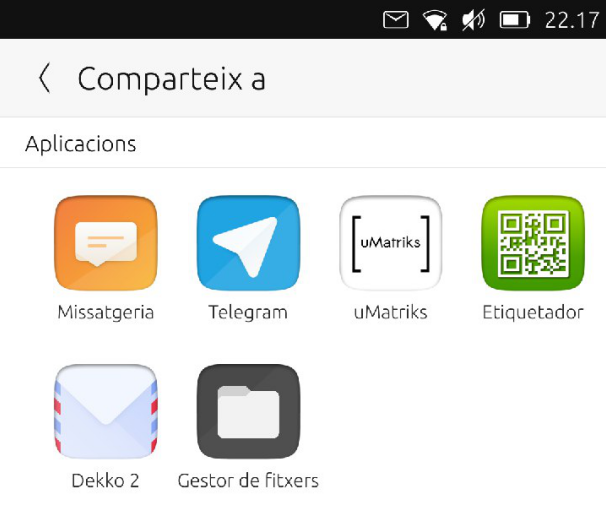
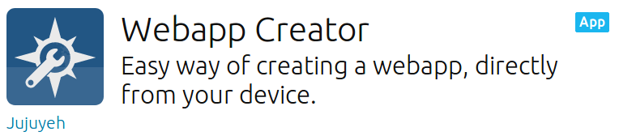
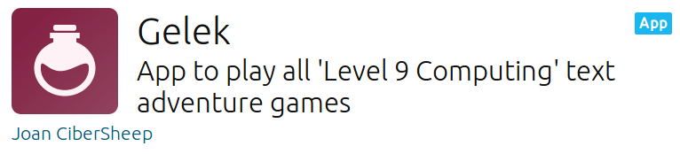
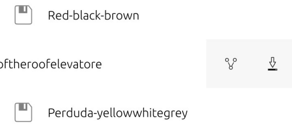
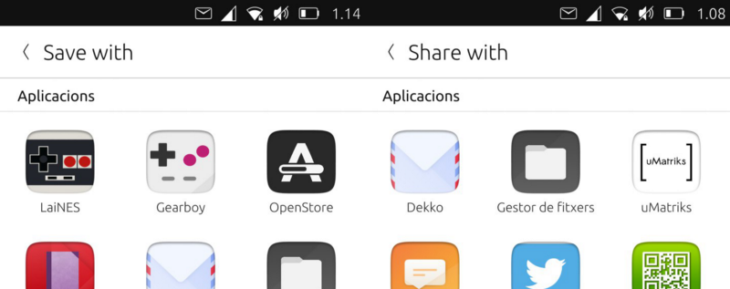

=============================================
The content hub. Tips and tricks
=============================================

        Content Hub Share Page

On Ubuntu Touch the apps are confined. The way of sharing files between them is through the Content Hub, a part of the system that takes care of file import, export and sharing.

Different ways of sharing the content
-------------------------------------
As we can see in the `documentation <https://api-docs.ubports.com/sdk/apps/qml/Ubuntu.Content/ContentHandler.html#detailed-description>`_, there are several ways of handling the file to be shared:

- ContentHandler.Source (The app selected is going to be the source of the file imported)
- ContentHandler.Destination (The app selected is going to be the destination of the file exported)
- ContentHandler.Share (The app selected is going to be the app from witch the file is going to be shared from)

Importing
^^^^^^^^^

        Webapp Creator on the OpenStore.io

Looking into the code of Webapp Creator, we’ll find the code to import an image to be used as icon. Tapping on the place holder will open the Content Hub that will let us choose from where to import the image (`see the source code <https://gitlab.com/cibersheep/webapp-creator/blob/master/webapp-creator/app/ImportPage.qml#L38>`_)

.. code:: qml

        ContentPeerPicker {
            anchors { fill: parent; topMargin: picker.header.height }
            visible: parent.visible
            showTitle: false
            contentType: picker.contentType //ContentType.Pictures
            handler: picker.handler //ContentHandler.Source

**ContentPeerPicker** is the element that shows the apps.
**contentType** is passed in the code as ContentType.Pictures. So, we will only see apps from which we only can import images.
And **handler** is passed in the code as ContentHandler.Source. As we want to import an image from the app selected in the Content Hub.

Exporting
^^^^^^^^^

        Gelek in the OpenStore.io

In Gelek, we are going to end with some saved games that we want to save in our device or share with ourselves (in Telegram and then save them to our computer).

Tapping on the download icon we will get a Content Hub to «save» the game file (which is actually an export).

The game file is a file type *.glksave.* So we will tell to the Content Hub that is of type «All» (`see code <https://gitlab.com/cibersheep/gelek/blob/master/app/InstallPage.qml#L38>`_).

.. code:: qml

        ContentPeerPicker {
            anchors { fill: parent; topMargin: picker.header.height }
            visible: parent.visible
            showTitle: false
            contentType: ContentType.All
            handler: ContentHandler.Destination

            onPeerSelected: {

**contentType** is *ContentType.All.* So, we will only see apps that are able to receive files of type other.
And **handler** is *ContentHandler.Destination.* The app selected will be the destination of our saved game.

Tapping on the File Manager we will save the saved game in the folder we choose.

Sharing
^^^^^^^
Similarly, tapping on the share icon will allow us to send the saved game through Telegram to ourselves (`see the source code <https://gitlab.com/cibersheep/webapp-creator/blob/master/webapp-creator/app/ImportPage.qml#L38>`_).

.. code:: qml

        ContentPeerPicker {
            anchors { fill: parent; topMargin: picker.header.height }
            visible: parent.visible
            showTitle: false
            contentType: picker.contentType //ContentType.Pictures
            handler: picker.handler //ContentHandler.Source

            onPeerSelected: {

The only difference between this and the previous code is that **handler** is *ContentHandler.Share*

Wait a minute. Why the different apps?
--------------------------------------

        Content Hub: Export vs Share

Each developer can decide the rules each app would follow, in relation to the Content Hub. Why the OpenStore is shown as the destination of an export?

Let’s check its manifest.json

.. code:: javascript

        "hooks": {
            "openstore": {
                "apparmor": "openstore/openstore.apparmor",
                "desktop": "openstore/openstore.desktop",
                "urls": "openstore/openstore.url-dispatcher",
                "content-hub": "openstore/openstore-contenthub.json"
            }
        },

The above code defines that the hooks for the app named “openstore” in relation to the “content-hub“ should follow the rules defined in openstore-contenthub.json

.. code:: javascript

        {
            "destination": [
                "all"
            ]
        }

This means, the OpenStore will be the destination for *all* ContentTypes.

What about uMatriks? Let’s see its content-hub.json

.. code:: javascript

        {
            "destination": [
                "pictures",
                "documents",
                "videos",
                "contacts",
                "music"
            ],
            "share": [
                "pictures",
                "documents",
                "videos",
                "contacts",
                "music"
            ],
            "source": [
                "pictures",
                "documents",
                "videos",
                "contacts",
                "music"
            ]
        }

So, with this example, uMatriks will be able to be the destination, source and share app for all kinds of ContentType.
What about the other hooks in the manifest.json?

That is «Flour from another sack» and will be discussed in the next article.

