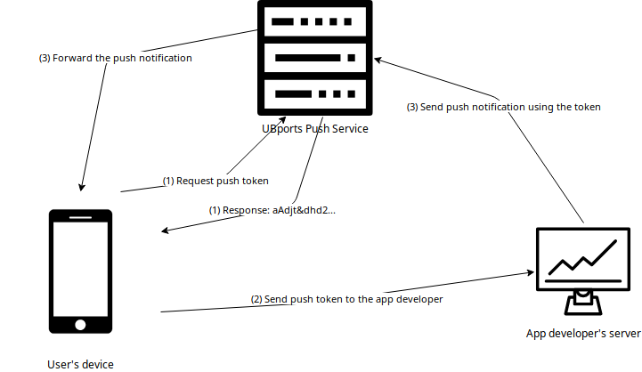

Push notifications
==================

Let's assume that you have an app created with Clickable and published on the OpenStore. But now you want to be able to send Push Notifications to your users. First of all, you need to understand how this is working:

1. Every app which uses push notifications has got a unique token. This token identifies the user, the device and the app itself. The token is generated by the UBports Push Service.
2. You will need the token to send a push notification. So the app sends its token to the app developer's server.
3. With the token you can send a HTTP request to the UBports Push Server which will forward the notification the user's device.

Let's practice this step-by-step.

.. note::
    In the following example we will not implement a server. Also the communication between your app and your server is up to you. Please inform the user about the communication with your server by providing a privacy policy!

Make the app ready for push notifications
-----------------------------------------

Implementing the PushClient
^^^^^^^^^^^^^^^^^^^^^^^^^^^

Implementing the pushclient
^^^^^^^^^^^^^^^^^^^^^^^^^^^

First we need to add the policy group "push-notification-client". Your apparmor file could look like this:

.. code-block:: js
    :emphasize-lines: 4

	{
	    "policy_groups": [
		"networking",
		"push-notification-client"
	    ],
	    "policy_version": 16.04
	}

In the next step we need to modify the Qml parts. We need to add a pushclient component:

.. code-block:: js

	//...

	import Ubuntu.PushNotifications 0.1

	//...

	PushClient {
		id: pushClient
		appId: "appname.yourname_hookname"
		onTokenChanged: console.log("👍", pushClient.token)
	}

You need to set the correct appId! If the app name in your manifest file is appname.yourname and the name of the main hook (the one which handles the .desktop file) is hookname, then the appId is:  appname.yourname_hookname.
When we now start the app, it will get a token and print this token in the logs. With clickable logs we will be able to copy this token out of the terminal. But the app is not yet ready to receive a push notification. For this we need something called a pushhelper!

Implementing the push helper
^^^^^^^^^^^^^^^^^^^^^^^^^^^^

The pushhelper is a part of the app which will receive all push notifications and process them before sending them to the system notification center. It will receive a json-file and must output another json-file in the correct format. The pushhelper is seperated from the app. So we need a new hook in the manifest. It could look like this:

.. code-block:: js
    :emphasize-lines: 12,13

	{
	    //...

	    "title": "pushclient",
	    "hooks": {
		"pushclient": {
		    "apparmor": "pushclient.apparmor",
		    "desktop":  "pushclient.desktop"
		},
		"push": {
		    "apparmor": "push-apparmor.json",
		    "push-helper": "push.json"
		}
	    },

	    //...
	}

It should be clear that we now need a different apparmor file and a different executable file. The push-apparmor.json file must only contain the policy group push-notification-client and should look like this:

.. code-block:: js

	{
	    "template": "ubuntu-push-helper",
	    "policy_groups": [
		"push-notification-client"
	    ],
	    "policy_version": 16.04
	}

The push.json is for redirecting to the executable file:

.. code-block:: js

	{
	    "exec": "pushexec"
	}

In our tutorial we will use python to create a executable which will forward the notification without changing anything:

.. code-block:: python

	#!/usr/bin/python3

	import sys

	f1, f2 = sys.argv[1:3]

	open(f2, "w").write(open(f1).read())

We also need to add this new files to the cmakelist and make the pushexec executable::

	[…]

	install(FILES pushexec PERMISSIONS OWNER_EXECUTE OWNER_WRITE OWNER_READ DESTINATION ${DATA_DIR})
	install(FILES push.json DESTINATION ${DATA_DIR})
	install(FILES push-apparmor.json DESTINATION ${DATA_DIR})

	[…]

Now the app is ready to receive and process push notifications!

Using the Push Service API
--------------------------

So now you have the token and the app is ready to receive and process push notifications. To send a notification, you need to send a HTTP request to this address:
https://push.ubports.com/notify
The content-type must be application/json and it must fit in the correct format. A example in javascript could look like this:

.. code-block:: js

	var req = new XMLHttpRequest();
	req.open("post", "https://push.ubports.com/notify", true);
	req.setRequestHeader("Content-type", "application/json");
	req.onreadystatechange = function() {
		if ( req.readyState === XMLHttpRequest.DONE ) {
				console.log("✍ Answer:", req.responseText);
		}
	}
	var approxExpire = new Date ();
	approxExpire.setUTCMinutes(approxExpire.getUTCMinutes()+10);
	req.send(JSON.stringify({
		"appid" : "appname.yourname_hookname",
		"expire_on": approxExpire.toISOString(),
		"token": "aAnqwiFn§DF%2",
	 	"data": {
			"notification": {
				"card": {
					"icon": "notification",
		         		"summary": "Push Notification",
		             		"body": "Hello world",
		             		"popup": true,
		             		"persist": true
		        	},
		        "vibrate": true,
		        "sound": true
		  	}
		}
	}));

Push Notification Object
^^^^^^^^^^^^^^^^^^^^^^^^

+---------------+--------+---------------------------------------------------------------------------+
| Parameter     | Type   | Description                                                               |
+===============+========+===========================================================================+
| appid         | string | | Required. ID of the application that will receive the notification,     |
|               |        | | as described in the client side documentation.                          |
+---------------+--------+---------------------------------------------------------------------------+
| expire_on     | string | | Required. Expiration date/time for this message, in                     |
|               |        | | `ISO8601 Extendendformat <https://www.w3.org/TR/NOTE-datetime>`_.       |
+---------------+--------+---------------------------------------------------------------------------+
| token         | string | | Required. The token identifying the user+device to which the message is |
|               |        | | directed, as described in the client side documentation.                |
+---------------+--------+---------------------------------------------------------------------------+
| clear_pending | bool   | | Discards all previous pending notifications. Usually in response to     |
|               |        | | getting a "too-many-pending" error. Defaults to false.                  |
+---------------+--------+---------------------------------------------------------------------------+
| replace_tag   | string | | If there's a pending notification with the same tag, delete it before   |
|               |        | | queuing this new one.                                                   |
+---------------+--------+---------------------------------------------------------------------------+
| data          | Data   | | A JSON object. The contents of the data field are arbitrary. We can use |
|               |        | | it to send any data to the app.                                         |
+---------------+--------+---------------------------------------------------------------------------+

Data
^^^^

+--------------+--------------+----------------------------------------------------------------------+
| Parameter    | Type         | Description                                                          |
+==============+==============+======================================================================+
| notification | Notification | A JSON object which defines how this notification will be presented. |
+--------------+--------------+----------------------------------------------------------------------+
| message      | object       | A JSON object that is passed as-is to the application via PopAll.    |
+--------------+--------------+----------------------------------------------------------------------+

Notification
^^^^^^^^^^^^

+----------------+-----------------+-----------------------------------------------------------------+
| Parameter      | Type            | Description                                                     |
+================+=================+=================================================================+
| summary        | string          | | Required. A title. The card will not be presented if this is  |
|                |                 | | missing.                                                      |
+----------------+-----------------+-----------------------------------------------------------------+
| body           | string          | | Longer text, defaults to empty.                               |
+----------------+-----------------+-----------------------------------------------------------------+
| actions        | array           | | If empty (the default), a bubble notification is              |
|                |                 | | non-clickable. If you add a URL, then bubble notifications    |
|                |                 | | are clickable and launch that URL. One use for this is using  |
|                |                 | | a URL like ``appid://com.ubuntu.developer.ralsina.hello``     |
|                |                 | | which will switch to the app or launch it.                    |
+----------------+-----------------+-----------------------------------------------------------------+
| icon           | string          | | An icon relating to the event being notified. Defaults to     |
|                |                 | | empty (no icon); a secondary icon relating to the application |
|                |                 | | will be shown as well, regardless of this field.              |
+----------------+-----------------+-----------------------------------------------------------------+
| timestamp      | integer         | | Seconds since the unix epoch, only used for persist for now.  |
|                |                 | | If zero or unset, defaults to current timestamp.              |
+----------------+-----------------+-----------------------------------------------------------------+
| persist        | bool            | | Whether to show in notification centre; defaults to false.    |
+----------------+-----------------+-----------------------------------------------------------------+
| popup          | bool            | | Whether to show in a bubble. Users can disable this, and can  |
|                |                 | | easily miss them, so don't rely on it exclusively. Defaults   |
|                |                 | | to false.                                                     |
+----------------+-----------------+-----------------------------------------------------------------+
| sound          | bool or string  | | This is either a boolean (play a predetermined sound) or the  |
|                |                 | | path to a sound file. The user can disable it, so don't rely  |
|                |                 | | on it exclusively. Defaults to empty (no sound). The path is  |
|                |                 | | relative, and will be looked up in (a) the application's      |
|                |                 | | ``.local/share/<pkgname>``, and (b) standard xdg dirs.        |
+----------------+-----------------+-----------------------------------------------------------------+
| vibrate        | bool or Vibrate | | The notification can contain a vibrate field, causing haptic  |
|                |                 | | feedback, which can be either a boolean (if true, vibrate a   |
|                |                 | | predetermined way) or an Vibrate object.                      |
+----------------+-----------------+-----------------------------------------------------------------+
| emblem-counter | Emblem-counter  | | A JSON object, which defines how to display the emblem        |
|                |                 | | counter.                                                      |
+----------------+-----------------+-----------------------------------------------------------------+

Vibrate
^^^^^^^

+-----------+---------+------------------------------------------------------------------------------+
| Parameter | Type    | Description                                                                  |
+===========+=========+==============================================================================+
| pattern   | array   | | A list of integers describing a vibration pattern (duration of alternating |
|           |         | | vibration/no vibration times, in milliseconds).                            |
+-----------+---------+------------------------------------------------------------------------------+
| repeat    | integer | | Number of times the pattern has to be repeated (defaults to 1, 0 is the    |
|           |         | | same as 1).                                                                |
+-----------+---------+------------------------------------------------------------------------------+

Emblem-Counter
^^^^^^^^^^^^^^

+-----------+---------+------------------------------------------------------------------------------+
| Parameter | Type    | Description                                                                  |
+===========+=========+==============================================================================+
| count     | integer | A number to be displayed over the application's icon in the launcher.        |
+-----------+---------+------------------------------------------------------------------------------+
| visible   | bool    | Set to true to show the counter, or false to hide it.                        |
+-----------+---------+------------------------------------------------------------------------------+
