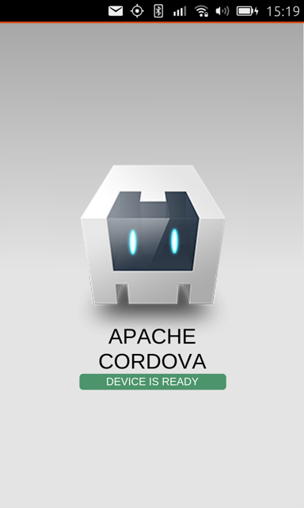
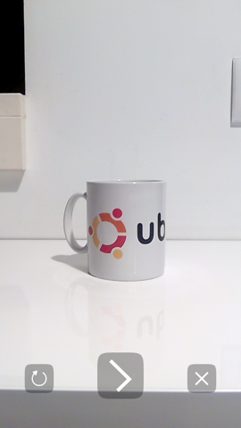
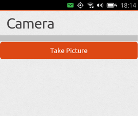

HTML5 Tutorials - Cordova camera app
====================================

This tutorial takes you through the steps needed to create an HTML5 app
that uses the Cordova runtime and its Camera API.

The app we develop here is quite simple:

-  It provides a **Take Picture** button.
-  When **Take Picture** is clicked, the Cordova Camera displays.
-  The user takes a picture.
-  The picture is returned through Cordova and is displayed in the app’s
   HTML.

Before getting started
----------------------

Cordova guide
~~~~~~~~~~~~~

You may want to read the `Cordova Guide <guides-cordova-guide.md>`__. It
contains all the info you need to set up your development environment.
The three prerequisites being:

-  Installing ``cordova-cli`` from the Ubuntu Cordova PPA
-  Creating a `click
   chroot <../../platform/sdk/tutorials-click-targets-and-device-kits.md>`__
   for the armhf architecture, to run and contain your application
-  Installing build dependencies in the `click
   chroot <../../platform/sdk/tutorials-click-targets-and-device-kits.md>`__;
   refer to the corresponding section in the `Cordova
   Guide <guides-cordova-guide.md>`__

HTML5 UI Toolkit basics
~~~~~~~~~~~~~~~~~~~~~~~

This tutorial is not focused on the UI Toolkit. For help, see the
`Ubuntu HTML5 UI Toolkit
Guide <guides-introduction-to-the-html5-ui-toolkit.md>`__.

Getting the resources for this app
~~~~~~~~~~~~~~~~~~~~~~~~~~~~~~~~~~

You can obtain the source tree for this app as follows:

Open a terminal with ``Ctrl+Alt+T`` and get the branch with:

::

    $ bzr branch lp:ubuntu-sdk-tutorials

Creating your Cordova app project
---------------------------------

We will be creating the application from scratch and copy-pasting parts
from the reference code.

You will need to instantiate a new project, with the following Cordova
command:

::

    $ cordova create cordovacam cordovacam.mydevid
    $ cd cordovacam

**Tip**: You may want to add app project files to revision control such
as Bazaar and commit them (except the .user file, which is typically not
stored in VCS).

Define your application icon
----------------------------

To define the icon for you application, you should first copy the sample
icon from the
``ubuntu-sdk-tutorials/html5/html5-tutorial-cordova-camera`` directory

::

    $ cp ../ubuntu-sdk-tutorials/html5/html5-tutorial-cordova-camera/www/icon.png ./www/img/logo.png

Then you need to add this entry into the Cordova app configuration file.

Edit the ``config.xml`` file and add the line below:

.. code:: xml

    <icon src="www/img/logo.png" />

**Note**: this is a mandatory step, to let the application pass the
package validation tests.

Add the Ubuntu platform support code to your project
----------------------------------------------------

As explained in the Cordova Guide, you need to add platform support code
to your project, which will be compiled and integrated in the Cordova
runtime shipped with your application.

Add the Cordova Ubuntu runtime files into your app project:

::

    $ cordova platform add ubuntu

Now, your project contains some additional files, notably:

``platforms/ubuntu/``

Add support for the Camera API
------------------------------

Add the Cordova Ubuntu runtime files into your app project:

::

    $ cordova plugin add cordova-plugin-camera

**Tip**: Put all of files added by the previous commands into your
version control system and commit them as appropriate.

Build the app
-------------

Use the standard Cordova command line tool to prepare the app for
running on your Ubuntu phone.

Generally, you don't need to build the app and then run it. The ``run``
command will ensure the app builds and the click package sent to the
phone before starting the application directly.

::

    $ cordova run --device --debug

**Tip**: you may see warning messages after the build. For example: you
haven't specified an icon for your application yet.

As the application is started on the device, you should also notice that
the output contains debug messages to let you connect to the running
Javascript code and inspect the HTML5 UI.

At this point, the app GUI is still in its default unmodified state. We
implement our app GUI in the next section.

Define the HTML5 GUI
--------------------

Here we replace the GUI declared in the default app with one appropriate
for this Camera app.

-  In index.html, add the following stylesheet declarations in the

   .. raw:: html

      <head>

   section of the document:

.. code:: html

    <meta name="viewport" content="width=device-width, initial-scale=1, maximum-scale=1, user-scalable=0">
    <!-- Ubuntu UI Style imports - Ambiance theme -->
    <link href="/usr/share/ubuntu-html5-ui-toolkit/0.1/ambiance/css/appTemplate.css" rel="stylesheet" type="text/css" />
    <!-- Ubuntu UI javascript imports - Ambiance theme -->
    
    
    
    
    
    
    

-  Ensure, you call the following 2 Javascript files in the

   .. raw:: html

      <head>

   section as well:

.. code:: html

    <!-- Cordova platform API access - Uncomment this to have access to the Javascript APIs -->
    
    <!-- Application script and css -->
    <script src="js/app.js"></script

-  Then, delete the entire div inside the

   .. raw:: html

      <body>

   …

   .. raw:: html

      </body>

   element and add the following new HTML fragment:

.. code:: html

    

      <header data-role="header">
        <ul data-role="tabs">
          <li data-role="tabitem" data-page="camera">Camera</li>
        </ul>
      </header>
      

        

            

                <header>Loading...</header>
                <progress class="bigger">Loading...</progress>
            

            

                <button data-role="button" class="ubuntu" id="click">Take Picture</button>
                
            

        
 <!-- tab: camera -->
      
 <!-- content -->
    
 <!-- mainview -->

This is a simple implementation of an Ubuntu HTML5 app. It declares the
following:

-  A **mainview** div (required)
-  A **header** with a single tabitem: “Camera”
-  A **content** div with two internal divs: loading and loaded
-  **loading div** displays at launch time and includes a progress
   spinner. This is hidden when Cordova is ready by JavaScript code we
   look at later
-  loaded div displays when Cordova is ready by JavaScript and contains:
-  A **Take Picture** button: We create an event listener for this below
   to popup the Cordova Camera
-  An **empty img** element: When the camera takes a picture, it uses
   this element to display the return image

If you run the app now, the GUI appears as follows:

.. figure:: ../../../media/app-html5-tutorial-cordova-spinner.png
   :alt: 

As noted above, that is the loading div that displays until Cordova
deviceready event is received.

**Tip**: To isolate your application UI from future UI toolkit changes,
we now recommend to bundle a copy of the toolkit inside your application
package. There is a small tool documented here that will assist you in
migrating your project. See
https://code.launchpad.net/~dbarth/ubuntu-html5-theme/cmdline-tool/+merge/253498

**Note:** at the end of the index.html file you should also see a
reference to a ``cordova.js`` script file which is loaded at the
beginning of the page. This file is not present in the source 'www'
directory. However it is automatically copied with the rest of the
cordova runtime startup code, during the build phase. So don't worry,
the file will be present in the resulting click package.

Let’s take the next step and add the JavaScript that responds to the
Cordova deviceready event by hiding the loading div, displaying the
loaded div, and providing an event handler for the **Take Picture**
button.

Adding JavaScript to display the Cordova Camera
-----------------------------------------------

Here we add an event handler for the Cordova deviceready event and,
inside that code, sets up our Take Picture to call the Cordova Camera
API to let the user take a picture.

You should mostly replace the default ``www/js/index.js`` file with a
new file called ``app.js`` from the tutorial branch. We will look at the
key elements of this file below.

The first step is to init the UbuntuUI object to setup the main user
interface parts. The following event listener will be triggered on the
initial window load event, and prepare the rest of the UI

.. code:: javascript

    window.onload = function () {
        var UI = new UbuntuUI();    
        UI.init();
        document.addEventListener("deviceready", function() {
            if (console && console.log)
                console.log('Platform layer API ready');
            //hide the loading div and display the loaded div
            document.getElementById("loading").style.display = "none";
            document.getElementById("loaded").style.display = "block";

Inside this function you can install a listener to react to the main
button press, and capture the image with the camera. Here is how it
looks:

.. code:: javascript

            // event listener to take picture
            UI.button("click").click( function() {
                navigator.camera.getPicture(onSuccess, onFail, {
                    quality: 100,
                    targetWidth: 400,
                    targetHeight: 400,
                    destinationType: Camera.DestinationType.DATA_URL,
                    correctOrientation: true
                 });
               console.log("Take Picture button clicked");
            }); // "click" button event handler
          }, false); // deviceready event handler
    }; // window.onload event handler

This is the first bit of new code that’s needed. Let’s take a look at
it.

Examining the new event listener
--------------------------------

-  An event handler for the Cordova deviceready event is added. This is
   received when the Cordova system is fully loaded and ready, so this
   is a great place to put code that uses Cordova objects. (See Cordova
   Guide for information.)
-  Inside the deviceready handler, first the loading div is hidden and
   then then loaded div is displayed.
-  Then, the **Take Picture** button is obtained with:
   UI.button(“click”).
-  Its click(FUNCTION) method provides the FUNCTION that runs when the
   button is clicked, the button’s event handler code. (See `HTML5
   APIs <api.md>`__ for complete API reference docs.)
-  This event handling function calls the navigator.camera.getPicture(…)
   method.
-  The navigator object is the base Cordova object and is available in
   the HTML5 runtime container when the app includes Cordova as
   described above.
-  getPicture(…) takes three arguments: the name of the function to run
   when a picture is taken(this is calledonSuccess here and is defined
   below), the name of a function to run when an attempt to take a
   picture fails (onFail here, defined below), and some optional
   arguments.
-  In the optional arguments, we set the image quality, its size, the
   type of image returned to DATA\_URL, which enables passing the image
   directly in JavaScript as a base64 encoded piece of data (without
   saving it as a file), and enable orientation correction

**Tip**: The getPicture(…) method and its arguments are defined in the
Cordova API reference docs.

Defining the onSuccess function
-------------------------------

As we saw above, Cordova getPicture is told to run onSuccess when the
picture is taken. Cordova runs it and passes it the actual picture,
formatted as Cordova type DATA\_URL.

So this app:

-  Needs an onSuccess function
-  That receives the passed image data
-  And modifies the app’s HTML img element’s src attribute to actually
   display the image from the passed image data

Here is code that does these things. You can paste this into the bottom
of app.js:

.. code:: javascript

    function onSuccess(imageData) {
       var image = document.getElementById('image');
       image.src = "data:image/jpeg;base64," + imageData;
       image.style.margin = "10px";
       image.style.display = "block";
    }

Defining the onFailure function
-------------------------------

For this simple app, we simply log the message provided by Cordova to
console. Paste this at the bottom of app.js:

.. code:: javascript

    function onFail(message) {
       console.log("Picture failure: " + message);

Running the app
---------------

With these pieces in place, the app should run and allow you to take a
picture.

As usual, do:

::

    $ cordova run --device --debug

Here is how the application looks like after clicking **Take Picture**:

Once you validate the picture, the system will bring back your
application and will display the photo below the button.

Polish
------

Add CSS
~~~~~~~

Let’s add some CSS styling:

-  Make our Take Picture button Ubuntu orange
-  Center it
-  Center the “Loading…” progress spinner

Create ``www/app.css`` with this content:

.. code:: css

    #loading {
      position: absolute;
      left:45%;
    }
    #loaded {
      display: none;
    }

Now, in ``index.html``, simply add the following inside the ``<head>``

.. code:: html

    <link href="app.css" rel="stylesheet" type="text/css"/>

Now, the Loading page and the home page look like this:

Next steps
----------

Check out the `Cordova Guide <guides-cordova-guide.md>`__ for a high
level review of using Cordova in Ubuntu HTML5 apps and for adding Ubuntu
as a built platform for native Cordova projects.

The Cordova APIs give your HTML5 apps access to other system and
device-level things, so check these out by visiting the Cordova API
docs.
