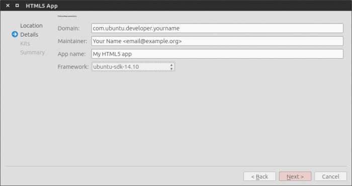
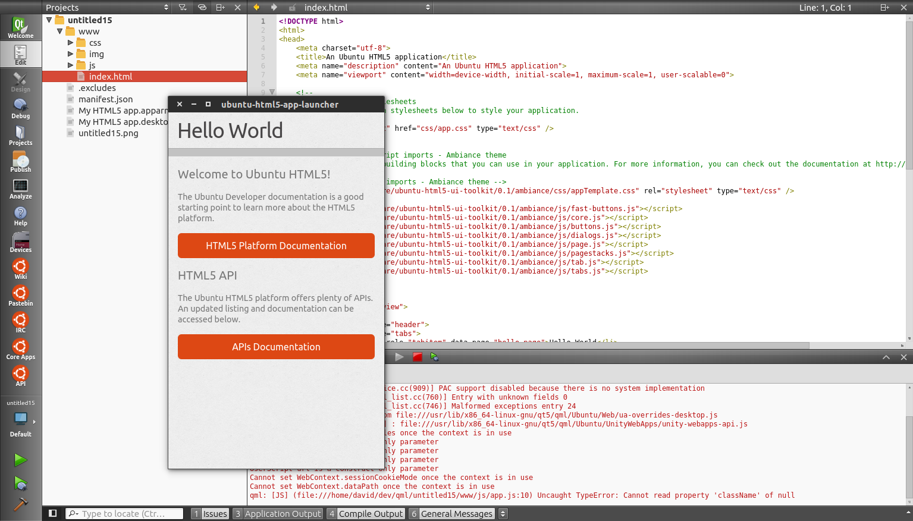

Guides - HTML5 guide
====================

What is an HTML5 app?
---------------------

HTML5 is traditionally for web pages. CSS provides styling and
animations, and JavaScript provides logic and control. But now, these
“web” technologies can be used to write apps for Ubuntu. How does this
work?

A few key points
~~~~~~~~~~~~~~~~

-  **A web container, not a traditional browser**: The HTML5 app runs in
   a web container. When the app is launched, the container is launched
   preconfigured to display the app’s HTML5/CSS/JavaScript. That is, the
   container’s default page is the app’s index.html file.
-  **First-class support of Web APIs**: With a web engine scoring
   511/555 on html5test.com, you get the familiar landscape of Web APIs
   standardized by the W3C and can start building or porting your app on
   solid and well-known foundations.
-  **Container provides run-time access to APIs**: The container is
   built to expose a growing set of APIs that let your app’s JavaScript
   access the Ubuntu Platform, like for example the Content Hub
-  **Ubuntu HTML5 UI toolkit**: Ubuntu provides a set of HTML5 layouts
   and widgets (with associated CSS and JavaScript) that you can use to
   build an HTML5 app that looks and behaves like other Ubuntu apps, for
   example QML apps. We provide a high level introduction to key Ubuntu
   HTML5 layouts and widgets in a separate mini-guide.
-  **Not just a web page: true Ubuntu apps**: An HTML5 app is just like
   other apps made with the Ubuntu SDK. They include the bits an Ubuntu
   app need, for example a Desktop file for Unity integration, a
   manifest file for click packaging, etc. Bottom line: HTML5 apps are
   now first class citizens in Ubuntu.

How to create an HTML5 app from QtCreator
-----------------------------------------

QtCreator is the preferred IDE for the Ubuntu SDK. It integrates with
physical Ubuntu devices and emulators, allowing you to package, run and
debug your applications from it. The easiest way to create a new app
from QtCreator is to create a New project and select the HTML5 app
template. You will be asked for a project name, then an app name. Other
required fields will be useful for packaging and integrating your
application within the Ubuntu app confinement model. You can have a look
at `this article <../../platform/guides/app-confinement.md>`__ to get a
better grasp of what our security model is.

Next, you will need to select devices Kits for running your app. Kits
are containers to run your app in the context of a specific architecture
(arm, x86) and framework (set of APIs available for each SDK release).
For example, if you want to test your app on your phone or in an arm
emulator, you need to select at least one “armhf” kit. It is recommended
to have one desktop and one phone Kit: this should allow you to test,
build and distribute your app without hassle on all form factors. `Click
targets and device
kits <../../platform/sdk/tutorials-click-targets-and-device-kits.md>`__
should give you all the details you need if you want to dive deeper or
need more help.

That’s it, your app template is created and ready to be edited. You can
even run it right now by clicking the play button at the bottom of the
left pane (or press ``Ctrl+R``).

How to structure your app
-------------------------

After creating your app with QtCreator, you will notice that a
recommended file tree has been provided by the template, here are the
highlights of this tree:

-  **css**: contains your css files
-  **img**: for visual resources
-  **js**: contains your javascript files
-  **index.html**: homepage of your app
-  **icon.png**: your app icon
-  **appname.apparmor**: `security policy
   groups <http://developer.ubuntu.com/en/publish/security-policy-groups/>`__
   declared by your app to access device functionalities (camera,
   networking, access to user content, etc.)
-  **appname.desktop**: your app declaration to the shell that will
   manage its launch, icon, etc.
-  **manifest.json**: your package declaration to the system installer.

These last three files have been pre-filled by the SDK and you probably
won’t have to edit their content. If you need to, don’t worry, the
system will warn you of any mistakes when you try to run or package your
app.

How to use Web APIs in your application
---------------------------------------

You can expect the large majority of standard APIs to be supported and
be as easy to use as usual. Here is `the compatibity
chart <http://html5test.com/s/676117241b62d256.html>`__ of our web
engine on html5test.com (score of 511/555). For example, to play a song,
you can call the html5 player element:

::

    <audio id="demo" src="audio.mp3"></audio>
    

     <button>Play the Audio</button>
     <button>Pause the Audio</button>
     <button>Increase Volume</button>
     <button>Decrease Volume</button>
    

You can find more documentation on Web APIs at
`webplatform.org <http://www.webplatform.org/docs/apis/>`__.

How to use Ubuntu APIs in your application
------------------------------------------

OS specific features and design patterns pioneered in Ubuntu can be
accessed very easily as well, such as the media-hub, online-accounts,
content-hub, etc. For example, to know when your application is about to
be closed, just use:

.. code:: javascript

    window.onload = function() {
        var api = external.getUnityObject('1.0');
        api.RuntimeApi.getApplication(function(application) {
            application.onAboutToQuit(function(killed) {
                console.log('killed: ' + killed)
            });
        });
    };

You can find more documentation on Ubuntu HTML5 APIs in the `API
section <api.md>`__.

How to add an Ubuntu style
--------------------------

Your app can use any visual style, but if you want to give a more native
feel to it, Ubuntu provides a set of HTML5 layouts and widgets (with
associated CSS and JavaScript) that you can use to build an HTML5 app
that looks and behaves like other Ubuntu apps, for example QML apps. For
example, you can import a complete theme simply by calling :

.. code:: html

    <!-- Ubuntu UI Style imports - Ambiance theme -->
    <link href="/usr/share/ubuntu-html5-ui-toolkit/0.1/ambiance/css/appTemplate.css" rel="stylesheet" type="text/css" />
    
    
    
    
    
    
    
    

And using ``<button>`` and ``<header>`` tags. `This
article <guides-introduction-to-the-html5-ui-toolkit.md>`__ provides a
high level introduction to key Ubuntu HTML5 layouts and widgets.

`Read the full API <../api-html5-current/UbuntuUI.md>`__.
