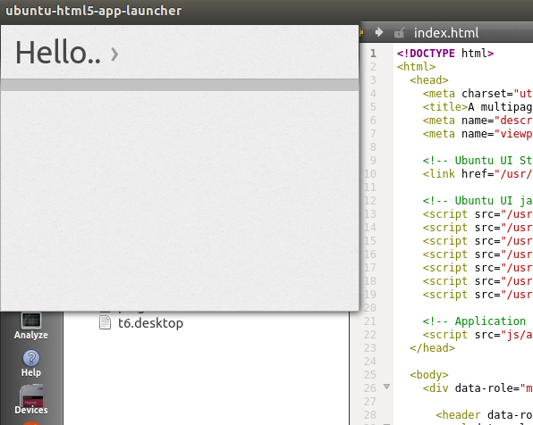
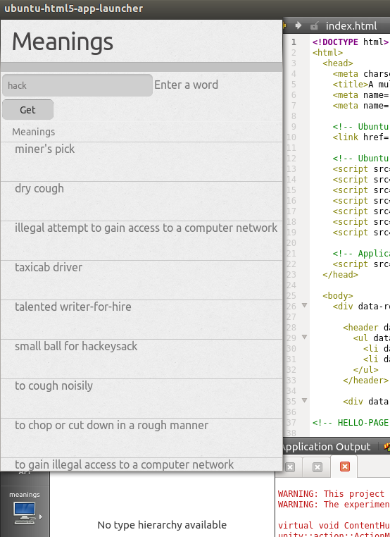

HTML5 Tutorials - Meanings app
==============================

This is a great starting place to learn the basics of writing an HTML5 app.

Here, you:

-  Start with a new, default HTML5 app project in the Ubuntu SDK
-  Implement a simple Ubuntu HTML5 GUI
-  Add some Javascript
-  Run and test the app
-  Take a quick run through packaging the app as a click package

These are the steps you follow for most apps.

You will put together a simple app called “Meanings”. The app displays a simple Ubuntu HTML5 GUI with a header, a text input box, and a button. When the user enters a word in the box and clicks the button, a web API is called that returns the meanings of the word. They are displayed in an Ubuntu List.

This simple app does not use any Ubuntu Platform APIs. Nor does it use a Cordova API. It is a straightforward Ubuntu App that happens to be written in HTML5. Be sure to check out other tutorials that dive into these important areas too.

Before getting started
----------------------

There are a couple requirements:

-  You need to install the Ubuntu SDK
-  You need to know how to `create an HTML5 app project in the SDK <../../platform/sdk/tutorials-creating-an-sdk-app-project.md>`__
-  You should have some experience `running apps from the SDK <../../platform/sdk/tutorials-running-apps-from-the-sdk.md>`__

Getting the app source
~~~~~~~~~~~~~~~~~~~~~~

The completed app source tree is available as a Bazaar branch. You can get it as follows:

1. Open a terminal with ``Ctrl + Alt + T``.
2. Ensure the bzr package is installed with: ``$ sudo apt install bzr``
3. Get the branch with: ``$ bzr branch lp:ubuntu-sdk-tutorials``
4. Move into the html5/html5-tutorial-meanings directory:
   ``$ cd ubuntu-sdk-tutorials/html5/html5-tutorial-meanings``

Now, let’s get developing!

Create your HTML5 app project in the SDK
----------------------------------------

Go ahead and create an HTML5 app project in the SDK.

Give the project any name you want. Here, we call it “meanings” Later we give the app the proper title displayed to users at runtime: “Meanings”.

Practise running the app
~~~~~~~~~~~~~~~~~~~~~~~~

After creating an HTML5 app project in the SDK, you can run it directly from the SDK on the Ubuntu Desktop (and on an attached devices, including physical devices and Ubuntu emulators you have created with the SDK).

Get it running on the Desktop with: **Build** > **Run**.

**Tip**: The SDK has an icon for this (on the left side vertical panel) and a keyboard shortcut: ``Ctrl + R``.

Here’s how a brand new app looks when run from the SDK (the actual GUI may vary as refinements are released):

The brand new HTML5 app project has the basic set of files you need.
But, naturally, the GUI and control logic are simply the defaults for
any new app. We’ll implement a GUI and control logic that suits the
needs of or Meanings app below.

**Note**: If you have a physical device, you can try running it there by following the tips in the `Ubuntu SDK <../../platform/sdk/index.md>`__ section. You can also try creating an emulator and running it there, again following those tips.

Run the app from the terminal
~~~~~~~~~~~~~~~~~~~~~~~~~~~~~

This is a great time to try running the unmodified app directly from the
terminal. This can be convenient.

1. Open a terminal. There are many ways. A quick way is Ctrl + Alt + T.
2. Move to your app project directory.
3. Launch the app as follows: ``$ ubuntu-html5-app-launcher --www=www``

Let’s take a closer look at that command:

-  ``ubuntu-html5-app-launcher``: This is the executable that launches
   the web container in which that HTML5 app runs. The container exposes
   built-in Ubuntu App Platform APIs that your app’s JavaScript can call
   directly.
-  ``--www=www``: This argument simply tells ubuntu-html5-app-launcher
   where to find the directory that contains the app’s HTML5 files.
   Currently, the HTML5 files are required to be in the www/ directory
   of the app project.

Debugging the app’s JavaScript
------------------------------

Before taking a closer look at Ubuntu HTML5, let’s take a moment to
learn how to debug the app’s JavaScript.

Many web developers are familiar with debugging a web page they are
developing right in the browser displaying the page using the browser’s
own development tools. That’s the approach used with Ubuntu HTML5 apps.

The Ubuntu HTML5 app runtime container is based on WebKit. So is
Chrome/Chromium. The approach used here is to send the debug data behind
the scenes to a URL. You then open that URL in a WebKit browser, and you
can then use its debug capabilities, for example having direct access
the the JavaScript console.

Add the --inspector argument to launch in debug mode
~~~~~~~~~~~~~~~~~~~~~~~~~~~~~~~~~~~~~~~~~~~~~~~~~~~~

When you launch the app from the terminal with
ubuntu-html5-app-launcher, you simply add the --inspector argument. Then
watch the output in the launch terminal for Inspector server… and open
the stated URL with the Chrome, Chromium (or other WebKit) browser.

For example, you would use a command like this:

::

     $ ubuntu-html5-app-launcher --www=www --inspector

Now, watch the output for something like this:

::

     Inspector server started successfully. Try pointing a WebKit browser to http://192.168.1.105:9221

Then, you would open the URL in a WebKit browser (like Chromium) and use
its native development tools. In the case of chromium, the displayed web
page has a link you click, which takes you to the debug tools for the
running app instance.

**Tip**: An app with a JavaScript error may fail to load the HTML GUI,
so getting used to launching in inspector (debug) mode and opening the
URL in a WebKit browser is an essential skill.

Let’s move on and take a look at the key files in your new app project.

HTML5 app project files
-----------------------

index.html
~~~~~~~~~~

Naturally, your new HTML5 app project has an index.html, the root file for the app.

**Tip**: Currently, all HTML5 files, including index.html, are expected
to be in the www/ directory. The ``index.html`` file imports all it
needs, including Ubuntu CSS and Ubuntu JavaScript, which provides a
convenient set of methods to control you Ubuntu HTML5 widgets. By
default, it also imports ``./js/app.js``, the app-specific JavaScript
file. And, it may also import a Cordova JavaScript file (not needed for
this app, so you can delete it if you want).

Let’s zero in on ``./js/app.js``.

App specific JavaScript: app.js
~~~~~~~~~~~~~~~~~~~~~~~~~~~~~~~

This is your app’s essential JavaScript file. You add your control code
here.

But first, let’s take a quick look at some critical code it contains by
default:

::

    window.onload = function () {
       var UI = new UbuntuUI();
       UI.init();
    [...]
    }

This is the required code that creates an UbuntuUI object (locally named
UI). This object is your entry point into the UbuntuUI API. This API is
used to control the Ubuntu HTML5 GUI.

**Tip**: Later, take a look at the `HTML5 UbuntuUI
API <guides-introduction-to-the-html5-ui-toolkit.md>`__ reference docs.

This is an event handler for the ``window.onload`` event. It provides an
anonymous function that executes when the event is received. This event
is received after the DOM fully loads, which is the proper time to
initialize the UbuntuUI.

**Note**: Another approach is to use the ``JQuery(document).ready()``
event handler method, as we do later in this app.

After the UI object is created, the code runs the essential
``UI.init()`` method. This method is needed to initialize the UI
framework.

Other project files
~~~~~~~~~~~~~~~~~~~

Here’s a quick summary of other key files:

-  **APP.desktop**: As noted, this is the file used by the system to
   launch the app. Check it out and note the critical Exec line that
   shows the command line the system uses to start the app. Note also
   useful bits like the Icon line that you use to name the icon file the
   system uses to represent the app in Unity. This is usually an icon in
   the app’s source tree.

There are two files that are hidden in the SDK GUI:

-  **APP.ubuntuhtmlproject**: This is the Ubuntu SDK (really, the
   QtCreator) project file. Select this when browsing the file system
   from the SDK to open a project.
-  **APP.ubuntuhtmlproject.user**: This contains per project SDK
   settings. This is normally not edited directly -- use the SDK GUI to
   set preferences instead. Note, this file is normally not added to
   version control.

Other key files are added when you package the app, as we see below.

Let’s get on with the HTML5 development!

Ubuntu HTML5 markup intro
-------------------------

Ubuntu HTML5 apps use specific markup to implement the GUI.

Let’s take a super fast look at Ubuntu HTML5 highlights.

**Tip**: Check out the `HTML5 Guide <guides-html5-guide.md>`__ for a
more detailed look.

App layout
~~~~~~~~~~

You can have “flat” organization with tab-style navigation or “deep”
organization with pagestack-style navigation. Our app will use the
simple tab- style navigation with a single tabitem and a single
corresponding tab (for content).

Ubuntu widgets
~~~~~~~~~~~~~~

Ubuntu HTML5 provides a set of widgets you can declare in markup for
things like buttons, lists, toolbars (also called footers), dialogs, and
etc.

Our app will use:

-  A header with a single tabitem with text: “Meanings”
-  A corresponding tab that contains the main content, including:
-  An input box where the user enters a word
-  A button looks up the word in the web API
-  A list that displays the returned meanings of the word

Replacing the default HTML5
---------------------------

We don’t need most of the default HTML in index.html. So let’s replace
the whole ``<body>[...]</body>`` with HTML5 that declares our app’s GUI.

Copy the following into index.html, replacing the
``<body>[...]</body>``:

::

      <body>
        

          <header data-role="header">
            <ul data-role="tabs">
              <li data-role="tabitem" data-page="main-page">Meanings</li>
            </ul>
          </header>
          

            

              
<input type="text" id="word">Enter a word</input>

              <button data-role="button" id="lookup">Get</button>
              

            
 <!-- tab: main-page -->
          
 <!-- content -->
        
 <!-- mainview -->
      </body>

**Tip**: It may be easier to copy and paste from the app source branch
described above.

Let’s check out how the app looks if you run it now with Ctrl + R. Note
that the GUI does not function yet because we have not yet added the
JavaScript control logic.

.. figure:: ../../../media/app-html5-tutorial-meanings-app.png
   :alt:

App HTML5 highlights
--------------------

Let’s examine some highlights of this HTML.

Mainview
~~~~~~~~

All the HTML5 inside the body is wrapped in a
``
``. This is standard for Ubuntu HTML5 apps.

Header
~~~~~~

-  There is a header:

   .. raw:: html

      <header data-role="header">

-  The header contains an unordered list (ul)
-  The unorder list has a single listitem (li) whose data-role is
   “tabitem”:

   .. raw:: html

      <li data-role="tabitem" data-page="main-page">

   Meanings

   .. raw:: html

      </li>

This implements the header part of our tab-style layout:

-  We have a single tab.
-  The text that displays is “Meanings”
-  Note the tabitem’s data-page attribute. This value (main-page) is
   what connects the tabitem to the tab declared lower down whose id is
   the same: ``
``.

When the user clicks the tabitem in the header, the corresponding tab
displays. We have only a single tabitem/tab.

Content
~~~~~~~

Below the header, we have a content div, declared like this:

::

    

    [...]
    
 <!-- content -->

This div contains the tabs that correspond with each tabitem declared in
the header (in our case, only one tab). Let’s take a look at our tab.

Tab
~~~

Here is our one tab:

::

    

    [...]
    
 <!-- tab: main-page -->

The data-role="tab" is what declares it as an Ubuntu tab.

As noted above, the ``id="main-page"`` is what causes this tab to be
displayed when the user click on the header’s corresponding tabitem.

Let’s peer inside the tab.

Input box
~~~~~~~~~

There’s a single input box that the Ubuntu framework styles
automatically:

::

     
<input type="text" id="word">Enter a word</input>

We put this in a div so it is rendered as block, not inline, per normal
HTML5.

Note the ``id="word”``. We will use this ID from JavaScript to get the
word the user has entered below.

“Get” Button
~~~~~~~~~~~~

There is one button that triggers the JavaScript code that calls the web
API to look up meanings for the word the user has entered:

::

     <button data-role="button" id="lookup">Get</button>

This button is declared as an Ubuntu button, with a data-role of button.
This means it is pulled into the framework and therefore you get a
convenient API for it. For example, you can add an click event handler
using the id easily.

**Tip**: Ubuntu CSS provide styles for several button classes. Check out
the actual Ubuntu CSS files to see what is available. For example, check
out: ``/usr/share/ubuntu-html5-ui-toolkit/0.1/ambiance/css/buttons.css``

Empty List, populated later
~~~~~~~~~~~~~~~~~~~~~~~~~~~

We declare a list that starts off empty:

::

     

That’s an Ubuntu list. We will use the UbuntuUI framework to obtain the
list in JavaScript and populate it with the meanings for the word that
are returned from the web API lookup.

That’s about it for the HTML5. Pretty straightforward. Now, let’s add
the JavaScript we need to complete this app’s basic pieces.

Implementing our Javascript
---------------------------

Adding the JQuery lib
~~~~~~~~~~~~~~~~~~~~~

This app uses JQuery to call the web API. We need to add the JQuery lib
to our package, which takes a few steps:

-  Ensure libjs-jquery package is installed with: $ sudo apt-get install
   libjs-jquery

-  Copy the lib into your app directory with $ cp
   /usr/share/javascript/jquery/jquery.min.js .

-  **Tip**: You might need to close and open the project for the
   jquery.min.js file to display in the SDK project.
-  Include the jquery.min.js file into your index.html file by adding
   this line into the main HTML ``<header> .. </header>``:

   .. raw:: html

      

Using the JQuery ready event handler
~~~~~~~~~~~~~~~~~~~~~~~~~~~~~~~~~~~~

In ``js/app.js``, find the default window.onload event handler:

::

    window.onload = function () {
       var UI = new UbuntuUI();
       UI.init();
    [...]
    }

Change the first and last lines to use the JQuery ready method, like
this:

::

    $( document ).ready(function() {
        var UI = new UbuntuUI();
        UI.init();
    [...]
    });

Note that the last line has changed!.

Add the button event handler
~~~~~~~~~~~~~~~~~~~~~~~~~~~~

As noted above, the button event handler code gets the word the user
entered and calls the web API to get meanings for it.

Start by deleting all the code inside ready function except for the
creation of the UI object and running of its init() method, so it looks
like this:

::

    $( document ).ready(function() {
        var UI = new UbuntuUI();
        UI.init();
    DELETE ALL THIS CODE
    });

Now, after the UI.init(); line, add the following:

::

        UI.button('lookup').click(function () {
          var lookup = document.getElementById('word').value;
          console.log('Looking up: ' + lookup);
          var url = "http://glosbe.com/gapi/translate?from=eng&dest=eng&format=json&phrase=" + lookup + "&pretty=true";
          $.ajax({
            type: 'GET',
            url: url,
            success: success,
            dataType:'jsonp',
            contentType: "application/json"
          });
        });

Examining the button’s event handling code
~~~~~~~~~~~~~~~~~~~~~~~~~~~~~~~~~~~~~~~~~~

First, we see the button being found with its id ("lookup") and its
click event handling code being set by this Ubuntu framework code:

::

     UI.button('lookup').click(FUNCTION);

**Tip**: That’s a common and useful coding pattern in the Ubuntu
framework. That is, most UbuntuUI objects that correspond to a specific
HTML element with an ID can be obtained in a similar way, for example:
UI.dialog(ID).

The value of the user-entered word is obtained.

The URL required by the web API is constructed, inserting the word
appropriately.

Then the JQuery ajax() method is called. The key points to note here are
that the URL is provided and the function to be called on success is
named (it is also named "success").

This success function is defined next, outside of the JQuery ready code.

The success function
~~~~~~~~~~~~~~~~~~~~

Add the following success function at the end of the js/app.js file:

::

    function success( data ){
      console.log('AJAX success.');
      var resEl = document.getElementById('res');
      var res ='<header>Meanings</header><ul>';
      for ( var idx1 = 0; idx1 < data.tuc.length; idx1++ ) {
        if ( data.tuc[idx1].meanings ) {
          console.log('meanings');
          for ( var idx2 = 0; idx2 < data.tuc[idx1].meanings.length; idx2++ ) {
            if ( data.tuc[idx1].meanings[idx2].text ) {
              console.log( data.tuc[idx1].meanings[idx2].text );
              res += '<li>' + data.tuc[idx1].meanings[idx2].text + '</li>';
            }
          }
        }
      }
      resEl.innerHTML = res + '</ul>';
    }

This function is called when the web API returns a result. The result is
passed into the function with the local name data.

An object named resEl is created for the empty list declared in our HTML
and it is given a header: “Meanings”.

Two nested loops iterate through the data to find and extract the
contained meanings of the word. These are appended to a string variable
(res) as HTML listitems.

Finally the list (resEl) is populated with the built up meanings list by
setting its inner HTML to res.

That’s it for app development!

With development done, time to run the app
------------------------------------------

You can now run the app using the methods referred to previously. For
example, you can use the ``Ctrl + R`` shortcut to run it in a window on
the Desktop.

Here we see it running after the user has typed in the word ‘hack’ and
clicked the **Get** button:

If you have problems, you might have accidentally introduced errors, so
trying debugging the app’s JavaScript as described above.

Let’s package it!

Give the app a Name and an Icon
-------------------------------

Open the app’s desktop file. This file contains key-value pairs that
represent the app in the Unity shell and enables displaying and
launching the app from the Applications scope and the Unity launcher.

**Tip**: If you named your app project “meanings”, then the desktop file
is named “meanings.desktop.”

Give the app a reasonable name, for example: Meanings

::

     Name=Meanings

You may also want to add an icon to the desktop file. This icon is
displayed in the Unity shell to represent the app. Simply add the icon
to the app’s source tree (and optionally add it to Bazaar revision
control). Then in the desktop file, set the filename:

::

    Icon=meanings.png

Packaging the app as a click package
------------------------------------

The Ubuntu SDK makes this really easy.

In the simplest case, all you need to do is navigate to the **Publish**
tab on the left side of the SDK GUI.

Here you see a **General** tab that displays key info about the package,
including:

-  Name
-  Maintainer: Verify this is you
-  title: set this to “Meanings”
-  Version: this is the click package version. Be sure to increment this
   when appropriate, for example when publishing a new version.
-  `Security policy
   groups <http://developer.ubuntu.com/en/publish/security-policy-groups/>`__:
   This is the list of apparmor policies your app needs. (Apparmor is
   the security/confinement tool used in Ubuntu.)

**Tip**: Don’t add any security policy groups you don’t really need.
Apps are confined by these policies and we all want Ubuntu app
confinement to be the best available, which means developers use
thoughtful discretion and only add policies as absolutely necessary.

There are other tabs here that we can ignore for now.

Go ahead and click **Create Package**. This creates the
**manifest.json** file for the first time. (The ``manifest.json`` file
may not display in the SDK until you close and reopen the app project.)

**Tip**: If you are managing your app project with revision control, for
example Bazaar, you should add this file with **Tools** > **Bazaar** >
**Add** followed by **Tools** > **Bazaar** > **Commit**.

``Manifest.json`` is the key file when it comes to packaging your app as
a click package. Includes information just gathered It also states the
framework the app requires (this is way to group and version APIs and
runtime requirements). It includes a section called “hooks” that lists
the apparmor file that states the app’s confinement data and that lists
the app’s desktop file (used by the system to launch the app).

Clicking **Create Package** also creates the actual installable click
package file in the app’s parent directory. This file is named based on
the fields in the manifest and, by default, is something like this:

``com.ubuntu.developer.MAINTER.PACKAGE_VERSION_all.click``

Note that package review tools automatically run. You can see their
results in the **Publish** tab in the **Validate Click Package** section
to the right. Check out the report there for errors and fix any you see.

Installing and running the app as a click package
-------------------------------------------------

**Note**:Click packages are currently only officially supported for
installation on an Ubuntu for phones/tablets device and in the Ubuntu
Emulator.

Now that you have the app packaged, you can use the SDK to install it
and run it on an attached device or emulator.

Once you have an attached device or emulator, try it out with: **Build**
> **Ubuntu** > **Install Application on Device**

Now, use the device’s GUI to find the app and launch it.

Next Steps
----------

Be sure to check out other HTML5 tutorials and guides in the
`HTML5 <../index.md>`__ section.
