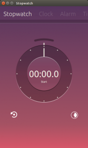

Platform guides - acceptance testing
====================================

This guide provides a model for automating functional or acceptance
tests in a sustainable way, independently from the language or tools
used.

Automating user acceptance testing
----------------------------------

Automated testing of an application through the Graphical User Interface
(GUI) is inherently fragile. The associated test suite requires regular
review and attention during the development cycle. This is known as
**Interface Sensitivity** –*even minor changes to the interface can
cause tests to fail*, quoting `xUnit test
patterns <http://xunitpatterns.com/>`__).

Also they are slow and they exercise too many components, some of which
are not under our control. That's why Test-Driven Development is instead
done with isolated and fast `unit
tests <../../apps/qml/tutorials-qml-unit-testing.md>`__ that are not
coupled to the GUI.

Yet after we run the automated unit tests that don't depend on the
design of the GUI we have to run **User Acceptance Tests (UAT)**. These
tests verify the integration of all the layers of the system and
external dependencies. If these tests are not automated, these testing
sessions will be manual, formal, repetitive, tedious, error-prone and
time-consuming.

Manual testing becomes unsustainable as the system under test grows in
breadth and complexity. Utilizing the page-object pattern alleviates
some of the problems stemming from this fragility, allowing us to do
automated user acceptance testing in a sustainable manner.

    “ The page object pattern enables automated User Acceptance Testing
    in a sustainable manner. ”

Introducing the Page Object Pattern
-----------------------------------

The **Page Object Pattern** comes from the
`Seleniumcommunity <https://github.com/SeleniumHQ/selenium/wiki/PageObjects>`__
and is the best way to turn a flaky and unmaintainable UAT into a stable
and useful part of your release process.

-  **A page** is what's visible on the screen at a single moment.
-  **A user story** consists of a user moving from page to page until
   they achieve their goal.

So we try to model the pages as objects following these guidelines:

1. The public methods represent the services that the page offers.
2. Try not to expose the internals of the page.
3. Methods return other PageObjects.
4. Generally don't make assertions.
5. Objects need not represent the entire page.
6. Different results for the same action are modelled as different
   methods.

Let's take the page objects of the `Ubuntu
ClockApp <http://bazaar.launchpad.net/~ubuntu-clock-dev/ubuntu-clock-app/utopic-3.0/view/head:/tests/autopilot/ubuntu_clock_app/emulators.py>`__
as an example, with some simplifications.

This application is written in QML and Javascript using the Ubuntu SDK;
the tests are written in Python using
`Autopilot <http://developer.ubuntu.com/api/devel/ubuntu-14.04/autopilot/tutorial/what_is_autopilot.html>`__
as the tool to simulate user actions through the GUI.

The public methods represent the services that the page offers.
~~~~~~~~~~~~~~~~~~~~~~~~~~~~~~~~~~~~~~~~~~~~~~~~~~~~~~~~~~~~~~~

This application has a stopwatch page that lets users measure elapsed
time. It offers services to start, stop and reset the watch, so we start
by defining the stop watch page object as follows:

.. code:: python

    class Stopwatch(object):
        def start(self):
            raise NotImplementedError()
        def stop(self):
            raise NotImplementedError()
        def reset(self):
            raise NotImplementedError()

Try not to expose the internals of the page.
~~~~~~~~~~~~~~~~~~~~~~~~~~~~~~~~~~~~~~~~~~~~

The internals of the page are more likely to change than the services it
offers. A stopwatch will keep the same three services we defined above
even if the whole design changes.

In this case, we reset the stop watch by clicking a button on the
bottom-left of the window, but we hide that as an implementation detail
behind the public methods.

On Python, we can indicate that a method is for internal use only by
adding a single leading underscore to its name. So, lets implement the
reset\_stopwatch method:

.. code:: python

    def reset(self):
        self._click_reset_button()
    def _click_reset_button(self):
        reset_button = self.wait_select_single(
            'ImageButton', objectName='resetButton')
        self.pointing_device.click_object(reset_button)

Now if the designers go crazy and decide that it's better to reset the
stop watch in a different way, we will have to make the change only in
one place to keep all the tests working.

Remember that this type of tests has Interface Sensitivity, that's
unavoidable; but we can reduce the impact of interface changes with
proper encapsulation and turn these tests into a useful way to verify
that a change in the GUI didn't introduce any regressions.

Methods return other PageObjects
~~~~~~~~~~~~~~~~~~~~~~~~~~~~~~~~

An UAT checks a user story. It will involve the journey of the user
through the system, so he will move from one page to another. Lets take
a look at how a journey to reset the stop watch will look like:

.. code:: python

    stopwatch = clock_page.open_stopwatch()
    stopwatch.start()
    stopwatch.reset()

In our sample application, the first page that the user will encounter
is the Clock. One of the things the user can do from this page is to
open the stopwatch page, so we model that as a service that the Clock
page provides.

Then return the new page object that will be visible to the user after
completing that step.

.. code:: python

    class Clock(object):
        def open_stopwatch(self):
            self._switch_to_tab('StopwatchTab')
            return self.wait_select_single(Stopwatch)

Now the return value of open\_stopwatch will make available to the
caller all the available services that the stopwatch exposes to the
user. Thus it can be chained as a user journey from one page to the
other.

Generally don't make assertions
~~~~~~~~~~~~~~~~~~~~~~~~~~~~~~~

A well written user acceptance test consists of a sequence of steps or
user actions and ends with one single assertion that verifies that the
user achieved their goal.

The page objects are the helpers for the user actions part of the test,
so it's better to leave the check for success out of them. With that in
mind, a test for the reset of the stopwatch would look like this:

.. code:: python

    def test_restart_button_must_restart_stopwatch_time(self):
        # Set up.
        stopwatch = self.clock_page.open_stopwatch()
        stopwatch.start()
        stopwatch.reset_stopwatch()
        # Check that the stopwatch has been reset.
        self.assertThat(
            stopwatch.get_time,
            Eventually(Equals('00:00.0')))

We have to add a new method to the stopwatch page object: get\_time. But
it only returns the state of the GUI as the user sees it. We leave in
the test method the assertion that checks it's the expected value.

.. code:: python

    class Stopwatch(object):
        # ...
        def get_time(self):
            return self.wait_select_single(
                'Label', objectName='time').text

Need not represent an entire page
~~~~~~~~~~~~~~~~~~~~~~~~~~~~~~~~~

The objects we are modeling here can just represent a part of the page.
Then we build the entire page that the user is seeing by composition of
page parts. This way we can reuse test code for parts of the GUI that
are reused in the application or between different applications.

As an example, take the ``_switch_to_tab('StopwatchTab')`` method that
we are using to open the stopwatch page. The Clock application is using
the Header component provided by the Ubuntu SDK, as all the other Ubuntu
applications are doing too. So, the Ubuntu SDK also provides helpers to
make it easier the user acceptance testing of the applications, and you
will find an object like this:

.. code:: python

    class Header(object):
        def switch_to_tab(tab_object_name):
            """Open a tab.                                                          
            :parameter tab_object_name: The tab's QML objectName property         
            :return: The newly opened tab.                                          
            :raise ToolkitException: If there is no tab with that object    
                name.                                                               
            """
        # ...

This object just represents the header of the page, and inside the
object we define the services that the header provides to the users. If
you dig into the full implementation of the Clock test class you will
find that in order to open the stopwatch page we end up calling Header
methods.

Different results for the same action are modeled as different methods
~~~~~~~~~~~~~~~~~~~~~~~~~~~~~~~~~~~~~~~~~~~~~~~~~~~~~~~~~~~~~~~~~~~~~~

According to guideline #3 we are returning page objects every time that
a user action opens the option for new actions to execute.

Sometimes the same action has different results depending on the context
or the values used for the action. For example, the Clock app has an
Alarm page. In this page you can add new alarms, but if you try to add
an alarm for sometime in the past, it will result in an error. So, we
will have two different tests that will look something like this:

.. code:: python

    def test_add_alarm_for_tomorrow_must_add_to_alarm_list(self):
        tomorrow = ...
        test_alarm_name = 'Test alarm for tomorrow'
        alarm_page = self.alarm_page.add_alarm(
            test_alarm_name, tomorrow)
        saved_alarms = alarm_page.get_saved_alarms()
        self.assertIn(
            (test_alarm_name, tomorrow),
            saved_alarms)
    def test_add_alarm_for_earlier_today_must_display_error(self):
        earlier_today = ...
        test_alarm_name = 'Test alarm for earlier_today'
        error_dialog = self.alarm_page.add_alarm_with_error(
            test_alarm_name, earlier_today)
        self.assertEqual(
            error_dialog.text,
            'Please select a time in the future.')

Take a look at the methods ``add_alarm`` and ``add_alarm_with_error``.
The first one returns the Alarm page again, where the user can continue
his journey or finish the test checking the result. The second one
returns the error dialog that's expected when you try to add an alarm
with the wrong values.

Conclusion
----------

User Acceptance Tests are fragile, but if we write them carefully
following the Page Object Pattern we can have a stable automated test
suite to run on every new release.

On Ubuntu we can then use the time we save in formal manual tests to run
a richer session of Exploratory Tests and to automate more user stories.
