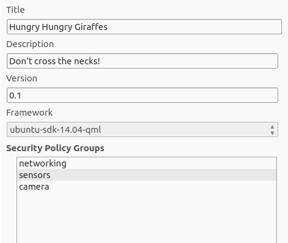
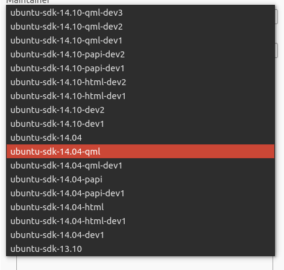

Platform guides - frameworks
============================

Frameworks are contracts between applications and the platform: a list
of APIs and libraries your application can use. Their role is to ensure
that your app is compatible with Ubuntu devices. Since Ubuntu 13.10,
several frameworks were made available and each new version of Ubuntu
brings updated ones. You should know which one to use depending on which
language your application is built in, this is the focus of this
article.

A framework for each supported language
~~~~~~~~~~~~~~~~~~~~~~~~~~~~~~~~~~~~~~~

When you develop an application, the SDK allows you to pick which
framework you want to use. It’s a one-click step that should be very
straightforward. Note that in most cases, the SDK will automatically
pick the right one for you. For example, Ubuntu 14.04 provides all
frameworks available in the previous version and the following new
frameworks :

-  ``ubuntu-sdk-14.04-qml``, for QML applications
-  ``ubuntu-sdk-14.04-html``, for HTML5/Cordova applications
-  ``ubuntu-sdk-14.04-papi``, for C/C++ applications
-  ``ubuntu-sdk-14.04``, a meta-framework containing all the other ones.
   If you are unsure about which framework to use, use this one

These screenshots show the framework picker in the “Publish” page of the
SDK and the complete list of available frameworks.

Which framework version to target?
~~~~~~~~~~~~~~~~~~~~~~~~~~~~~~~~~~

When a new framework version is available, you don’t necessarily have to
update your application to use it: successive framework versions coexist
on Ubuntu devices and older ones will be supported as long as possible.
Nevertheless, newer frameworks provide more features and enhanced
performances for existing APIs.

**Changes between versions**
^^^^^^^^^^^^^^^^^^^^^^^^^^^^

You can find the list of supported APIs for the latest stable frameworks
and the ones being currently worked on, in the
`QML <../../apps/qml/index.md>`__ and
`HTML5 <../../apps/html-5/index.md>`__ API docs. Note that a command
line tool to list all changes between versions of a framework is coming
soon.

**Target a framework newer than the version of Ubuntu you are running**
^^^^^^^^^^^^^^^^^^^^^^^^^^^^^^^^^^^^^^^^^^^^^^^^^^^^^^^^^^^^^^^^^^^^^^^

The SDK allows you to run your app with any framework, regardless of
your development environment and version of Ubuntu. See the “Device
kits” section of `Running apps from the
SDK <../../platform/sdk/tutorials-running-apps-from-the-sdk.md>`__.

Going further
~~~~~~~~~~~~~

Now that you are familiar with frameworks, you should probably read
another short article on `Security Policy
Groups <https://developer.ubuntu.com/en/publish/security-policy-groups/>`__.
Another piece of the platform that defines what your application is
allowed to do and the many ways you can bring more features and security
to your users. For an in-depth look at frameworks, you can read the
complete `documentation <https://wiki.ubuntu.com/Click/Frameworks>`__.
