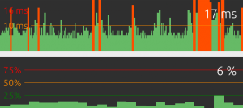
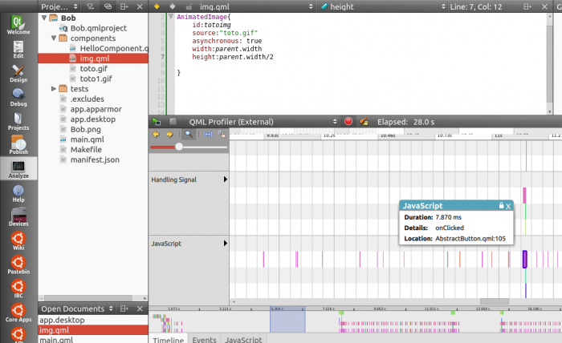
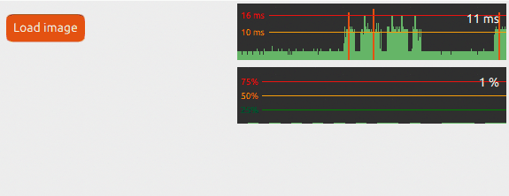
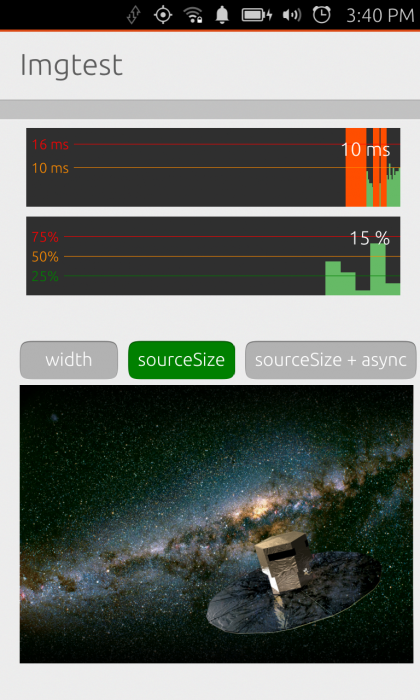
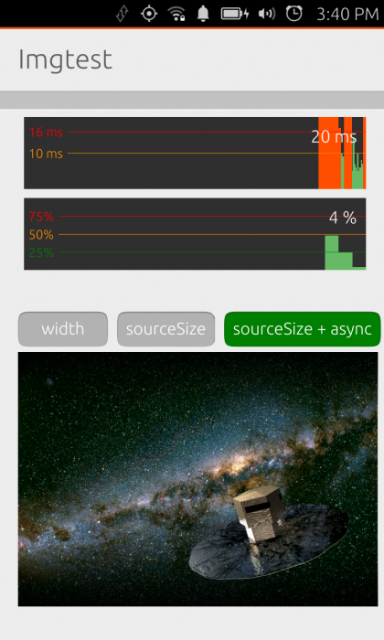

Platform guides - performance
=============================

The SDK and Unity teams are constantly looking for ways to improve the
overall performance and battery life of Ubuntu. Your app should be
written in the same spirit: lightweight and fast.

This article will show you how to measure performance in your QML app
and give you some tips on common pitfalls and resource hogs.

Measuring: how does my app perform?
-----------------------------------

Let’s start with an important truth: if you want your animations and
transitions to look natural and smooth, your application will need to
render each frame in less than 16ms (~60fps).

This can be a challenge if you are trying to do many things at the same
time. The good news is: the SDK gives you tools to measure and track the
cause of your slow-downs.

Meet the Performance overlay
~~~~~~~~~~~~~~~~~~~~~~~~~~~~

Adding the performance overlay to your application will help you see if
it’s slower than it should:

import Ubuntu.PerformanceMetrics 0.1 PerformanceOverlay { active: true }

You now have a new piece of UI floating above your app, don’t worry you
can move it around. The top pane of the overlay shows the frame
rendering time, the CPU usage is at the bottom.

Interact with your app and perform common actions… Each time you end up
in the red, there is something you need to optimize! (like this app that
obviously needs more work before being released…)

Profiler
~~~~~~~~

When you have identified an issue, but are not sure which part of your
code is causing it, the profiler is a fantastic tool to show you what’s
going wrong:

-  Go to the “Analyze” pane of the SDK and start your application from
   it.
-  Reproduce the problematic event
-  Stop the application and wait for the profile to load

For each event, it provides creating and painting time, javascript
functions and specific QML objects performance.

Best practices for optimum performance
--------------------------------------

Metrics will help you identify the performance bottlenecks and fix them,
but following best practices will help you avoiding them in the first
place. Here are some tips.

Stay available
~~~~~~~~~~~~~~

-  **Make long-running tasks asynchronous.** To keep your app responsive
   and available at all times, make sure long running or potentially
   blocking events are handled asynchronously. A high CPU usage can
   often **delay** the rendering of your app.
-  **Make your app start fast**. This seems obvious, but to improve
   loading time, **only load the bare minimum at startup**. For that,
   you are going to use and love Loaders, which we are going to talk
   about in a moment…

Divide your UI into multiple QML files
~~~~~~~~~~~~~~~~~~~~~~~~~~~~~~~~~~~~~~

**Avoid using one large QML file.** Think object-oriented and put each
logical entity in a separate file you will import in your main scene.
This is necessary to unload components when you don’t need them anymore.

Use Loaders
~~~~~~~~~~~

**Use Loaders to dynamically load and unload UI components**. They will
dramatically lower the CPU usage of your app.

To load a component, set the source of your loader to the qml file you
need, for example :

Item { width: 200; height: 200 Loader { id: pageLoader } MouseArea {
anchors.fill: parent onClicked: pageLoader.source = "Page1.qml" } }

To unload the component, simply set pageLoader.source to an empty
string.

Below, you can see how *hiding* a GIF keeps consuming CPU as opposed to
unloading it.

To learn more about it, have a look at the `Loaders
documentation <http://qt-project.org/doc/qt-5/qml-qtquick-loader.html>`__.

Common resource hogs
--------------------

Complexity in code is often the cost of great apps, but keep in mind
that something that is going to be repeated often needs to be cheap to
execute. Splitting your code into logical blocks in independent QML
files is a good way to keep track of complex and expensive components.

Images
~~~~~~

They are often the greatest memory hogs, let’s see how to handle them:

-  **Avoid scaling and resizing images**. Don’t hesitate to use multiple
   sizes of your assets and declare their exact dimensions.
-  **Load large images asynchronously**, the UI will stay responsive
   while loading them. Note that this is only needed for local
   resources, network images are always lazy-loaded.

::

    Image {
        source: “largefile.jpg”
        asynchronous: true
    }

-  **Use sourceSize for large files**: it will define the number of
   pixels to be stored in memory. A large image displayed at a smaller
   size using its sourceSize property will effectively use the memory of
   the smaller display size.

::

    Image {
        source: “largefile.jpg”
        sourceSize: { width: 100; height: 100 }
        asynchronous: true
    }

Here is a small test app showing CPU usage on a Nexus4 with various
image loading parameters (35%, 15% and 4%):

.. figure:: ../../../media/perf_img1-420x700.png
   :alt: 

-  **Avoid enabling the smooth**\ \*\* property of images while
   animating them\*\*. If you really need to smooth an image, you can
   turn smoothing off before the animation and add it back when the
   animation is over.
-  **Prefer bitmaps.** This is a sad fact of life, but vectors will load
   slower than bitmaps.
-  **Don’t clip a rotated image.** Clipping is very useful to draw
   boundaries in your UI, but when you apply it to modified images, it
   becomes very expensive.

Overdraws
~~~~~~~~~

You should always try to prevent painting the same area of your UI
several times.

-  **Remove hidden components.** If several parts of your UI are
   overlapping, try to unload or remove hidden and useless components.
-  **Prefer Item to Rectangle.** A common mistake is to use a Rectangle
   component as a standard UI element holder, if you don’t need an
   actual rectangle background, you should probably use an Item instead.

Going further
-------------

You can find more QML tips in the `Qt
doc <http://qt-project.org/wiki/Performance_tip_Images>`__ and at
`AskUbuntu <http://askubuntu.com/questions/tagged/qml>`__.

If you are blocked on a performance issue, come on Freenode IRC and ask
the friendly developer community in the `#ubuntu-app-devel
channel <http://webchat.freenode.net/?channels=ubuntu-app-devel>`__.
