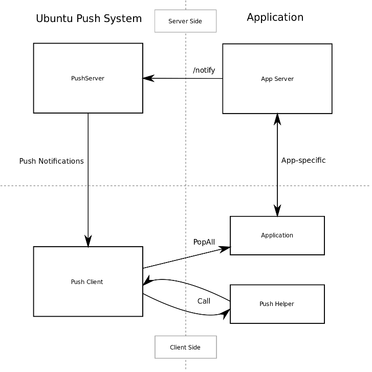

Platform guides - client push notifications
===========================================

This document describes how to use the Ubuntu Push Client service from
the point of view of a developer writing a QML-based application.

Let's describe the push system by way of an example.

Alice has written a chat application called Chatter. Using it, Bob can
send messages to Carol and vice-versa. Alice has a web application for
it, so the way it works now is that Bob connects to the service, posts a
message, and when Carol connects, she gets it. If Carol leaves the
browser window open, it beeps when messages arrive.

Now Alice wants to create an Ubuntu Touch app for Chatter, so she
implements the same architecture using a client that does the same thing
as the web browser. Sadly, since applications on Ubuntu Touch don't run
continuously, messages are only delivered when Carol opens the app, and
the user experience suffers.

Using the Ubuntu Push Server, this problem is alleviated: the Chatter
server will deliver the messages to the Ubuntu Push Server, which in
turn will send it in an efficient manner to the Ubuntu Push Client
running in Bob and Carol's devices. The user sees a notification (all
without starting the app) and then can launch it if he's interested in
reading messages at that point.

Since the app is not started and messages are delivered
opportunistically, this is both battery and bandwidth-efficient.

The Ubuntu Push system provides:

-  A push server which receives **push messages** from the app servers,
   queues them and delivers them efficiently to the devices.
-  A push client which receives those messages, queues messages to the
   app and displays notifications to the user

The full lifecycle of a push message is:

1. Created in a application-specific server
2. Sent to the Ubuntu Push server, targeted at a user or user+device
   pair
3. Delivered to one or more Ubuntu devices
4. Passed through the application helper for processing
5. Notification displayed to the user (via different mechanisms)
6. Application Message queued for the app's use

If the user interacts with the notification, the application is launched
and should check its queue for messages it has to process.

For the app developer, there are several components needed:

-  A server that sends the **push messages** to the Ubuntu Push server
-  Support in the client app for registering with the Ubuntu Push client
-  Support in the client app to react to **notifications** displayed to
   the user and process **application messages**
-  A helper program with application-specific knowledge that transforms
   **push messages** as needed.

In the following sections, we'll see how to implement all the client
side parts. For the application server, see the Ubuntu Push Server API
section

The PushClient component
------------------------

Example:

::

    import Ubuntu.PushNotifications 0.1
    PushClient {
        id: pushClient
        Component.onCompleted: {
            notificationsChanged.connect(messageList.handle_notifications)
            error.connect(messageList.handle_error)
        }
        appId: "com.ubuntu.developer.push.hello_hello"
    }

Registration: the appId and token properties
~~~~~~~~~~~~~~~~~~~~~~~~~~~~~~~~~~~~~~~~~~~~

To register with the push system and start receiving notifications, set
the appId property to your application's APP\_ID, with or without
version number. For this to succeed the user **must** have an Ubuntu One
account configured in the device.

The APP\_ID is as described in the
`ApplicationIddocumentation <https://wiki.ubuntu.com/AppStore/Interfaces/ApplicationId>`__
except that the version is treated as optional. Therefore both
``com.ubuntu.music_music`` and ``com.ubuntu.music_music_1.3.496`` are
valid. Keep in mind that while both versioned and un-versioned APP\_IDs
are valid, they are still different and will affect which notifications
are delivered to the application. Un-versioned IDs mean the token will
be the same after updates and the application will receive old
notifications, while versioned IDs mean the app needs to explicitly ask
to get older messages delivered.

Setting the same appId more than once has no effect.

After you are registered, if no error occurs, the PushClient will have a
value set in its token property which uniquely identifies the
user+device combination.

Receiving notifications
~~~~~~~~~~~~~~~~~~~~~~~

When a notification is received by the Push Client, it will be delivered
to your application's push helper, and then placed in your application's
mailbox. At that point, the PushClient will emit the
``notificationsChanged(QStringList)`` signal containing your messages.
You should probably connect to that signal and handle those messages.

Because of the application's lifecycle, there is no guarantee that it
will be running when the signal is emitted. For that reason, apps should
check for pending notifications whenever they are activated or started.
To do that, use the ``getNotifications()`` slot. Triggering that slot
will fetch notifications and trigger the
``notificationsChanged(QStringList)`` signal.

Error handling
~~~~~~~~~~~~~~

Whenever PushClient suffers an error, it will emit the
``error(QString)`` signal with the error message.

Persistent notification management
~~~~~~~~~~~~~~~~~~~~~~~~~~~~~~~~~~

Some notifications are persistent, meaning that, after they are
presented, they don't disappear automatically. This API allows the app
to manage that type of notifications.

On each notification there's an optional tag field, used for this
purpose.

The persistent property of PushClient contains the list of the tags of
notifications with the "persist" element set to true that are visible to
the user right now.

The void ``clearPersistent(QStringList tags)`` method clears persistent
notifications for that app marked by tags. If no tag is given, match
all.

The count property sets the counter in the application's icon to the
given value.

Application helpers
-------------------

The payload delivered to push-client will be passed onto a helper
program that can modify it as needed before passing it onto the postal
service (see the helper output format).

The helper receives two arguments ``infile`` and ``outfile``. The
message is delivered via ``infile`` and the transformed version is
placed in ``outfile``.

This is the simplest possible useful helper, which simply passes the
message through unchanged:

.. code:: python

    #!/usr/bin/python3
    import sys
    f1, f2 = sys.argv[1:3]
    open(f2, "w").write(open(f1).read())

Helpers need to be added to the click package manifest:

::

    {
        "name": "com.ubuntu.developer.ralsina.hello",
        "description": "description of hello",
        "framework": "ubuntu-sdk-14.10-qml-dev2",
        "architecture": "all",
        "title": "hello",
        "hooks": {
            "hello": {
                "apparmor": "hello.json",
                "desktop": "hello.desktop"
            },
            "helloHelper": {
                "apparmor": "helloHelper-apparmor.json",
                "push-helper": "helloHelper.json"
            }
        },
        "version": "0.2",
        "maintainer": "Roberto Alsina <roberto.alsina@canonical.com>"
    }

Here, we created a helloHelper entry in hooks that has an apparmor
profile and an additional JSON file for the push-helper hook.

``helloHelper-apparmor.json`` must contain **only** the
push-notification-client policy group:

::

    {
        "policy_groups": [
            "push-notification-client"
        ],
        "policy_version": 1.2
    }

And ``helloHelper.json`` must have at least a exec key with the path to
the helper executable relative to the json, and optionally an app\_id
key containing the short id of one of the apps in the package (in the
format ``packagename_appname`` without a version). If the app\_id is not
specified, the helper will be used for all apps in the package:

::

    {
        "exec": "helloHelper",
        "app_id": "com.ubuntu.developer.ralsina.hello_hello"
    }

**Note**: For deb packages, helpers should be installed into
``/usr/lib/ubuntu-push- client/legacy-helpers/`` as part of the package.

Helper output format
--------------------

Helpers output has two parts, the postal message (in the "message" key)
and a notification to be presented to the user (in the "notification"
key).

Here's a simple example:

::

    {
        "message": "foobar",
        "notification": {
            "tag": "foo",
            "card": {
                "summary": "yes",
                "body": "hello",
                "popup": true,
                "persist": true,
                "timestamp": 1407160197
            }
            "sound": "buzz.mp3",
            "vibrate": {
                "pattern": [200, 100],
                "repeat": 2
            }
            "emblem-counter": {
                "count": 12,
                "visible": true
            }
        }
    }

The notification can contain a **tag** field, which can later be used by
the persistent notification management API.

**Note**: This format **will** change with future versions of the SDK
and it **may** be incompatible.

-  **message**: (optional) A JSON object that is passed as-is to the
   application via PopAll.
-  **notification**: (optional) Describes the user-facing notifications
   triggered by this push message.

The notification can contain a **card**. A card describes a specific
notification to be given to the user, and has the following fields:

-  **summary**: (required) a title. The card will not be presented if
   this is missing.
-  **body**: longer text, defaults to empty.
-  **actions**: If empty (the default), a bubble notification is
   non-clickable. If you add a URL, then bubble notifications are
   clickable and launch that URL. One use for this is using a URL like
   ``appid://com.ubuntu.developer.ralsina.hello/hello/current-user-version``
   which will switch to the app or launch it if it's not running. See
   the `URLDispatcher
   guide <https://developer.ubuntu.com/en/apps/platform/guides/url-dispatcher-guide/>`__
   for more information.
-  **icon**: An icon relating to the event being notified. Defaults to
   empty (no icon); a secondary icon relating to the application will be
   shown as well, regardless of this field.
-  **timestamp**: Seconds since the unix epoch, only used for persist
   (for now). If zero or unset, defaults to current timestamp.
-  **persist**: Whether to show in notification centre; defaults to
   false
-  **popup**: Whether to show in a bubble. Users can disable this, and
   can easily miss them, so don't rely on it exclusively. Defaults to
   false.

The notification can contain a **sound** field. This is either a boolean
(play a predetermined sound) or the path to a sound file. The user can
disable it, so don't rely on it exclusively. Defaults to empty (no
sound). The path is relative, and will be looked up in (a) the
application's ``.local/share/<pkgname>``, and (b) standard xdg dirs.

The notification can contain a **vibrate** field, causing haptic
feedback, which can be either a boolean (if true, vibrate a
predetermined way) or an object that has the following content:

**Note**: Keep in mind that the precise way in which each field is
presented to the user depends on factors such as whether it's shown as a
bubble or in the notification centre, or even the version of Ubuntu
Touch the user has on their device.

-  **pattern**: a list of integers describing a vibration pattern
   (duration of alternating vibration/no vibration times, in
   milliseconds).
-  **repeat**: number of times the pattern has to be repeated (defaults
   to 1, 0 is the same as 1).

The notification can contain a **emblem-counter** field, with the
following content:

-  **count**: a number to be displayed over the application's icon in
   the launcher.
-  **visible**: set to true to show the counter, or false to hide it.

**Note**: Unlike other notifications, ``emblem-counter`` needs to be
cleaned by the app itself. Please see the persistent notification
management section.

Security
--------

To use the push API, applications need to request permission in their
security profile, using something like this:

::

    {
        "policy_groups": [
            "networking",
            "push-notification-client"
        ],
        "policy_version": 1.2
    }

Ubuntu Push Server API
----------------------

The Ubuntu Push server is located at https://push.ubuntu.com and has a
single endpoint: /notify. To notify a user, your application has to do a
POST with Content- type: application/json.

Here is an example of the POST body using all the fields:

::

    {
        "appid": "com.ubuntu.music_music",
        "expire_on": "2014-10-08T14:48:00.000Z",
        "token": "LeA4tRQG9hhEkuhngdouoA==",
        "clear_pending": true,
        "replace_tag": "tagname",
        "data": {
            "id": 43578,
            "timestamp": 1409583746,
            "serial": 1254,
            "sender": "Joe",
            "snippet": "Hi there!"
        }
    }

**Note**: The contents of the data field are arbitrary. They should be
enough for your helper to build a notification using it, and decide
whether it should be displayed or not. Keep in mind that this will be
processed by more than one version of the helper, because the user may
be using an older version of your app.

-  **appid**: ID of the application that will receive the notification,
   as described in the client side documentation.
-  **expire\_on**: Expiration date/time for this message, in `ISO8601
   Extendendformat <http://en.wikipedia.org/wiki/ISO_8601>`__
-  **token**: The token identifying the user+device to which the message
   is directed, as described in the client side documentation.
-  **clear\_pending**: Discards all previous pending notifications.
   Usually in response to getting a "too-many-pending" error.
-  **replace\_tag**: If there's a pending notification with the same
   tag, delete it before queuing this new one.
-  **data**: A JSON object.
