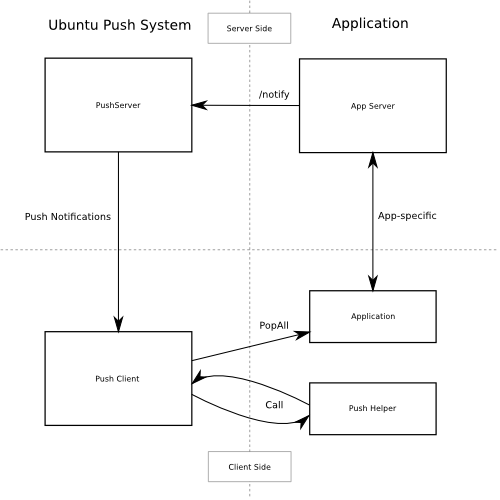

Platform guides - server push notifications
===========================================

This document describes how to use the Ubuntu Push Client service from a
platform integrator's point of view. Application developers are expected
to use a much simpler API, in turn based on the lower-level API
described here.

The expected audience for this document is, therefore, either platform
developers, or application developers who, for whatever reason, can't
use or prefer not to use the available higher level APIs.

An example
----------

Let's describe the push system by way of an example.

Alice has written a chat application called Chatter. Using it, Bob can
send messages to Carol and vice-versa. Alice has a web application for
it, so the way it works now is that Bob connects to the service, posts a
message, and when Carol connects, she gets it. If Carol leaves the
browser window open, it beeps when messages arrive.

Now Alice wants to create an Ubuntu app for Chatter, so she implements
the same architecture using a client that does the same thing as the web
browser. Sadly, since applications on Ubuntu for devices don't run
continuously, messages are only delivered when Carol opens the app, and
the user experience suffers.

Using the Ubuntu Push Server, this problem is alleviated: the Chatter
server will deliver the messages to the Ubuntu Push Server, which in
turn will send it in an efficient manner to the Ubuntu Push Client
running in Bob and Carol's devices. The user sees a notification (all
without starting the app) and then can launch it if he's interested in
reading messages at that point.

Since the app is not started and messages are delivered
opportunistically, this is both battery and bandwidth-efficient.

   Push Notifications diagram

The Ubuntu Push system provides:

-  A push server which receives **push messages** from the app servers,
   queues them and delivers them efficiently to the devices.
-  A push client which receives those messages, queues messages to the
   app and displays notifications to the user

The full lifecycle of a push message is:

-  Created in a application-specific server
-  Sent to the Ubuntu Push server, targeted at a user or user+device
   pair
-  Delivered to one or more Ubuntu devices
-  Passed through the application helper for processing
-  Notification displayed to the user (via different mechanisms)
-  Application Message queued for the app's use

If the user interacts with the notification, the application is launched
and should check its queue for messages it has to process.

For the app developer, there are several components needed:

-  A server that sends the **push messages** to the Ubuntu Push server
-  Support in the client app for registering with the Ubuntu Push client
-  Support in the client app to react to **notifications** displayed to
   the user and process **application messages**
-  A helper program with application-specific knowledge that transforms
   **push messages** as needed.

In the following sections, we'll see how to implement all the client
side parts. For the application server, see the Ubuntu Push Server API
section

The PushNotifications Service
=============================

-  **Service**: ``com.ubuntu.PushNotifications``
-  **Object path**: ``/com/ubuntu/PushNotifications/QUOTED_PKGNAME``

The PushNotifications service handles registering the device with the
Ubuntu Push service to enable delivery of messages to it.

Each Ubuntu package has to use a separate object path for security
reasons, that's why the object path includes ``QUOTED_PKGNAME``. For
example, in the case of the music application, the package name is
com.ubuntu.music and ``QUOTED_PKGNAME`` is ``com_2eubuntu_2emusic``.
Everything that is not a letter or digit has to be quoted as ``_XX``
where ``XX`` are the hex digits of the character. In practice, this
means replacing "." with ``_2e`` and ``-`` with ``_2f``

**Note**: For applications that are not installed as part of click
packages, the ``QUOTED_PKGNAME`` is ``_`` and the ``APP_ID`` when
required is ``_PACKAGENAME``.

For example, for ubuntu-system-settins:

-  ``QUOTED_PKGNAME`` is ``_``
-  ``APP_ID`` is ``_ubuntu-system-settings``

com.ubuntu.PushNotifications.Register
-------------------------------------

``string Register(string APP_ID)``

Example:

::

    $ gdbus call --session --dest com.ubuntu.PushNotifications --object-path /com/ubuntu/PushNotifications/com_2eubuntu_2emusic \
      --method com.ubuntu.PushNotifications.Register com.ubuntu.music_music
      ('LeA4tRQG9hhEkuhngdouoA==',)

The Register method takes as argument the ``APP_ID`` (in the example,
``com.ubuntu.music_music``) and returns a token identifying the user and
device. For this to succeed the user **must** have an Ubuntu One account
configured in the device.

The ``APP_ID`` is as described in the
`ApplicationIddocumentation <https://wiki.ubuntu.com/AppStore/Interfaces/ApplicationId>`__
except that the version is treated as optional. Therefore both
``com.ubuntu.music_music`` and ``com.ubuntu.music_music_1.3.496`` are
valid. Keep in mind that while both versioned and un-versioned APP\_IDs
are valid, they are still different and will affect which notifications
are delivered to the application. Un-versioned IDs mean the token will
be the same after updates and the application will receive old
notifications, while versioned IDs mean the app needs to explicitly ask
to get older messages delivered.

Register is idempotent, and calling it multiple times returns the same
token.

This token is later used by the application server to indicate the
recipient of notifications.

**Note**: There is currently no way to send a push message to all of a
user's devices. The application server has to send to each registered
device individually instead.

com.ubuntu.PushNotifications.Unregister
---------------------------------------

``void Unregister(string APP_ID)``

Example:

::

    $ gdbus call --session --dest com.ubuntu.PushNotifications --object-path /com/ubuntu/PushNotifications/com_2eubuntu_2emusic \
      --method com.ubuntu.PushNotifications.Unregister com.ubuntu.music_music

The Unregister method invalidates the token obtained via Register
therefore disabling reception of push messages.

The method takes as argument the ``APP_ID`` (in the example,
``com.ubuntu.music_music``) and returns nothing.

The ``APP_ID`` is as described in the
`ApplicationIddocumentation <https://wiki.ubuntu.com/AppStore/Interfaces/ApplicationId>`__
except that the version is treated as optional. Therefore both
``com.ubuntu.music_music`` and ``com.ubuntu.music_music_1.3.496`` are
valid.

The Postal Service
==================

-  **Service**: ``com.ubuntu.Postal``
-  **Object path**: ``/com/ubuntu/Postal/QUOTED_PKGNAME``

The Postal service delivers the actual messages to the applications.
After the application is registered, the push client will begin
delivering messages to the device, which will then (possibly) cause
specific notifications to be presented to the user (message bubbles,
sounds, haptic feedbak, etc.) Regardless of whether the user
acknowledges those notifications or not, the payload of the push message
is put in the Postal service for the application to pick up.

Because user response to notifications can cause application activation,
apps should check the status of the Postal service every time the
application activates.

com.ubuntu.Postal.Post
----------------------

``void Post(string APP_ID, string message)``

Example:

::

    gdbus call --session --dest com.ubuntu.Postal --object-path /com/ubuntu/Postal/com_2eubuntu_2emusic \
     --method com.ubuntu.Postal.Post com.ubuntu.music_music \
     '"{\"message\": \"foobar\", \"notification\":{\"card\": {\"summary\": \"yes\", \"body\": \"hello\", \"popup\": true, \"persist\": true}}}"'

The arguments for the Post method are ``APP_ID`` (in the example,
``com.ubuntu.music_music``) and a JSON string describing a push message.

Depending on the contents of the push message it may trigger user-facing
notifications, and will queue a message for the app to get via the
PopAll method.

The ``APP_ID`` is as described in the
`ApplicationIddocumentation <https://wiki.ubuntu.com/AppStore/Interfaces/ApplicationId>`__
except that the version is treated as optional. Therefore both
``com.ubuntu.music_music`` and ``com.ubuntu.music_music_1.3.496`` are
valid.

**Note**: Post is useful as a unified front-end for notifications in
Ubuntu, since it wraps and abstracts several different APIs.

com.ubuntu.Postal.PopAll
------------------------

``array{string} PopAll(string APP_ID)``

Example:

::

    $ gdbus call --session --dest com.ubuntu.Postal --object-path /com/ubuntu/Postal/com_2eubuntu_2emusic \
      --method com.ubuntu.Postal.PopAll com.ubuntu.music_music
      (['{"foo": "bar", ....}'],)

The argument for the ``PopAll`` method is the ``APP_ID`` and it returns
a list of strings, each string being a separate postal message, the
"message" element of a helper's output fed from Post or from the Ubuntu
Push service,

Post Signal
-----------

``void Post(string APP_ID)``

Every time a notification is posted, the postal service will emit the
Post signal. Your app can connect to it to react to incoming
notifications if it's running when they arrive. Remember that on Ubuntu,
the application lifecycle means it will often **not** be running when
notifications arrive. If the application is in the foreground when a
notification arrives, the notification **will not** be presented.

The object path is similar to that of the Postal service methods,
containing the ``QUOTED_PKGNAME``.

Persistent Notification Management
----------------------------------

Some notifications are persistent, meaning they don't disappear
automatically. For those notifications, there is an API that allows the
app to manage them without having to know the underlying details of the
platform.

On each notification there's an optional tag field, used for this
purpose.

``array(string) ListPersistent(string APP_ID)``

Returns a list of the tags of notifications with the "persist" element
set to true that are visible to the user right now.

``void ClearPersistent(string APP_ID, [tag1, tag2,....])``

Clears persistent notifications for that app by tag(s). If none given,
match all.

``void SetCounter(string APP_ID, int count int, bool visible)``

Set the counter to the given values.

Application Helpers
===================

The payload delivered to push-client will be passed onto a helper
program that can modify it as needed before passing it onto the postal
service (see Helper Output Format).

The helper receives two arguments infile and outfile. The message is
delivered via infile and the transformed version is placed in outfile.

This is the simplest possible useful helper, which simply passes the
message through unchanged:

.. code:: python

    #!/usr/bin/python3
    import sys
    f1, f2 = sys.argv[1:3]
    open(f2, "w").write(open(f1).read())

Helpers need to be added to the click package manifest:

::

    {
            "name": "com.ubuntu.developer.ralsina.hello",
            "description": "description of hello",
            "framework": "ubuntu-sdk-14.10-qml-dev2",
            "architecture": "all",
            "title": "hello",
            "hooks": {
                    "hello": {
                            "apparmor": "hello.json",
                            "desktop": "hello.desktop"
                    },
                    "helloHelper": {
                            "apparmor": "helloHelper-apparmor.json",
                            "push-helper": "helloHelper.json"
                    }
            },
            "version": "0.2",
            "maintainer": "Roberto Alsina <roberto.alsina@canonical.com>"
    }

Here, we created a helloHelper entry in hooks that has an apparmor
profile and an additional JSON file for the push-helper hook.

``helloHelper-apparmor.json`` must contain **only** the
push-notification-client policy group:

::

    {
            "policy_groups": [
                    "push-notification-client"
            ],
            "policy_version": 1.2
    }

And ``helloHelper.json`` must have at least a exec key with the path to
the helper executable relative to the json, and optionally an app\_id
key containing the short id of one of the apps in the package (in the
format ``packagename_appname`` without a version). If the app\_id is not
specified, the helper will be used for all apps in the package:

::

    {
            "exec": "helloHelper",
            "app_id": "com.ubuntu.developer.ralsina.hello_hello"
    }

**Note**: For deb packages, helpers should be installed into
``/usr/lib/ubuntu-push- client/legacy-helpers/`` as part of the package.

Helper Output Format
====================

Helpers output has two parts, the postal message (in the "message" key)
and a notification to be presented to the user (in the "notification"
key).

Here's a simple example:

::

    {
            "message": "foobar",
            "notification": {
                    "tag": "foo",
                    "card": {
                            "summary": "yes",
                            "body": "hello",
                            "popup": true,
                            "persist": true
                    }
                    "sound": "buzz.mp3",
                    "vibrate": {
                            "pattern": [200, 100],
                            "duration": 200,
                            "repeat": 2
                    }
                    "emblem-counter": {
                            "count": 12,
                            "visible": true
                    }
            }
    }

The notification can contain a **tag** field, which can later be used by
the persistent notification management API.

-  **message**: (optional) A JSON object that is passed as-is to the
   application via PopAll.
-  **notification**: (optional) Describes the user-facing notifications
   triggered by this push message.

The notification can contain a **card**. A card describes a specific
notification to be given to the user, and has the following fields:

-  **summary**: (required) a title. The card will not be presented if
   this is missing.
-  **body**: longer text, defaults to empty.
-  **actions**: If empty (the default), a bubble notification is
   non-clickable. If you add a URL, then bubble notifications are
   clickable and launch that URL. One use for this is using a URL like
   ``appid://com.ubuntu.developer.ralsina.hello/hello/current-user-version``
   which will switch to the app or launch it if it's not running. See
   `URLDispatcher <https://wiki.ubuntu.com/URLDispatcher>`__ for more
   information.
-  **icon**: An icon relating to the event being notified. Defaults to
   empty (no icon); a secondary icon relating to the application will be
   shown as well, regardless of this field.
-  **timestamp**: Seconds since the unix epoch, only used for persist
   (for now)
-  **persist**: Whether to show in notification centre; defaults to
   false
-  **popup**: Whether to show in a bubble. Users can disable this, and
   can easily miss them, so don't rely on it exclusively. Defaults to
   false.

**Note**: Keep in mind that the precise way in which each field is
presented to the user depends on factors such as whether it's shown as a
bubble or in the notification centre, or even the version of Ubuntu the
user has on their device.

The notification can contain a **sound** field. This is the path to a
sound file. The user can disable it, so don't rely on it exclusively.
Defaults to empty (no sound). This is a relative path, and will be
looked up in (a) the application's ``.local/share/<pkgname>``, and (b)
standard xdg dirs.

The notification can contain a **vibrate** field, causing haptic
feedback, that has the following content:

-  **pattern**: a list of integers describing a vibration pattern.
-  **duration**: duration in milliseconds. Is equivalent to setting
   pattern to [duration], and overrides pattern.
-  **repeat**: number of times the pattern has to be repeated (defaults
   to 1, 0 is the same as 1).

The notification can contain a **emblem-counter** field, with the
following content:

-  **count**: a number to be displayed over the application's icon in
   the launcher.
-  **visible**: set to true to show the counter, or false to hide it.

**Note**: Unlike other notifications, ``emblem-counter`` needs to be
cleaned by the app itself. Please see the persistent notification
management section.

Security
--------

To use the push API, applications need to request permission in their
security profile, using something like this:

::

    {
            "policy_groups": [
                    "networking",
                    "push-notification-client"
            ],
            "policy_version": 1.2
    }

Ubuntu Push Server API
======================

The Ubuntu Push server is located at
`https://push.ubuntu.com <https://push.ubuntu.com/>`__ and has a single
endpoint: /notify. To notify a user, your application has to do a POST
with ``Content- type: application/json``.

Here is an example of the POST body using all the fields:

::

    {
            "appid": "com.ubuntu.music_music",
            "expire_on": "2014-10-08T14:48:00.000Z",
            "token": "LeA4tRQG9hhEkuhngdouoA==",
            "clear_pending": true,
            "replace_tag": "tagname",
            "data": {
                    "message": "foobar",
                    "notification": {
                            "card": {
                                    "summary": "yes",
                                    "body": "hello",
                                    "popup": true,
                                    "persist": true
                            }
                            "sound": "buzz.mp3",
                            "tag": "foo",
                            "vibrate": {
                                    "duration": 200,
                                    "pattern": [200, 100],
                                    "repeat": 2
                            }
                            "emblem-counter": {
                                    "count": 12,
                                    "visible": true
                            }
                    }
            }
    }

-  **appid**: ID of the application that will receive the notification,
   as described in the client side documentation.
-  **expire\_on**: Expiration date/time for this message, in `ISO8601
   Extendend format <http://en.wikipedia.org/wiki/ISO_8601>`__
-  **token**: The token identifying the user+device to which the message
   is directed, as described in the client side documentation.
-  **clear\_pending**: Discards all previous pending notifications.
   Usually in response to getting a "too-many-pending" error.
-  **replace\_tag**: If there's a pending notification with the same
   tag, delete it before queuing this new one.
-  **data**: A JSON object.

In this example, data is what a helper would output but that's not
necessarily the case. The content of the data field will be passed to
the helper application which **has** to produce output in that format.
