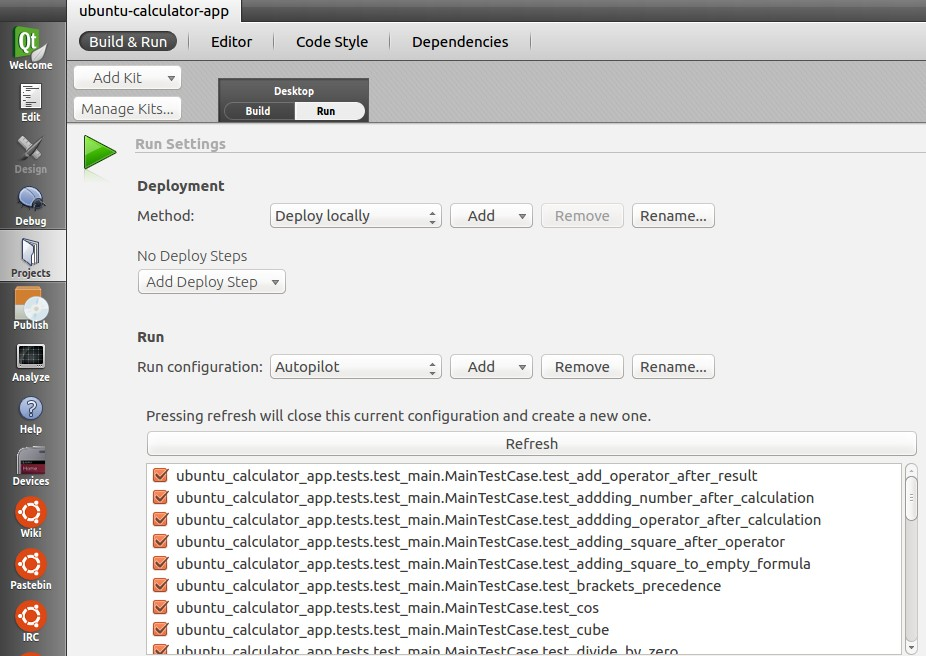
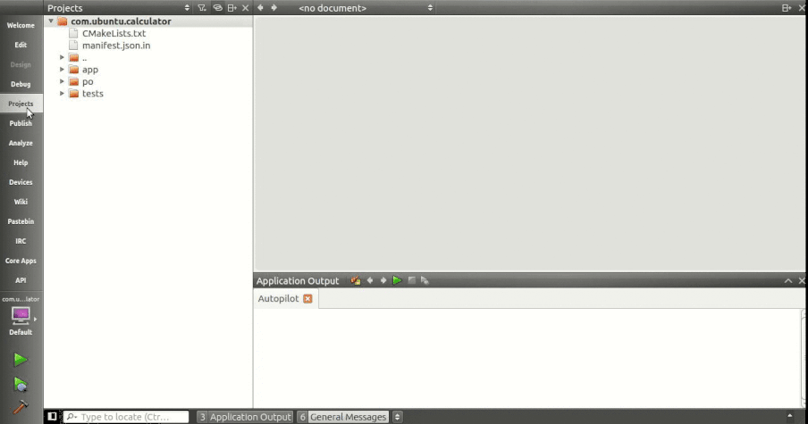

Platform guides - running autopilot tests
=========================================

Autopilot is a common tool of choice for writing acceptance tests for
applications developed with the Ubuntu SDK. This guide will cover the
different options available to you for running the autopilot test suite
for your applications. While the autopilot binary is also a testrunner,
there are some other tools to make it easier to run on the desktop and
the device. This guide assumes you are familiar with using `autopilot
testrunner <../../apps/api-autopilot-current/guides-running_ap.md>`__.

Running tests on the desktop
----------------------------

Using the Ubuntu SDK
~~~~~~~~~~~~~~~~~~~~

By utilizing the ubuntu SDK for development, it's easy to also run a
project's autopilot tests directly from inside the SDK. Be sure to
`follow the installation guide for the
SDK <../sdk/installing-the-sdk.md>`__ to ensure the SDK release ppa is
installed. Then install the autopilot plugin package.

``$ sudo apt-get update && sudo apt-get install qtcreator-plugin-autopilot``

Once installed, launch the SDK and open a project. Click the Projects
Tab, and Select Run to change the Run settings. Use the dropdown to
select the 'Autopilot' run configuration. It will display a list of
autopilot tests for the project.

Choose a specific test to run or run them all. When ready, launch the
tests as normal by pressing the run button. Your autopilot tests will
now run inside a separate window. You can watch there execution or
continue working. The results of the tests will be displayed in the
Application Output Console.

autopilot3-sandbox-run
~~~~~~~~~~~~~~~~~~~~~~

This tool ships with autopilot itself and was developed as a way to run
autopilot test suites on your desktop in a sane manner. If you have
autopilot, it's already installed. If not, make sure you `install
autopilotfirst <../../apps/api-autopilot-current/guides-installation.md>`__.
By default, autopilot will take control of your mouse and keyboard for
the test duration. This is not desirable in a desktop environment.
``autopilot3-sandbox-run`` allows you to run autopilot tests in a nested
xserver, thereby retaining control of your mouse and keyboard on the
desktop.

Run the ``autopilot3-sandbox-run`` command with ``--help`` to see all
the options available. By default, the tests will run in an Xvfb server,
all completely behind the scenes with the results being reported to you
upon completion. This is a great way to run tests with no interference
on your desktop. However, if you are a visual person like me, you may
instead wish to pass ``-X`` to enable the test runs to occur in a Xephyr
window allowing you to see what's happening, but still retaining control
of your mouse and keyboard.

Run tests without any UI

``autopilot3-sandbox-run my_testsuite_name``

I still want to see what's happening!

``autopilot3-sandbox-run -X my_testsuite_name``

Running tests on a phone
------------------------

autopkgtest
~~~~~~~~~~~

Autopkgtest is the easiest way to run your tests on device, especially
considering the device has a read-only image by default. Autopkgtest is
available in the archives, but running on the phone requires autopkgtest
3.8.1 or newer. This requires vivid or newer. **Please update you
installation of autopkgtest before testing.** **The best way to ensure
success is to `download the latest
deb <https://packages.debian.org/sid/all/autopkgtest/download>`__ and
install it**. The deb will cleanly install on Ubuntu 12.04 LTS and
newer. The included documentation `shows how to run
tests <https://people.debian.org/~mpitt/autopkgtest/README.running-tests.html>`__
for a lot of possible scenarios, but for touch specific tests these are
the most common use cases:

**Note**: Your device likely has a password. You should pass it via the
-p parameter\*\*. So, to run tests of an already installed click
package:

``adt-run --click com.ubuntu.calculator --- ssh -s adb -- -p 0000``

If you are working on your application and wish to run tests from a
local source directory be sure to pass the directory as the first
argument. Finally, you can also alternatively specify a path to a local
click package to test against, instead of a package name. For example,
this will run the tests inside ``my-source-code`` after installing
``my-click.click``.

``adt-run my-source-code/ my-click.click --- ssh -s adb -- -p 0000``

Should you happen to have more than once device connected, don't forget
to pass the serial along with the -s command.

``adt-run my-source-code/ my-click.click --- ssh -s adb -- -s 12345 -p 0000``

Caveats
~~~~~~~

If you test an older image, downloading the test dependencies sometimes
fails with "404 Not found". This is due to adt depending on the archive
being in sync with the packages present on the device. If the image is
very old, the packages and test dependencies at image build time are no
longer available in the archive. To work around this, you can prepend
``setup-commands`` ``ro-apt-update`` to your to command line arguments.

``adt-run --setup-commands ro-apt-update --click com.ubuntu.calculator --- ssh -s adb -- -p 0000``

This will temporarily switch the device to r/w for running apt-get
update, and then switch back to a read only image. This may allow the
testing to proceed; and you need only run apt-get update one time. If
you continue to get errors during test setup after trying this
workaround, there is nothing you can do. Instead, flash a more current
image in order to test.
