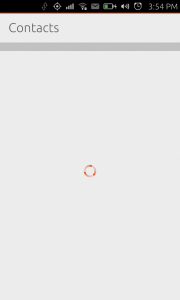

Platform guides - splash screens
================================

Ubuntu offers three kinds of splash screens for applications:

1. A splash with a gradient background, the application icon and
   application name (default)
2. A splash with a gradient background and an image
3. A splash faking a MainView with header text set giving the illusion
   that the application has started instantly but with its contents
   being shown later on.

Apps by default get option 1 and the gradient background is all black by
default as well. So nothing changes until you start adding the new
entries to the desktop file of your application. Those entries are the
following:

X-Ubuntu-Splash-Show-Header (boolean)
-------------------------------------

Whether an application header should be shown on the splash screen. It
turns on splash screen mode 3 (as described above). The header will
display the text in X-Ubuntu-Splash-Title, if defined, or the
application name otherwise.

X-Ubuntu-Splash-Title (text, to be localizable soon)
----------------------------------------------------

See ``X-Ubuntu-Splash-Show-Header`` above.

X-Ubuntu-Splash-Image (file name)
---------------------------------

File name of an image present in the directory stated in the Path entry.
The splash image is centered on the splash screen and displayed in its
actual size (ie, it's not stretched or shrunk and aspect ratio is kept).

X-Ubuntu-Splash-Color (color)
-----------------------------

Background color of the splash screen. It uses ``QColor::setNamedColor``
to parse a color value out of a text string. The see its documentation
for valid string formats and values. If ``X-Ubuntu-Splash-Show-Header``
is true, it defaults to the theme's background color, otherwise it
defaults to black.

X-Ubuntu-Splash-Color-Header (color)
------------------------------------

Background color used in the upper area of the splash screen (ie, its
header area). It uses ``QColor::setNamedColor`` to parse a color value
out of a text string. There will be a vertical gradient between
``X-Ubuntu-Splash-Color-Header`` and ``X-Ubuntu-Splash-Color`` in the
upper half of the splash background. By default it uses
``X-Ubuntu-Splash-Color`` (or its default value, if not set).

X-Ubuntu-Splash-Color-Footer (color)
------------------------------------

Background color used in the bottom area of the splash screen (ie, its
footer area). It uses ``QColor::setNamedColor`` to parse a color value
out of a text string. There will be a vertical gradient between
``X-Ubuntu-Splash-Color`` and ``X-Ubuntu-Splash-Color-Footer`` in the
lower half of the splash background. By default it uses
``X-Ubuntu-Splash-Color`` (or its default value, if not set).
