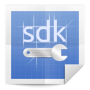

SDK - installing the SDK
========================

Here’s where you learn the exact steps needed to install the Ubuntu SDK,
Ubuntu’s integrated development environment (IDE) for developing Ubuntu
Apps.

The Ubuntu SDK is available for Ubuntu 14.04 (Trusty) onwards.

Adding the SDK Release PPA
--------------------------

Please add the `SDK Release
PPA <https://launchpad.net/~ubuntu-sdk-team/+archive/ppa>`__ as follows,
entering your password as prompted:

``$ sudo add-apt-repository ppa:ubuntu-sdk-team/ppa``

Installing the Ubuntu SDK
-------------------------

Install as follows:

``$ sudo apt update && sudo apt install ubuntu-sdk``

**Tip**: Some people, particularly those running the development version
of Ubuntu, should ensure all installed packages are updated to the
latest available versions with:

``$ sudo apt update && sudo apt dist-upgrade``

Launching the Ubuntu SDK IDE
----------------------------

1. Search in the Dash for “Ubuntu SDK”.
2. Launch it from this icon:

You can also launch the SDK from the shell with:

``$ ubuntu-sdk``

**Tip**: You might want the SDK icon always on your Unity launcher panel
to make it easy find and launch. Just launch the SDK, find its icon on
the launcher panel on the left side of the Ubuntu Desktop, right click
it, and select Lock to Launcher.

Next steps
----------

A good next move is one of the quick tutorials in the Ubuntu SDK
section, for example `Create an App
Project <tutorials-creating-an-sdk-app-project.md>`__ and `Running Apps
from the SDK <tutorials-running-apps-from-the-sdk.md>`__.
