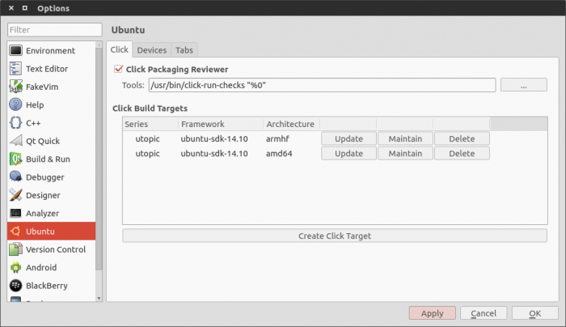
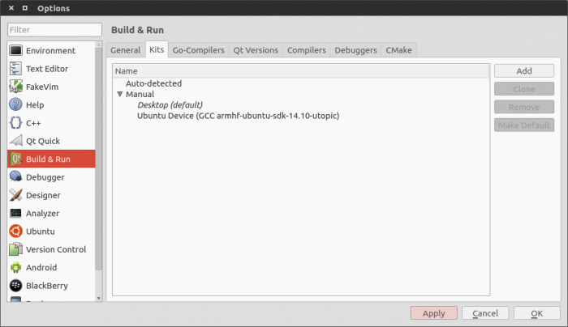

Tutorials - click targets and device kits
=========================================

To build your application for a specific environment (phone, emulator or
desktop), the SDK needs to know which devices you are targeting (it can
be all of them). That’s why, when opening the SDK for the first time, or
when creating a new project, it will guide you through the creation of
targets.

What are Click targets ?
------------------------

They are ``chroots``. If you are familiar with Linux development you
probably already know what a ``chroot`` is, but for the sake of clarity,
here is a short explanation :

Chroots are jails for a new root directory. They allow creating a new
fake environment on top of the one you are running.

Creating chroots is a handy way to build click packages for different
types of devices (for example, building a package for the arm
architecture that your phone uses, on your desktop computer).

Before creating a target, the SDK will prompt you to choose the
architecture of the device you want to target and the framework you want
to use. Target creation can take some time, but you only need to create
each target once.

Architectures
~~~~~~~~~~~~~

Three architectures are available : armfh, i386 and amd64

-  **amrfh** is the ARM architecture commonly found on phones, tablets
   and some desktops
-  **i386** is often used on older desktops (32bits)
-  **amd64** is the 64bits architecture used on most recent computers

Note that emulators can use any architecture.

Frameworks
~~~~~~~~~~

Each `framework <../guides/frameworks.md>`__ is related to an Ubuntu
release. In most cases, you will want to use the latest version to allow
your app to use the latest features of the platform, but you can also
try and see how your app behaves with older releases.

Linking a click target to a device with device kits
---------------------------------------------------

To run your app on a device, you need a link between the click target
and the device. This is what device kits are for. On the Devices tab,
you can see your devices (connected via USB and existing emulators) and
simple click the ``Autocreate`` button to create a device kit using the
click target of your choice.

.. figure:: ../../../media/autocreate_device_kit-700x399.png
   :alt: 

Managing targets and kits
-------------------------

You can retrieve existing targets and kits from the Options pane of the
SDK.

Targets can be created, deleted and updated in the **"Ubuntu" >
"Click"** pane

Kits can be created and deleted in the **"Build & Run" > "Kits"** pane.

Video guide
-----------

`Nekhelesh
Ramananthan <https://plus.google.com/+NekheleshRamananthan/posts>`__
demonstrates how to use the Ubuntu SDK Kits to build and run apps on the
desktop, emulator and physical devices.

.. raw:: html

   <iframe width="560" height="315" src="https://www.youtube-nocookie.com/embed/PBpCykbmqs8?rel=0" frameborder="0" allowfullscreen>

.. raw:: html

   </iframe>

Next steps
----------

Now that this setup step is out of the way, you can go back to creating
your app! Have a look at the `platformguides <../guides/index.md>`__ to
learn how to make the most of our APIs.
