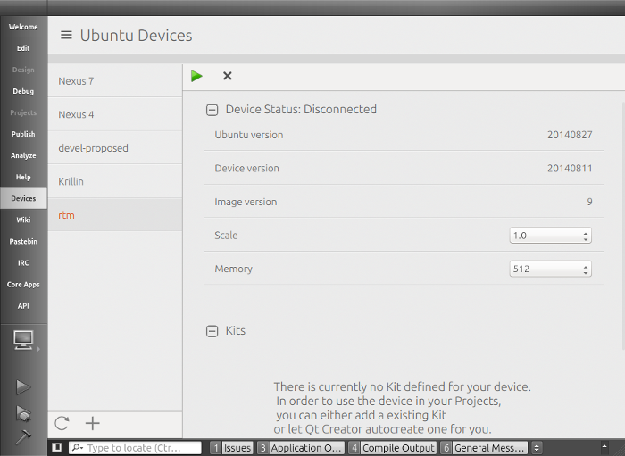
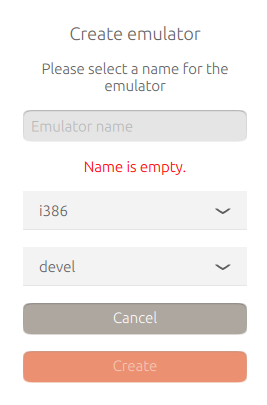
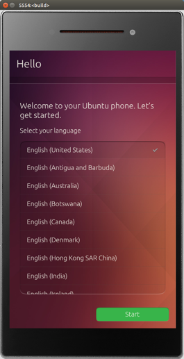

Tutorials - using the Ubuntu Emulator
=====================================

Ubuntu emulators are a great way to develop apps, particularly when you
do not have a physical device that currently runs Ubuntu. Once an
emulator is attached to the SDK, you can run apps on them, install click
packages on them, and etc. just as if they were physical devices.

Here you learn how to use the Ubuntu emulator from the Ubuntu SDK,
including:

-  Creating emulators
-  Launching an emulator
-  Attaching an emulator to the SDK
-  Opening a root shell to an emulator

**Note**: The Ubuntu emulator is under rapid development, including its
support in the SDK. So stay nimble, stay tuned for new information, and
keep alert for changes!

**Tip**: For the cutting edge Ubuntu emulator and SDK experience, update
your system from the SDK PPA, as explained in the `Installing the
SDK <installing-the-sdk.md>`__ tutorial.

What is the Ubuntu emulator?
----------------------------

The emulator is an instance of Ubuntu for phones and tablets that runs
on your Desktop in a window instead of on a physical device. It looks
and operates the same as Ubuntu on a phone or tablet, but you use a
mouse to interact with the GUI instead of physical touch and swipe
gestures.

**Tip**: The emulator is slower than a physical device, so be patient.

Creating an emulator instance
-----------------------------

**Before this step, please ensure that you have enabled hardware
virtualization in your BIOS settings.**

**Tip**: The i386 emulator runs much quicker on x86 devices like your
computer than the armhf emulator.

1. In the Ubuntu SDK, open the **Devices** tab. At the bottom click the
   plus "+" icon.
2. Inside the new window, enter a name for your new emulator in the
   **Name** field. In addition, select your desired channel and and
   architecture for the emulator.
3. Click the **Create** new emulator button.

**Note**: It takes a while to create an emulator.

On success, the new emulator is listed on the left side of the
**Devices** tab with its name and other descriptive information,
including the “version=NUMBER”, which is the build number of the Ubuntu
for phones and tablets image.

Launching an emulator instance
------------------------------

1. In the Ubuntu SDK, open the **Devices** tab.
2. Select an emulator from those listed on the left side of the screen.
3. Click the green **play button** to start the emulator

**Tip**: It takes some time for an emulator to start.

When the launch is complete, the emulator displays in a separate window.
You interact with the GUI using your mouse and the onscreen keyboard,
which displays when needed.

Getting shell access to a running emulator
------------------------------------------

.. figure:: ../../../media/platform-sdk-004-Selection_009.png
   :alt: 

You can now open a shell to a running emulator using the ``_control_``
buttons inside the emulator device tab as follows:

1. Click the **Control** rollup near the bottom of the page. The list
   will expaned showing several options
2. Click the **execute** button next to Open SSH connection to device

More information
----------------

-  https://wiki.ubuntu.com/Touch/Emulator
-  http://davidplanella.org/ubuntu-emulator-quickstart-guide/

Next steps
----------

Now that you have an emulator running as an attached device, you might
check out the `Running an app from the
SDK <tutorials-running-apps-from-the-sdk.md>`__ tutorial.
