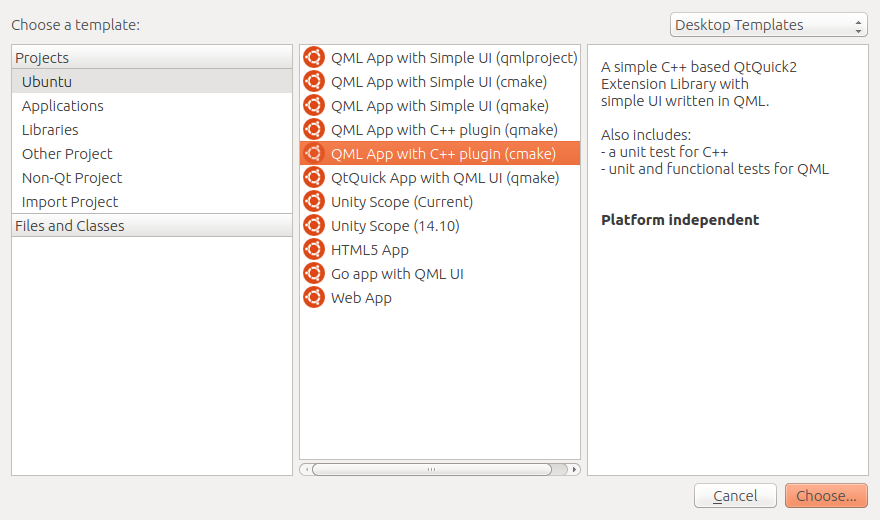
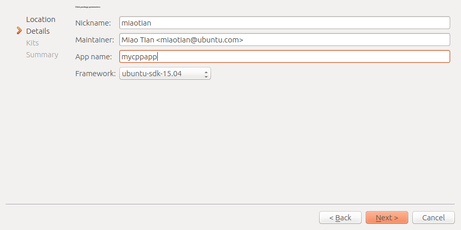
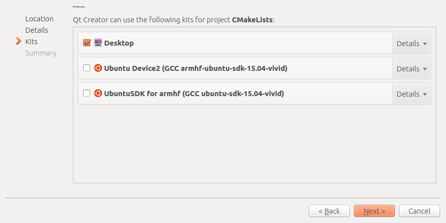
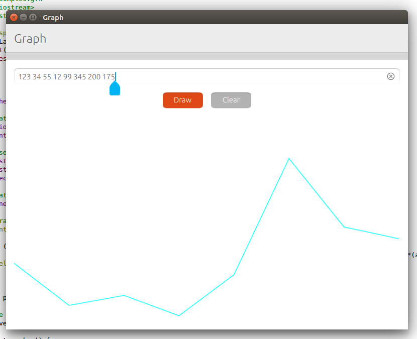

Tutorials - add a C++ backend to your QML app
=============================================

Whether you are creating a new app or porting an existing one from
another ecosystem, you may need more backend power than the QML +
JavaScript duo proposed in the `QML app
tutorial <tutorials-building-your-first-qml-app.md>`__. Let's have a
peek at how to to add a C++ backend to your application, using system
libraries or your own, and vastly increase its performance and potential
features.

In this tutorial, you will learn how to use and invoke C++ classes from
QML and integrate a 3rd party library into your project.

The SDK template
----------------

Let's start by opening the Ubuntu SDK and click on New Project to be
presented with the project wizard. For this tutorial, we are going to
use the ``QML App with C++ plugin (cmake)`` template.

Continue through the wizard by picking:

-  A project name. For the sake of consistency during this tutorial,
   let's use "``mycppapp``"
-  An app name (``mycppapp``)

.. figure:: ../../../media/qml-tutorial-c-backend-screenshot2.png
   :alt: 

-  Enter your `developer
   information <https://myapps.developer.ubuntu.com/dev/account/>`__

-  Choose a framework (if you are unsure about which one to use, see the
   `Frameworks
   guide <https://developer.ubuntu.com/en/start/platform/guides/frameworks/>`__).
   For this tutorial, we are going to use ``ubuntu-sdk-15.04``.

-  A
   `kit <../../platform/sdk/tutorials-click-targets-and-device-kits.md>`__
   corresponding to the type of device and architecture your app will be
   published for. For this tutorial, we are only going to use a
   ``desktop`` kit.

Template files
~~~~~~~~~~~~~~

After creating the project, the SDK has now switched to the editor tab.
If you are already used to QML-only apps, you can see a slightly
different file tree on the left pane:

.. figure:: ../../../media/qml-tutorial-c-backend-screenshot-template-files.png
   :alt: 

An ``app`` folder for QML files and the desktop file, a ``backend``
folder for C++ modules and tests, and a ``po`` folder that will hold
generated translations templates.

Other files worthy of a note are ``manifest.json.in`` and
``mycppapp.apparmor``, both needed for packaging. Since we are using the
CMake build tool, each directory also contains a ``CMakeLists.txt``
file.

``Manifest.json.in``, ``app/mycppapp.desktop.in`` and
``mycppapp.apparmor`` have already been pre-filled with the information
you entered in the wizard. You can edit them to manage your app version,
maintainer info, change the framework and permission policies your app
is going to use. We are not going to use them during this tutorial, you
can safely ignore them.

Running the template
~~~~~~~~~~~~~~~~~~~~

If you run the app provided by the template (by pressing Ctrl+R or
clicking the green Play icon), you can see that it looks similar to a
standalone QML app, the big difference is that the QML object used to
display the "Hello world" string is actually a class imported from C++.

.. figure:: ../../../media/qml-tutorial-c-backend-screenshot-running.png
   :alt: 

First example - Calling the command-line
----------------------------------------

In this example, we are going to learn how to call the command line (and
get its output) from a QML UI.

Note that what you will be able to do (in terms of command line use) on
a device other than the Ubuntu desktop will be fairly limited due to our
app `confinement
policies <https://developer.ubuntu.com/en/publish/security-policy-groups/>`__,
but this will be a good introduction to exchanging data between the
backend and the UI.

backend/modules/Mycppapp/mytype.h
~~~~~~~~~~~~~~~~~~~~~~~~~~~~~~~~~

Currently, this file defines a ``MyType`` class with a very simple API:
it receives a string and returns it.

Let's change it to a ``Launcher`` class, using
`Qprocess <http://doc.qt.io/qt-5/qprocess.html>`__ to run system
commands.

Replace the content of the file with:

.. code:: c++

    #ifndef LAUNCHER_H
    #define LAUNCHER_H
    #include <QObject>
    #include <QProcess>
    class Launcher : public QObject
    {
        Q_OBJECT
    public:
        explicit Launcher(QObject *parent = 0);
        ~Launcher();
        Q_INVOKABLE QString launch(const QString &program);
    protected:
        QProcess *m_process;
    };
    #endif

mytype.cpp
~~~~~~~~~~

Now, we are going to make use of this ``Launcher`` class. It will
receive strings from QML, interpret it as a command, wait for the
command to finish and return the output.

Replace the content of ``mytype.cpp`` with:

.. code:: c++

    #include "mytype.h"
    Launcher::Launcher(QObject *parent) :
        QObject(parent),
        m_process(new QProcess(this))
    {
    }
    QString Launcher::launch(const QString &program)
    {
        m_process->start(program);
        m_process->waitForFinished(-1);
        QByteArray bytes = m_process->readAllStandardOutput();
        QString output = QString::fromLocal8Bit(bytes);
        return output;
    }
    Launcher::~Launcher() {
    }

backend.cpp
~~~~~~~~~~~

This is where the ``QQmlExtensionPlugin`` is used to register C++
classes as QML Types, that you will be able to use in your UI.

The syntax is fairly explicit, and the most important line of this file
is where the type registration is made:

.. code:: c++

    qmlRegisterType<MyType>(uri, 1, 0, "MyType");

Since our class is now called ``Launcher``, We need to change it to:

.. code:: c++

    qmlRegisterType<Launcher>(uri, 1, 0, "Launcher");

That means that from the QML side, you now have access to a ``Launcher``
type with a launch function taking a string and returning the terminal
output. How cool is that?

QML side
~~~~~~~~

In ``Main.qml``, let's replace the content of our page component with a
very simple UI

.. code:: c++

    Page {
        title: i18n.tr("mycppapp")
        // Here, we instantiate our Launcher component
        Launcher {
            id:launcher
        }
        Column{
            anchors.fill:parent
            spacing: units.gu(2)
            anchors.margins:units.gu(2)
            Row {
                spacing: units.gu(2)
                TextField{
                    id:command
                }
                Button{
                    id:button
                    text:i18n.tr("Run")
                    onClicked:{
                        // And we call its launch function
                        // when the Run button is clicked
                        txt.text = launcher.launch(command.text)
                    }
                }
            }
            Text{
                id:txt
            }
        }
    }

Run the app and enjoy a tiny shell access!

.. figure:: ../../../media/qml-tutorial-c-backend-screenshot-tiny-shell.png
   :alt: 

Second example - Integrate an external library
----------------------------------------------

In this example, we are going to use a very straightforward SVG drawing
library (`simple-svg <https://code.google.com/p/simple-svg/>`__) which
comes as a standalone header file, and turn our first example above into
an SVG graph plotting app.

Accessing the library
~~~~~~~~~~~~~~~~~~~~~

Let's start by downloading
`simple\_svg\_1.0.0.hpp <https://code.google.com/p/simple-svg/downloads/detail?name=simple_svg_1.0.0.hpp&can=2&q=>`__
, rename it to ``simplesvg.h`` and add it to the rest of our source
files (in ``backend/modules/Mycppapp/``).

Then, we edit ``mytype.h`` to slightly change the structure of our
launch function

From

.. code:: c++

    Q_INVOKABLE QString launch(const QString &program);

To

.. code:: c++

    Q_INVOKABLE void draw(const int &width, const int &height, const QString &array);

We now have a ``draw`` function that takes a width, a height and a
string (which will be a stringified, space separated, array of
integers).

The draw function
~~~~~~~~~~~~~~~~~

It’s time to flesh out our SVG generating function in ``mytype.cpp``

First, a few more includes at the top of the file :

.. code:: c++

    #include "mytype.h"
    #include "simplesvg.h"
    #include <iostream>
    #include <string>
    using namespace svg;

Then, we need going to replace our ``launch()`` function, that takes a
string from QML:

.. code:: c++

    QString Launcher::launch(const QString &program)
    {
        m_process->start(program);
        m_process->waitForFinished(-1);
        QByteArray bytes = m_process->readAllStandardOutput();
        QString output = QString::fromLocal8Bit(bytes);
        return output;
    }

...by a ``draw()`` one, still using data sent from QML:

It makes heavy use of functions and classes provided by the bundled SVG
library

.. code:: c++

    void Launcher::draw(const int &width, const int &height, const QString &array)
    {
        // Create the SVG doc
        Dimensions dimensions(width, height);
        Document doc("../mycppapp/app/graph.svg", Layout(dimensions, Layout::BottomLeft));
        // Parse our string into an array
        std::istringstream buf(array.toStdString());
        std::istream_iterator<std::string> beg(buf), end;
        std::vector<std::string> tokens(beg, end);
        // Create a line
        Polyline polyline_a(Stroke(1.5, Color::Cyan));
        // Iterate over our array to define line start/end points
        for( int a = 0; a < tokens.size(); a = a + 1 )
        {
            if (tokens.size() < 2) {
                polyline_a << Point(width/(tokens.size())*(a), atoi(tokens[a].c_str())) << Point(width/(tokens.size())*(a+1), atoi(tokens[a].c_str()));
            } else {
                polyline_a << Point(width/(tokens.size()-1)*(a), atoi(tokens[a].c_str()));
            }
        }
        doc << polyline_a;
        // Save the doc
        doc.save();
    }

On the QML side of things, you can now call ``Launcher.draw()``
with\ ``(width, height, points)`` as arguments to generate a SVG file!

QML UI
~~~~~~

Here is our QML UI using the ``draw()`` function in ``Main.qml``

.. code:: c++

    Page {
        title: i18n.tr("Graph")
        id:page
        Rectangle {
            anchors.fill:parent
            Launcher {
                id: launcher
            }
            TextField{
                id:txt
                width:parent.width - units.gu(4)
                anchors.top:parent.top
                anchors.horizontalCenter:parent.horizontalCenter
                anchors.margins:units.gu(2)
            }
            Row {
                anchors.top:txt.bottom
                anchors.horizontalCenter: parent.horizontalCenter
                anchors.margins: units.gu(2)
                spacing: units.gu(2)
                Button {
                    id:drawButton
                    anchors.margins:units.gu(2)
                    text:i18n.tr("Draw")
                    enabled:(txt.length)
                    color: UbuntuColors.orange
                    onClicked: {
                        launcher.draw(page.width, page.height, txt.text)
                        img.source = ""
                        img.source = Qt.resolvedUrl("graph.svg")
                    }
                }
                Button {
                    id:clearButton
                    anchors.margins:units.gu(2)
                    text:i18n.tr("Clear")
                    onClicked: {
                        launcher.draw(page.width, page.height, "")
                        img.source = ""
                        img.source = Qt.resolvedUrl("graph.svg")
                    }
                }
            }
            Image {
                id:img
                anchors.fill:parent
                anchors.margins:units.gu(2)
                cache:false
                source: Qt.resolvedUrl("graph.svg")
            }
        }
    }

That's it! Our simple QML app is ready to use: enter some Y-axis values
in the input field and it will generate and display a SVG graph.

Packaging
~~~~~~~~~

The packaging process is as simple as others applications. The
**Publish** tab allows you to package it as a ``.click`` and the
template ``CMakeLists`` are here to make sure everything is included in
your build.

If you add libraries bigger than standalone header files, you can use
the existing ``CMakeLists`` files in the template as a starting point on
how to include them as modules.

As an example, here is the ``CMakeLists`` file for our backend
directory:

.. code:: c++

    include_directories(
        ${CMAKE_CURRENT_SOURCE_DIR}
    )
    set(
        Mycppappbackend_SRCS
        modules/Mycppapp/backend.cpp
        modules/Mycppapp/mytype.cpp
    )
    # Make the unit test files visible on qtcreator
    add_custom_target(Mycppappbackend_UNITTEST_QML_FILES ALL SOURCES "tests/unit/tst_mytype.qml")
    add_library(Mycppappbackend MODULE
        ${Mycppappbackend_SRCS}
    )
    set_target_properties(Mycppappbackend PROPERTIES
             LIBRARY_OUTPUT_DIRECTORY Mycppapp)
    qt5_use_modules(Mycppappbackend Gui Qml Quick)
    # Copy qmldir file to build dir for running in QtCreator
    add_custom_target(Mycppappbackend-qmldir ALL
        COMMAND cp ${CMAKE_CURRENT_SOURCE_DIR}/modules/Mycppapp/qmldir ${CMAKE_CURRENT_BINARY_DIR}/Mycppapp
        DEPENDS ${QMLFILES}
    )
    # Install plugin file
    install(TARGETS Mycppappbackend DESTINATION ${QT_IMPORTS_DIR}/Mycppapp/)
    install(FILES   modules/Mycppapp/qmldir DESTINATION ${QT_IMPORTS_DIR}/Mycppapp/)

Further reading
---------------

-  This `CMake
   tutorial <http://derekmolloy.ie/hello-world-introductions-to-cmake/>`__
   should help you getting started with complex CMake projects
-  The `Qt documentation on integrating QML and
   C++ <http://doc.qt.io/qt-5/qtqml-cppintegration-topic.html>`__ will
   give you a high level overview of integration concepts, such as data
   type conversion
