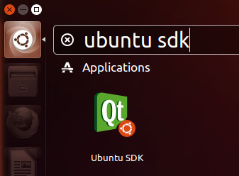
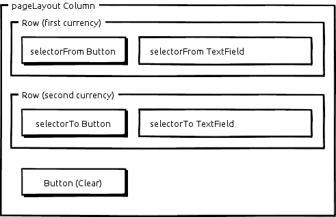
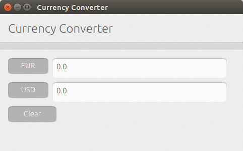

Tutorials - building your first QML app
=======================================

In this recipe you will learn how to write a currency converter app for
Ubuntu on the phone. You will be using several components from the
Ubuntu QML toolkit: ``i18n``, ``units``, ``ItemStyle`` for theming,
``Label``, ``ActivityIndicator``, ``Popover``, ``Button``,
``TextField``, ``ListItems.Header`` and ``ListItems.Standard``.

The application will show you how to use the QML declarative language to
create a functional user interface and its logic, and to communicate
through the network and fetch data from a remote source on the Internet.

In practical terms, you will be writing an application that performs
currency conversion between two selected currencies. The rates are
fetched using the European Central Bank’s API. Currencies can be changed
by pressing the buttons and selecting the currency required from the
list.

Requirements
------------

-  Ubuntu 14.04 or later – `get
   Ubuntu <https://www.ubuntu.com/download/desktop>`__
-  The Ubuntu SDK – `install the Ubuntu
   SDK <../../platform/sdk/installing-the-sdk.md>`__

The tools
---------

The focus of this tutorial will be on the Ubuntu UI toolkit preview and
its components, rather than on the tools. However, it is worth
mentioning and giving an overview of the tools you will be using:

Development host
~~~~~~~~~~~~~~~~

**Ubuntu 14.04** (or later) will be used as the host machine for
development. At the end of this recipe you will have created a
platform-agnostic QML app that can be run on the development host
machine. Subjects such as cross-compiling for a different architecture
and installation on a phone are more advanced topics that will be
covered at a later date when the full Ubuntu SDK is released.

Integrated Development Environment (IDE)
~~~~~~~~~~~~~~~~~~~~~~~~~~~~~~~~~~~~~~~~

We will be writing declarative QML code, which does not need to be
compiled to be executed, so **you can use your favourite text editor**
to write the actual code, which will consist of a single QML file.

For this tutorial, **we recommend using Ubuntu SDK**. Ubuntu SDK is a
powerful IDE to develop applications based on the Qt framework.

QML viewer
~~~~~~~~~~

To start QML applications, either during the prototyping or final
stages, we will use **Ubuntu SDK** and the Ctrl+R shortcut.

However, as an alternative for quick app viewing with QML Scene, it is
worth noting that you can also use **QML Scene** without Ubuntu SDK. QML
Scene is a command-line application that interprets and runs QML code.

To run a QML application with QML Scene, open up a terminal with the
Ctrl+Alt+T key combination, and execute the qmlscene command, followed
by the path to the application:

``$ qmlscene /path/to/application.qml``

`Learn more about QML
Scene › <http://qt-project.org/doc/qt-5.0/qtquick/qtquick-qmlscene.html>`__

Getting started
---------------

To start Ubuntu SDK, simply open the **Dash**, start typing “\ **ubuntu
sdk**\ “, and click on the Ubuntu SDK icon that appears on the search
results.

Next stop: putting our developer hat on.

The main view
~~~~~~~~~~~~~

We’ll start off with a minimum QML canvas with our first Ubuntu
component: a label inside the main view.

1. In Ubuntu SDK, press ``Ctrl+N`` to create a new project
2. Select the **Projects** > **Ubuntu** > **App with Simple UI**
   template and click **Choose…**
3. Give the project **CurrencyConverter** as a **Name**. You can leave
   the **Create in:** field as the default and then click **Next**.
4. You can optionally set up a revision control system such as Bazaar in
   the final step, but that’s outside the scope of this tutorial. Click
   on **Finish**.
5. Replace the **Column** component and all of its children, and replace
   them with the **Page** as shown below, and then save it with
   ``Ctrl+S``:

.. code:: qml

    import QtQuick 2.4
    import Ubuntu.Components 1.3
    /*!
        \brief MainView with a Label and Button elements.
    */
    MainView {
        id: root
        // objectName for functional testing purposes (autopilot-qt5)
        objectName: "mainView"
        // Note! applicationName needs to match the "name" field of the click manifest
        applicationName: "currencyconverter.yourname"

        width: units.gu(100)
        height: units.gu(75)
        property real margins: units.gu(2)
        property real buttonWidth: units.gu(9)
        Page {
            title: i18n.tr("Currency Converter")
        }
    }

Try to run it now to see the results:

1. Inside Ubuntu SDK, press the Ctrl+R key combination. It is a shortcut
   to the **Build** > **Run** menu entry

Or alternatively, from the terminal:

1. Open a terminal with ``Ctrl+Alt+T``
2. Run the following command: ``qmlscene ~/CurrencyConverter/main.qml``

.. figure:: ../../../media/qml-tutorial-converter_0.png
   :alt: 

Hooray! Your first Ubuntu app for the phone is up and running. Nothing
very exciting yet, but notice how simple it was to bootstrap it. You can
close your app for now.

Now starting from the top of the file, let’s go through the code.

.. code:: qml

    import QtQuick 2.4
    import Ubuntu.Components 1.3

Every QML document consists of two parts: an imports section and an
object declaration section. First of all we import the QML types and
components that we need, specifying the namespace and its version. In
our case, we import the built-in QML and Ubuntu types and components.

We now move on to declaring our objects. In QML, a user interface is
specified as a tree of objects with properties. JavaScript can be
embedded as a scripting language in QML as well, but we’ll see this
later on.

.. code:: qml

    MainView {
        id: root
        // objectName for functional testing purposes (autopilot-qt5)
        objectName: "mainView"
        // Note! applicationName needs to match the "name" field of the click manifest
        applicationName: "currencyconverter.yourname"

        width: units.gu(100)
        height: units.gu(75)
        property real margins: units.gu(2)
        property real buttonWidth: units.gu(9)
        Page {
            title: i18n.tr("Currency Converter")
        }
    }

Secondly, we create a
`MainView <../api-qml-current/Ubuntu.Components.MainView.md>`__, the
most essential SDK component, which acts as the root container for our
application. It also provides the standard toolbar and
`Header <../design/building-blocks/header.md>`__.

With a syntax similar to JSON, we define its
`properties <http://doc.qt.io/qt-5/qtqml-syntax-propertybinding.html>`__
by giving it an id we can refer it to (``root``), and then we define
some visual properties (``width``, ``height``, ``color``). Notice how in
QML properties are bound to values with the ‘\ ``property: value``\ ‘
syntax. We also define a custom property called ``margins``, of
`type <http://doc.qt.io/qt-5/qtqml-typesystem-basictypes.html>`__
`real <http://doc.qt.io/qt-5/qml-real.html>`__ (a number with decimal
point). Don’t worry about the ``buttonWidth`` property for now, we’ll
use it later on. The rest of the properties available in the MainView we
leave at their default values by not declaring them.

Notice how we specify units as ``units.gu``. These are **grid units**,
which we are going to talk about in a minute. For now, you can consider
them as a form- factor-agnostic way to specify measurements. They return
a pixel value that’s dependent on the device the application is running
on.

Inside our main view, we add a child
`Page <../api-qml-current/Ubuntu.Components.Page.md>`__, which will
contain the rest of our components as well as provide a title. We title
text to the page, ensuring it is enclosed with the ``i18n.tr()``
function, which will make it translatable.

Resolution independence
~~~~~~~~~~~~~~~~~~~~~~~

A key feature of the Ubuntu user interface toolkit is the ability to
scale to all form factors in a world defined by users with multiple
devices. The approach taken has been to define a new unit type, the grid
unit (gu in short). Grid units translate to a pixel value depending on
the type of screen and device the application is running on. Here are
some examples:

+------------------+----------------+
| Device           | Conversion     |
+==================+================+
| Most laptops     | 1 gu = 8 px    |
+------------------+----------------+
| Retina laptops   | 1 gu = 16 px   |
+------------------+----------------+
| Smart phones     | 1 gu = 18 px   |
+------------------+----------------+

`Learn more about resolution
independence <../api-qml-current/UbuntuUserInterfaceToolkit.resolution-independence.md>`__

Internationalization
~~~~~~~~~~~~~~~~~~~~

As part of the Ubuntu philosophy, internationalization and native
language support is a key feature of the Ubuntu toolkit. We’ve chosen
``gettext`` as the most ubiquitous Free Software internationalization
technology, which we’ve implemented in QML through the family of
``i18n.tr()`` functions.

Fetching and converting currencies
----------------------------------

Now we will start adding the logic to our app, which will mean getting
the currency and rates data and doing the actual conversion.

Start by adding the following code around line 33 **before the Page’s
closing brace**. We will mostly be appending code in all subsequent
steps, but any snippet will be contained inside our root MainView. So
when you append code, make sure it is still before the MainView’s
closing brace at the end of the file.

.. code:: qml

    ListModel {
        id: currencies
        ListElement {
            currency: "EUR"
            rate: 1.0
        }
        function getCurrency(idx) {
            return (idx >= 0 && idx < count) ? get(idx).currency: ""
        }
        function getRate(idx) {
            return (idx >= 0 && idx < count) ? get(idx).rate: 0.0
        }
    }

What we are doing here is to use ``currencies`` as a
`ListModel <http://doc.qt.io/qt-5/qml-qtqml-models-listmodel.html>`__
object that will contain a list of items consisting of ``currency`` and
``rate`` pairs. The ``currencies`` ListModel will be used as a source
for the view elements that will display the data. We will be fetching
the actual data from the Euro foreign exchange reference rates from the
European Central Bank. As such, the Euro itself is not defined there, so
we’ll pre-populate our list with the EUR currency, with a reference rate
of 1.0.

The function statements in currencies illustrate another powerful
feature of QML: integration with JavaScript. The two JavaScript
functions are used as glue code to retrieve a currency or rate from an
index. They are required as currencies may not be loaded when component
property bindings use them for the first time. But do not worry much
about their function. For now it’s just important to remember that you
can transparently `integrate JavaScript code iny our QML
documents <http://doc.qt.io/qt-5/qtqml-javascript-expressions.html>`__.

Now we’ll fetch the actual data with a QtQuick object to load XML data
into a model: the `integrate JavaScript code in your QML
documents <http://doc.qt.io/qt-5/qml-qtquick-xmllistmodel-xmllistmodel.html>`__.
To use it, we add an additional import statement at the top of the file,
so that it looks like:

.. code:: qml

    import QtQuick 2.4
    import QtQuick.XmlListModel 2.0
    import Ubuntu.Components 1.3

And then around line 49, add the actual rate exchange fetcher code:

.. code:: qml

    XmlListModel {
        id: ratesFetcher
        source: "http://www.ecb.int/stats/eurofxref/eurofxref-daily.xml"
        namespaceDeclarations: "declare namespace gesmes='http://www.gesmes.org/xml/2002-08-01';"
                               +"declare default element namespace 'http://www.ecb.int/vocabulary/2002-08-01/eurofxref';"
        query: "/gesmes:Envelope/Cube/Cube/Cube"
        onStatusChanged: {
            if (status === XmlListModel.Ready) {
                for (var i = 0; i < count; i++)
                    currencies.append({"currency": get(i).currency, "rate": parseFloat(get(i).rate)})
            }
        }
        XmlRole { name: "currency"; query: "@currency/string()" }
        XmlRole { name: "rate"; query: "@rate/string()" }
    }

The relevant properties are ``source``, to indicate the URL where the
data will be fetched from; ``query``, to specify an absolute
`XPath <https://developer.mozilla.org/en-US/docs/XPath>`__ query to use
as the base query for creating model items from the ``XmlRoles`` below;
and ``namespaceDeclarations`` as the namespace declarations to be used
in the XPath queries.

The ``onStatusChanged`` signal handler demonstrates another combination
of versatile features: the signal and handler system together with
JavaScript. Each QML property has got a ``<property>Changed`` signal and
its corresponding on\ ``<property>Changed`` signal handler. In this
case, the ``StatusChanged`` signal will be emitted to notify of any
changes of the status property, and we define a handler to append all
the currency/rate items to the ``currencies`` ListModel once
``ratesFetcher`` has finished loading the data.

In summary, ``ratesFetcher`` will be populated with currency/rate items,
which will then be appended to ``currencies``.

It is worth mentioning that in most cases we’d be able to use a single
XmlListModel as the data source, but in our case we use it as an
intermediate container. We need to modify the data to add the EUR
currency, and we put the result in the ``currencies`` ListModel.

Notice how network access happens transparently so that you as a
developer don’t have to even think about it!

Around line 66, let’s add an
`ActivityIndicator <../api-qml-current/Ubuntu.Components.ActivityIndicator.md>`__
component to show activity while the rates are being fetched:

.. code:: qml

    ActivityIndicator {
        objectName: "activityIndicator"
        anchors.right: parent.right
        running: ratesFetcher.status === XmlListModel.Loading
    }

We anchor it to the right of its parent (``root``) and it will show
activity until the rates data has been fetched.

And finally, around line 32 (above and outside of the ``Page``), we add
the ``convert`` JavaScript function that will perform the actual
currency conversions:

.. code:: javascript

    function convert(from, fromRateIndex, toRateIndex) {
        var fromRate = currencies.getRate(fromRateIndex);
        if (from.length <= 0 || fromRate <= 0.0)
            return "";
        return currencies.getRate(toRateIndex) * (parseFloat(from) / fromRate);
    }

Choosing currencies
-------------------

At this point we’ve added all the backend code and we move on to user
interaction. We’ll start off with creating a new
`Component <http://doc.qt.io/qt-5/qml-qtqml-component.html>`__, a
reusable block that is created by combining other components and
objects.

Let’s first append two import statements at the top of the file,
underneath the other import statements:

.. code:: qml

    import Ubuntu.Components.ListItems 0.1
    import Ubuntu.Components.Popups 1.3

And then add the following code around line 79:

.. code:: qml

    Component {
        id: currencySelector
        Popover {
            Column {
                anchors {
                    top: parent.top
                    left: parent.left
                    right: parent.right
                }
                height: pageLayout.height
                Header {
                    id: header
                    text: i18n.tr("Select currency")
                }
                ListView {
                    clip: true
                    width: parent.width
                    height: parent.height - header.height
                    model: currencies
                    delegate: Standard {
                        objectName: "popoverCurrencySelector"
                        text: currency
                        onClicked: {
                            caller.currencyIndex = index
                            caller.input.update()
                            hide()
                        }
                    }
                }
            }
        }
    }

At this point, if you run the app, you will not yet see any visible
changes, so don’t worry if all you see is an empty rectangle.

What we’ve done is to create the currency selector, based on a
`Popover <../api-qml-current/Ubuntu.Components.Popups.Popover.md>`__ and
a standard Qt Quick
`ListView <http://doc.qt.io/qt-5/qml-qtquick-listview.html>`__. The
ListView will display the data from the ``currencies`` ListMode. Notice
how the Column object wraps the
`Header <../api-qml-current/Ubuntu.Components.ListItems.Header.md>`__
and the list view to arrange them vertically, and how each item in the
list view will be a
`Standard <../api-qml-current/Ubuntu.Components.ListItems.Standard.md>`__
list item component.

The popover will show the selection of currencies. Upon selection, the
popover will be hidden (see ``onClicked`` signal) and the caller’s data
is updated. We assume that the caller has ``currencyIndex`` and
``input`` properties, and that ``input`` is an item with an ``update()``
function.

Arranging the UI
----------------

Up until now we’ve been setting up the backend and building blocks for
our currency converter app. Let’s move on to the final step and the fun
bit, putting it all together and seeing the result!

Add the final snippet of code around line 110:

.. code:: qml

    Column {
        id: pageLayout
        anchors {
            fill: parent
            margins: root.margins
        }
        spacing: units.gu(1)
        Row {
            spacing: units.gu(1)
            Button {
                id: selectorFrom
                objectName: "selectorFrom"
                property int currencyIndex: 0
                property TextField input: inputFrom
                text: currencies.getCurrency(currencyIndex)
                onClicked: PopupUtils.open(currencySelector, selectorFrom)
            }
            TextField {
                id: inputFrom
                objectName: "inputFrom"
                errorHighlight: false
                validator: DoubleValidator {notation: DoubleValidator.StandardNotation}
                width: pageLayout.width - 2 * root.margins - root.buttonWidth
                height: units.gu(5)
                font.pixelSize: FontUtils.sizeToPixels("medium")
                text: '0.0'
                onTextChanged: {
                    if (activeFocus) {
                        inputTo.text = convert(inputFrom.text, selectorFrom.currencyIndex, selectorTo.currencyIndex)
                    }
                }
                function update() {
                    text = convert(inputTo.text, selectorTo.currencyIndex, selectorFrom.currencyIndex)
                }
            }
        }
        Row {
            spacing: units.gu(1)
            Button {
                id: selectorTo
                objectName: "selectorTo"
                property int currencyIndex: 1
                property TextField input: inputTo
                text: currencies.getCurrency(currencyIndex)
                onClicked: PopupUtils.open(currencySelector, selectorTo)
            }
            TextField {
                id: inputTo
                objectName: "inputTo"
                errorHighlight: false
                validator: DoubleValidator {notation: DoubleValidator.StandardNotation}
                width: pageLayout.width - 2 * root.margins - root.buttonWidth
                height: units.gu(5)
                font.pixelSize: FontUtils.sizeToPixels("medium")
                text: '0.0'
                onTextChanged: {
                    if (activeFocus) {
                        inputFrom.text = convert(inputTo.text, selectorTo.currencyIndex, selectorFrom.currencyIndex)
                    }
                }
                function update() {
                    text = convert(inputFrom.text, selectorFrom.currencyIndex, selectorTo.currencyIndex)
                }
            }
        }
        Button {
            id: clearBtn
            objectName: "clearBtn"
            text: i18n.tr("Clear")
            width: units.gu(12)
            onClicked: {
                inputTo.text = '0.0';
                inputFrom.text = '0.0';
            }
        }
    }

It’s a piece of code that’s longer than previous snippets, but it is
pretty simple and there is not much new in terms of syntax. What we’re
doing is arranging the visual components to provide user interaction
within the ``root`` area and defining signal handlers.

Notice how we use the ``onClicked`` signal handlers to define what will
happen when the user clicks on the currency selectors (i.e. the pop ups
are opened), the ``onTextChanged`` handler to call the ``convert``\ ()
function defined earlier to do conversions as we type, and we define the
``update()`` function the list view items from the ``currencySelector``
component defined earlier expect.

We are using a Column and two Rows to set up the layout, and each row
contains a currency selector button and a text field to display or input
the currency conversion values. We’ve also added a button below them to
clear both text fields at once. Here’s a mockup to illustrate the
layout:

Lo and behold
-------------

So that’s it! Now we can lay back and enjoy our creation. Just press the
``Ctrl+R`` shortcut within Ubuntu SDK, and behold the fully functional
and slick currency converter you’ve just written with a few lines of
code.

.. figure:: ../../../media/qml-tutorial-converter_2.png
   :alt: 

Test it!
--------

Now that the application is running, don't forget about tests! The
`qualitypage for qml applications <../../platform/quality.md>`__ has you
covered. Learn about writing tests for every level of the testing
pyramid by using the application you just built.

Conclusion
----------

You’ve just learned how to write a form-factor-independent Ubuntu
application for the phone. In doing that, you’ve been exercising and
combining the power of technologies such as QML, Javascript and a
variety of Ubuntu components, to produce an app with a cohesive, crisp
and clean Ubuntu look.

You’ll surely have noticed the vast array of possibilities these
technologies open up, so it’s now up to you: help us testing the toolkit
preview, write your own apps and give us your feedback to make Ubuntu be
in the next billion phones!

Learn more
----------

If this tutorial has started whetting your appetite, you should
definitely check out the **Component Showcase** app that comes with the
Ubuntu QML toolkit preview. With it, you’ll be able to see all of the
Ubuntu components in action and look at their code to learn how to use
it in your apps.

.. figure:: ../../../media/qml-tutorial-ui_gallery.png
   :alt: 

If you want to study the Component Showcase code:

1. **Start Ubuntu SDK** by pressing the Ubuntu button in the Launcher.
   That will bring up the **Dash**.
2. Start typing ``ubuntu sdk`` and click on the Ubuntu SDK icon.
3. In Ubuntu SDK, then press the Ctrl+O key combination to open the file
   selection dialog.
4. **Select** the file
   ``/usr/lib/ubuntu-ui-toolkit/examples/ubuntu-ui-toolkit-gallery/ubuntu-ui-toolkit-gallery.qml``
   and click on **Open**.
5. To run the code, you can select the **Tools** > **External** > **Qt
   Quick** > **Qt Quick 2 Preview (qmlscene)** menu entry.

Alternatively, if you only want to run the Component Showcase:

1. Open the Dash
2. Type ``toolkit gallery`` and double click on the “Ubuntu Toolkit
   Gallery” result that appears to run it

Reference
~~~~~~~~~

-  `Code for this
   tutorial <http://bazaar.launchpad.net/~ubuntu-sdk-tutorials-dev/ubuntu-sdk-tutorials/trunk/files/head:/getting-started/CurrencyConverter.md>`__
   (use ``bzr branch lp:ubuntu-sdk-tutorials`` to get a local copy)
-  `Writing tests for Currency Converter <../../platform/quality.md>`__
-  `Ubuntu UI Toolkit API documentation <../api-qml-current/index.md>`__
-  `Qt Quick
   documentation <http://qt-project.org/doc/qt-5.0/qtquick/qtquick-index.html>`__
-  `Getting Started Programming with Qt
   Quick <http://qt-project.org/doc/qt-5.0/qtdoc/gettingstartedqml.html>`__
-  `Syntax of the QML
   language <http://qt-project.org/doc/qt-5.0/qtqml/qtqml-index.html#syntax-of-the-qml-language>`__
-  `Integrating JavaScript and
   QML <http://qt-project.org/doc/qt-5.0/qtquick/qtquick-usecase-integratingjs.html>`__

Questions?
----------

If you’ve got any questions on this tutorial, or on the technologies
that it uses, just `get in touch with our App Developer
Community <http://community.ubuntu.com>`__!
