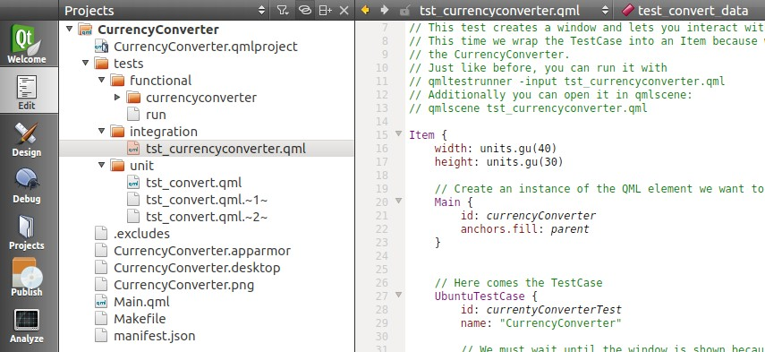

Tutorials - QML integration testing
===================================

In this tutorial you will learn how to write an integration test to
strengthen the quality of your Ubuntu QML application. It builds upon
the Currency Converter Tutorial.

Requirements
------------

-  **Ubuntu 14.04 or later** - `Get
   Ubuntu <https://www.ubuntu.com/download/desktop/>`__
-  **The currency converter tutorial** - if you haven't already,
   `complete the currency converter
   tutorial <tutorials-building-your-first-qml-app.md>`__
-  **The unit testing tutorial for currency converter** - if you haven't
   already, `unit testing tutorial <tutorials-qml-unit-testing.md>`__
-  **The QML test runner tool** - open a terminal with ``Ctrl+Alt+T``
   and run these commands to install all required packages:

``sudo apt-get install qtdeclarative5-dev-tools qtdeclarative5-test-plugin``

What are integration tests?
---------------------------

An integration test tests interactions between pieces of your code. It
can help ensure that data is passed properly between functions,
exceptions are handled properly and passed, etc.

Integration tests are the middle of the `testing
pyramid <../../platform/quality.md>`__. They cover more code at once and
at a higher level than unit tests. As you remember, the testing pyramid
describes the three levels of testing an application, going from low
level tests at the bottom and increasing to high level tests at the top.

In Ubuntu, like unit tests, integration tests for your qml application:

-  Are written in JavaScript within an `Ubuntu
   Testcase <../api-qml-current/Ubuntu.Test.UbuntuTestCase.md>`__ type
-  Are executed with the ``qmltestrunner`` tool, which will determine
   whether they pass or fail

Again, the ``qmltestrunner`` tool allows you to execute QML files as
testcases consisting of test\_ functions. We’ll make use of it to run
our tests.

Running the example
-------------------

To help you see what integration tests look like in real life, grab a
branch of the currency converter code from the tutorial. Run this
command in a terminal:

``bzr branch lp:ubuntu-sdk-tutorials``

This creates a new folder called ``ubuntu-sdk-tutorials``. The code
we'll be looking at inside the branch is under
``getting-started/CurrencyConverter``. On the terminal, now switch to
the tutorial folder:

``cd ubuntu-sdk-tutorials/getting-started/CurrencyConverter``

If you navigate to that folder with the file browser, you can click on
the ``CurrencyConverter.qmlproject`` file and open it with the Ubuntu
SDK IDE:

So let’s run it! Switch back to your terminal and run:

``qmltestrunner -input tests/integration``

If everything went successfully, you should see a small window appear
and disappear quickly and a printout displaying all tests as passing.

.. figure:: ../../../media/Selection_008.jpg
   :alt: 

Integration tests for Currency Converter
----------------------------------------

The currency converter application involves inputting data into
TextField’s on a Page and pressing a Button. We know from our previous
unit test tutorial that the convert function we use to do this operates
correctly, so it’s time to test passing data from our TextField’s to the
convert function and vice versa.

Now let’s write some tests!

Preparing the testcase
----------------------

Before we can test these qml components we’ll need to create an instance
of the QML element we want to test. To do this, open the
``tst_currencyconverter.qml`` file. In order to declare an instance of
our main qml window, we’ll need to import our qml files from the root
folder. The ``import “../..”`` line imports all of the qml from the root
folder ensuring we can declare a new instance. Our main window is called
Main in our application, so let’s declare a new instance.

.. code:: qml

    import "../.."
    ...
    Item {
        width: units.gu(40)
        height: units.gu(30)
        // Create an instance of the QML element we want to test
        Main {
            id: currencyConverter
            anchors.fill: parent
        }
    }

This will create a small (40 by 30 units) instance of our currency
converter main window when we execute this QML. We will use this to
test.

Simulating mouse and keyboard input
-----------------------------------

We also need to think about how we will simulate mouse and keyboard
input, since we intend to pass data into UI elements. Fortunately, there
are useful methods from Qt.TestCase to help us.

The\ `keyPress() <../api-qml-current/QtTest.TestCase.md#keyPress-method>`__,\ `keyRelease() <../api-qml-current/QtTest.TestCase.md#keyRelease-method>`__,
and\ `keyClick() <../api-qml-current/QtTest.TestCase.md#keyClick-method>`__
methods can be used to simulate keyboard events, while
`mousePress() <../api-qml-current/QtTest.TestCase.md#mousePress-method>`__,[
mouseRelease()] (../api-qml-current/QtTest.TestCase.md#mouseRelease-
method),\ `mouseClick() <../api-qml-current/QtTest.TestCase.md#mouseClick-method>`__,\ `mouseDoubleClick() <../api-qml-current/QtTest.TestCase.md#mouseDoubleClick-method>`__,
and\ `mouseMove() <../api-qml-current/QtTest.TestCase.md#mouseMove-method>`__
methods can be used to simulate mouse events.

These useful methods are self-describing and allow us to interact with
the active qml element. Before using them however, we must ensure the
window has loaded. To do this, we’ll be using the
`when <../api-qml-current/QtTest.TestCase.md#when-prop>`__
and\ `windowShown <../api-qml-current/QtTest.TestCase.md#windowShown-prop>`__
properties.

``when: windowShown``

Adding this simple check will ensure our test won’t begin until the
window has loaded.

Our first testcase
------------------

With our test now all ready to launch and wait for our element to load,
we can write our test for converting rates. Note again that we simulate
the mouse and keyboard as inputs for our test.

.. code:: qml

    function test_convert(data) {
        var inputFrom = findChild(currencyConverter, "inputFrom")
        var inputTo = findChild(currencyConverter, "inputTo")
        // Click in the middle of the inputFrom TextField to focus it
        mouseClick(inputFrom, inputFrom.width / 2, inputFrom.height / 2)
        // Click at the right end of the inputFrom TextField to clear it
        mouseClick(inputFrom, inputFrom.width - units.gu(1), inputFrom.height / 2)
        // Press key from data set
        keyClick(data.inputKey)
        // Now the field should contain the value from the data set
        // compare() also checks the type. We need to convert text to int if the data set holds ints.
        compare(parseInt(inputFrom.text), data.value)
        // The output field should be 0 when the input is 0, otherwise it should be greater than 0
        if (data.value == 0) {
            // Here we compare the text to the string "0"
            compare(inputTo.text, "0", "0 Euros is not 0 Dollars!?!?")
        } else {
            // With verify() automatic casting can happen.
            verify(inputTo.text > 0)
        }
    }

This test case will clear the input text field and input values. We then
assert to ensure that two things occur. The first is that the text field
receives and properly reacts to our input. The second assertion checks
if the conversion field is properly updated with a converted value.

Going deeper
------------

Did you notice our test case also has an import of data? This lets us
test a few different values to make sure we have all our edge cases
covered. We can do this by defining ``_data`` functions. Examine the
following function in the test case.

.. code:: qml

    function test_convert_data() {
        return [
            { tag: "0", inputKey: Qt.Key_0, value: 0 },
            { tag: "5", inputKey: Qt.Key_5, value: 5 }
        ]
    }

This function is named the same as our test\_convert function, with an
additional string of ``_data`` appended to the end. This instructs
``qmltestrunner`` to run our ``test_convert`` function with the given
inputs; 1 run for each set of values.

Another test
------------

There’s an additional test we can code to ensure our input fields behave
properly. The clear button is a part of the main window and the text
fields should react when it is pressed. Let’s write a testcase to ensure
this behaves as expected.

.. code:: qml

    function test_clearButton() {
        var inputFrom = findChild(currencyConverter, "inputFrom")
        var inputTo = findChild(currencyConverter, "inputTo")
        // Click in the middle of the inputFrom TextField to focus it
        mouseClick(inputFrom, inputFrom.width / 2, inputFrom.height / 2)
        // Press Key "5"
        keyClick(Qt.Key_5)
        // Now the field should contain the value 0.05 because 0.0 is already in there in the beginning
        tryCompare(inputFrom, "text", "0.05")
        var clearBtn = findChild(currencyConverter, "clearBtn")
        mouseClick(clearBtn, clearBtn.width / 2, clearBtn.height / 2)
        // Now the field should be set back to "0.0"
        tryCompare(inputFrom, "text", "0.0")
    }

In this testcase we utilize the
`tryCompare <../api-qml-current/QtTest.TestCase.md#tryCompare-method>`__
function to issue asserts in reaction to our simulation of inputs. This
allows for an asynchronous event to occur, as opposed to the
`compare <../api-qml-current/QtTest.TestCase.md#compare-method>`__
function which we used above. In other words, our assertion won’t fail
immediately, since the inputfield needs some small amount of time to
react to the button state.

Notice the multiple assertions as well. If we ever decide the clear
button should perform additional functions, we can update this testcase.

Conclusion
----------

You've just learned how to write integrations tests for a form-factor-
independent Ubuntu application for the phone. But there is more
information to be learned about how to write qml tests. Check out the
links below for more documentation and help.

Resources
~~~~~~~~~

-  `Ubuntu Test components API
   reference <../api-qml-current/Ubuntu.Test.md>`__
-  `Running tests with
   qmltestrunner <http://doc.qt.io/qt-5/qtquick-qtquicktest.html#running-tests>`__
-  `Learn how to simulate mouse and keyboard input with Qt Quick
   Test <http://doc.qt.io/qt-5/qml-qttest-testcase.html#simulating-keyboard-and-mouse-events>`__
