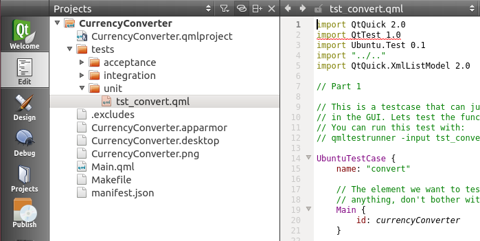
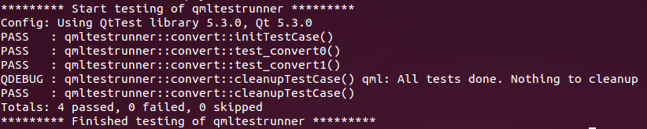

Tutorials - QML unit testing
============================

In this tutorial you will learn how to write a unit test to strengthen
the quality of your Ubuntu QML application. It builds upon the Currency
Converter Tutorial.

Requirements
------------

-  **Ubuntu 14.04 or later** - `Get
   Ubuntu <https://www.ubuntu.com/download/desktop/>`__
-  **The Currency Converter tutorial** - if you haven't already,
   `complete the Currency
   Convertertutorial <tutorials-building-your-first-qml-app.md>`__
-  **The QML test runner tool** - open a terminal with ``Ctrl+Alt+T``
   and run these commands to install all required packages:

::

    $ sudo apt-get install qtdeclarative5-dev-tools qtdeclarative5-test-plugin

What are unit tests?
--------------------

To help ensure your application performs as expected it’s important to
have a nice suite of unit tests. Unit tests are the foundation of a good
testing story for your application. Let’s learn more about them.

A unit test should generally test a specific unit of code. It should be
able to pass or fail in only one way. This means you should generally
have one and only one assertion or assert for short. An assertion is a
statement about the expected outcome of a series of actions. By limiting
yourself to a single statement about the expected outcome, it is clear
why a test fails.

Unit tests are the base of the `testing
pyramid <../../platform/quality.md>`__. The testing pyramid describes
the three levels of testing an application, going from low level tests
at the bottom and increasing to high level tests at the top. As unit
tests are the lowest level, they should represent the largest number of
tests for your project.

In Ubuntu, unit tests for your QML application:

-  Are written in JavaScript within an `Ubuntu
   Testcase <../api-qml-current/Ubuntu.Test.UbuntuTestCase.md>`__ type.
   This makes it easy to write tests with only a few lines of JavaScript
-  Are executed with the qmltestrunner tool, which will determine
   whether they pass or fail

Testing with qmltestrunner
--------------------------

QML makes developing applications easy. Fortunately, it makes testing
those applications easy too! The ``qmltestrunner`` tool allows you to
execute QML files as testcases. As we will learn later, these files
should contain test\_ functions and use the `Ubuntu
Testcase <../api-qml-current/Ubuntu.Test.UbuntuTestCase.md>`__ type.

Here’s an example of a very basic unit test:

.. code:: qml

    import QtTest 1.0
    import Ubuntu.Test 1.0
    UbuntuTestCase {
       name: "MathTests"
       function test_math() {
           compare(2 + 2, 4, "2 + 2 = 4")
       }
    }

Running the example
-------------------

To help you see what unit tests look like in real life, grab a branch of
the currency converter code from the tutorial. Run this command in a
terminal:

``bzr branch lp:ubuntu-sdk-tutorials``

This creates a new folder called ``ubuntu-sdk-tutorials``. The code
we'll be looking at inside the branch is under
``getting-started/CurrencyConverter``. On the terminal, now switch to
the tutorial folder:

``cd ubuntu-sdk-tutorials/getting-started/CurrencyConverter``

If you navigate to that folder with the file browser, you can click on
the ``CurrencyConverter.qmlproject`` file and open it with the Ubuntu
SDK IDE:

Inside you will notice a tests folder that contains three subfolders
named unit, integration, and functional. You’ll notice this corresponds
to the `testing
pyramid <https://developer.ubuntu.com/en/apps/quality/>`__.

Since we are interested in the unit tests, navigate to the unit folder.
Inside you’ll find the ``tst_convert.qml`` file, which is a QML unit
test.

So let’s run it! Switch back to your terminal and run:

``qmltestrunner -input tests/unit``

If everything went successfully, you should see a small printout
displaying all tests as passing.

What to test
------------

Unit tests are a great way to ensure our code and functions react as we
expect them to. The currency converter project has a convert function,
so let’s test it! First a quick look at the QML function in the
``Main.qml`` file:

.. code:: qml

    function convert(from, fromRateIndex, toRateIndex) {
           var fromRate = currencies.getRate(fromRateIndex);
           if (from.length <= 0 || fromRate <= 0.0)
                   return "";
           return currencies.getRate(toRateIndex) * (parseFloat(from) / fromRate);
    }

The function converts currencies given a currency and the rate indexes
to convert from and to. With that in mind, let’s write some tests to
test and ensure it’s working properly.

Our first test case
-------------------

Since we want to test the convert function, let’s feed it some specific
input and ensure it returns the proper results. Let’s start simple
enough and pass in a value of 1. You can see this test case written out
in ``test_convert1()`` inside of ``tst_convert.qml``.

.. code:: qml

    function test_convert1() {
           // convert 1.00 from currency 5 to currency 10
           var value = currencyConverter.convert("1.00", 5, 10)
           verify(value > 0)
    }

This shows the basic format for a unit test. We call the function with a
known value and then assert our expectations about the result. If for
some reason the result is different than our expectations, the test will
fail.

Another great use of unit tests is to explore how your code will react
in edge cases. For instance, what would happen (and what should happen!)
if 0 is passed to the function? What about -1? How about a string?
Explore these edge cases and test them!

Running a testcase
------------------

After you’ve written your set of test cases, it’s important to
understand how they will be executed. `Ubuntu
Testcase <../api-qml-current/Ubuntu.Test.UbuntuTestCase.md>`__ contains
some built in methods that control execution. For example, here’s the
actual order of execution for our example unit test suite in
``tst_convert.qml``.

.. code:: qml

    initTestCase()
    init()
    test_convert0()
    cleanup()
    init()
    test_convert1()
    cleanup()
    cleanupTestCase()

If you need to execute some code before or after running a test that is
common to all tests, put it in `init
() <../api-qml-current/QtTest.TestCase.md#init-method>`__ / `cleanup
() <../api-qml-current/QtTest.TestCase.md#cleanup-method>`__. If you
have a bit of code that needs to execute before any tests are run, or
after the test suite is complete, place it in
`initTestCase() <../api-qml-current/QtTest.TestCase.md#initTestCase-method>`__
/
`cleanupTestCase() <../api-qml-current/QtTest.TestCase.md#cleanupTestCase-method>`__
respectively.

For our test suite you can see we do have some code in both
``initTestCase()`` and ``cleanupTestCase()``. Since our app requires an
Internet connection, ``initTestCase()`` accounts for the data loading
time. Loading data for an application is a common use case of something
that might need to be added to ``initTestCase()``.

Finally, you will also notice that the test cases run in ascending
order, sorted by name. However, generally tests should be self contained
and independent, so don’t be tempted by assuming a test will run after a
prior test based on ordering.

Conclusion
----------

You've just learned how to write unit tests for a
form-factor-independent Ubuntu application for the phone. But there is
more information to be learned about how to write qml tests. Check out
the links below for more documentation and help.

Resources
~~~~~~~~~

-  `Ubuntu Test components
   reference <../api-qml-current/Ubuntu.Test.md>`__
-  `Running tests with qml
   testrunner <http://doc.qt.io/qt-5/qtquick-qtquicktest.html#running-tests>`__
-  `Get started with Qt Quick
   Test <http://doc.qt.io/qt-5/qtquick-qtquicktest.html>`__
