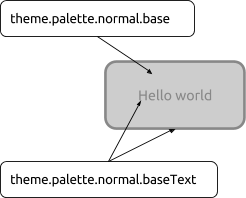

Tutorials - Ubuntu UI toolkit palette
=====================================

What the palette looks like now
-------------------------------

The
`Palette <https://developer.ubuntu.com/api/apps/qml/sdk-15.04.1/Ubuntu.Components.Themes.Palette/>`__
has been in need of some updating for some time and we’ve been working
hard behind the scenes to update this for OTA 10. We’ve stripped back
the palette and rebuilt it from the ground up, considering every aspect
as we went along.

Below is an introduction to how the palette is constructed and how we
apply it to components in the UI toolkit. The majority of the elements
are coming with OTA 10 release, and we will point out those which will
come with OTA 11 explicitly.

How the palette is constructed
------------------------------

-  Colour set
-  Theme
-  Palette value
-  Palette value sets

The Ubuntu color set
~~~~~~~~~~~~~~~~~~~~

The colors in the color set are the foundation of the palette. However
these values or names should never be hardcoded into any component as
this will lead to conflicts and misrepresentation of color when other
themes will be used. These colors are defined in UbuntuColors singleton.

+---------------+-----------------+------------------+
| Colour name   | Colour values   | Colour example   |
+===============+=================+==================+
| Jet           | #111111         |                  |
+---------------+-----------------+------------------+
| Inkstone      | #3B3B3B         |                  |
+---------------+-----------------+------------------+
| Slate         | #5D5D5D         |                  |
+---------------+-----------------+------------------+
| Graphite      | #666666         |                  |
+---------------+-----------------+------------------+
| Ash           | #888888         |                  |
+---------------+-----------------+------------------+
| Silk          | #CDCDCD         |                  |
+---------------+-----------------+------------------+
| Porcelain     | #F7F7F7         |                  |
+---------------+-----------------+------------------+
| Blue          | #19B6EE         |                  |
+---------------+-----------------+------------------+
| Green         | #3EB34F         |                  |
+---------------+-----------------+------------------+
| Red           | #ED3146         |                  |
+---------------+-----------------+------------------+
| Orange        | #E95420         |                  |
+---------------+-----------------+------------------+

The theme
~~~~~~~~~

The theme is the visual look of the UI components. There are two themes
which come with the SDK, Ambiance (light) and Suru Dark (dark). The
colors a component is painted with depend on the theme chosen by the
developer.

Palette values
~~~~~~~~~~~~~~

These are the normal color values given to a specific component. Each
palette value name has a semantic meaning and is applied on a certain
layer within the application UI.

There are three layers in an Ubuntu UI and those are the following:

1. background - the base layer where the application window resides
2. foreground - a layer above the base, holding components brought into
   foreground
3. overlay - a layer floating above background, mostly contains popups
   and dialogs

There are also 2 sub layers which can sit on top of any of these main
layers. These are:

1. base - sits flat on the surface of any main layer.
2. raised - sits proud but not detached from the surface of any main
   layer.

.. figure:: ../../../media/qml-tutorial-palette-diagram-02.png
   :alt: 

In addition to these there are palette values which are not applied on
any particular layer, but mostly color a section of a component. Those
will be described in the following chapters in more details.

Each palette value follows the UI layer it is applied in, and each of
them has at least one palette value suffixed with “Text”, which defines
the color value to be used when drawing on the base color or putting a
text above it.

.. code:: qml

    Rectangle {
        color: theme.palette.normal.**base**
        border {
            width: 3
            color: theme.palette.normal.**baseText**
        }
        Text {
            text: “Hello world”
            anchors.centerIn: parent
            horizontalAlignment: Text.AlignHCenter
            color: theme.palette.normal.**baseText**
        }
    }

Background
^^^^^^^^^^

These are the colors applied to the bottom level (or background) of the
application.

+----------------------------+------------+-------------+
| Background                 | Ambiance   | Suru dark   |
+============================+============+=============+
| .background                | White      | Jet         |
+----------------------------+------------+-------------+
| .backgroundText            | Jet        | White       |
+----------------------------+------------+-------------+
| .backgroundSecondaryText   | Slate      | Silk        |
+----------------------------+------------+-------------+
| .backgroundTertiaryText    | Ash        | Ash         |
+----------------------------+------------+-------------+
| .backgroundPositiveText    | Green      | Green       |
+----------------------------+------------+-------------+
| .backgroundNegativeText    | Red        | Red         |
+----------------------------+------------+-------------+

Base
^^^^

These are the colors applied to elements that sit flat on the main
layers. For example the outline of a text field or the bar of the
slider.

+-------------+------------+-------------+
| Base        | Ambiance   | Suru dark   |
+=============+============+=============+
| .base       | Silk       | Graphite    |
+-------------+------------+-------------+
| .baseText   | Ash        | Ash         |
+-------------+------------+-------------+

Foreground
^^^^^^^^^^

These are the colors applied to components that sit on top of the
background layer. For example the background of a neutral button.

+-------------------+-------------+-------------+
| Foreground        | Ambiance    | Suru dark   |
+===================+=============+=============+
| .foreground       | Porcelain   | Inkstone    |
+-------------------+-------------+-------------+
| .foregroundText   | Jet         | White       |
+-------------------+-------------+-------------+

Raised
^^^^^^

These are the colors applied to elements that are raised above the main
layers. For example the thumb toggles for sliders and switches.

+------------------------+------------+-------------+
| Raised                 | Ambiance   | Suru dark   |
+========================+============+=============+
| .raised                | White      | White       |
+------------------------+------------+-------------+
| .raisedText            | Slate      | Slate       |
+------------------------+------------+-------------+
| .raisedSecondaryText   | Silk       | Silk        |
+------------------------+------------+-------------+

Overlay
^^^^^^^

These are the colors applied to elements that float above the background
layer. For example popovers, dialogs and menus.

+-------------------------+------------+-------------+
| Overlay                 | Ambiance   | Suru dark   |
+=========================+============+=============+
| .overlay                | White      | Inkstone    |
+-------------------------+------------+-------------+
| .overlayText            | Slate      | white       |
+-------------------------+------------+-------------+
| .overlaySecondaryText   | Silk       | Slate       |
+-------------------------+------------+-------------+

Selection
^^^^^^^^^

These are the colors applied to components that have selected content.
This should not be confused with the entire component’s selected state.
For example text in an editable text field.

+------------------+----------------------+----------------------+
| Selection        | Ambiance             | Suru dark            |
+==================+======================+======================+
| .selection       | Blue (20% opacity)   | Blue (40% opacity)   |
+------------------+----------------------+----------------------+
| .selectionText   | Jet                  | White                |
+------------------+----------------------+----------------------+

Field
^^^^^

These are the colors applied to the background of input controls . For
example the background of a text field, checkbox or radio button.

+--------------+------------+-------------+
| Field        | Ambiance   | Suru dark   |
+==============+============+=============+
| .field       | White      | Jet         |
+--------------+------------+-------------+
| .fieldText   | Jet        | White       |
+--------------+------------+-------------+

These are the colors applied to positive actions. For example a positive
button.

+-----------------+------------+-------------+
| Positive        | Ambiance   | Suru dark   |
+=================+============+=============+
| .positive       | Green      | Green       |
+-----------------+------------+-------------+
| .positiveText   | White      | White       |
+-----------------+------------+-------------+

Negative
^^^^^^^^

These are the colors applied to negative actions. For example a negative
button.

+-----------------+------------+-------------+
| Negative        | Ambiance   | Suru dark   |
+=================+============+=============+
| .negative       | Red        | Red         |
+-----------------+------------+-------------+
| .negativeText   | White      | White       |
+-----------------+------------+-------------+

Activity
^^^^^^^^

These are the colors applied to active items. For example the indication
of progress on a progress bar or a slider.

+-----------------+------------+-------------+
| Activity        | Ambiance   | Suru dark   |
+=================+============+=============+
| .activity       | Blue       | Blue        |
+-----------------+------------+-------------+
| .activityText   | White      | White       |
+-----------------+------------+-------------+

Palette value sets
~~~~~~~~~~~~~~~~~~

In addition to the palette values above, an item can have a value set to
control the look of the item as it enters or leaves a state. The defined
value sets are:

-  ``theme.palette.disabled``
-  ``theme.palette.normal``
-  ``theme.palette.highlighted``
-  ``theme.palette.focused``
-  ``theme.palette.selected``
-  ``theme.palette.selectedDisable``\ d

Each value set contains the color value for each of the color names
listed above.

**Note**: the focused value set will land in OTA11.

How we define the color of an item
----------------------------------

Each item is considered to have different states, though not specified
explicitly through a given property or enumeration.

For instance an *Item* as well as a *StyledItem* in most of the cases is
in **normal state**, being in normal use. This state is represented by
the **enabled** property. This property can already drive the normal and
**disabled state**. Now, a component can be **focused** or not, which is
driven through the **activeFocus** and **keyNavigationFocus** for the
*StyledItem*.

Some items which react on mouse or touch interaction, have a property
that drives the **highlighted state** of the component, for example,
*AbstractButton* has **pressed** and *ListItem* has **highlighted**.
ListViews have a special state called **selected state**, which is used
when a given *ListView* element is set to be the current one through the
**currentIndex**/**currentItem** properties. A ListView can have a
selected element also when disabled, in which case the **enabled** and
**currentIndex** properties will drive us to the **selected disabled
state**.

These states draw the palette to have a color set for each state so a
different color can be applied on the component whenever a given state
is entered. These color sets are called value sets. A component can
choose the color using the following formula:

**theme.palette.valueSet.value**

where valueSet corresponds to one of the states enumerated above, with
camel case, and value is one of the palette color values listed in
`Palette
values <https://docs.google.com/document/d/1HBY0hRKtqNvOw8jfcDHvwbhagXYmOE6S-z2_ab7qtgk/edit#heading=h.3gvdp3c2jec8>`__.

When coloring a component it is highly recommended to choose the value
set corresponding to a given state of the component, and never choose a
different color value from the value sets.

The wrong way:

.. code:: qml

    Rectangle {
        color: enabled ? theme.palette.normal.base : theme.palette.disabled.overlay
    }

The right way:

.. code:: qml

    Rectangle {
        color: enabled ? theme.palette.normal.base : theme.palette.disabled.base
    }

For example, coloring a custom Button could be done in the following
way:

.. code:: qml

    Rectangle {
        signal clicked
        MouseArea {
            id: mouseArea
            anchors.fill: parent
            onClicked: parent.clicked()
        }
        color: enabled ? (mouseArea.pressed
                         ? theme.palette.highlighted.base
                         : theme.palette.normal.base)
                       : theme.palette.disabled.base
    }

Coloring the selected element of a ListView on the other hand is a lot
different:

.. code:: qml

    ListView {
        id: listView
        model: 10
        delegate: ListItem {
            // [...]
        }
        highlight: currentItem ? highlightComponent : null
        Component {
            id: highlightComponent
            Rectangle {
                color: listView.enabled ? (listView.activeFocus
                                          ? theme.palette.focused.background
                                          : theme.palette.selected.background)
                                        : theme.palette.selectedDisabled.background
            }
        }
    }

The following diagram illustrates the state transitions of a component
driving the colors.

.. figure:: ../../../media/qml-tutorial-state-transitions-colors.png
   :alt: 

Choosing the palette value set automatically
--------------------------------------------

We are working on an API to chose the color value set based on the
component’s current state. This will be an extension of the StyledItem
and ThemeSettings component, and we hope it will reach the toolkit in
OTA11. With the API available, component styles will no longer need to
use huge bindings to find out the color set to be used, but instead will
be able to use a simple binding line. The API is in prototyping phase,
thus this chapter will be updated later.
