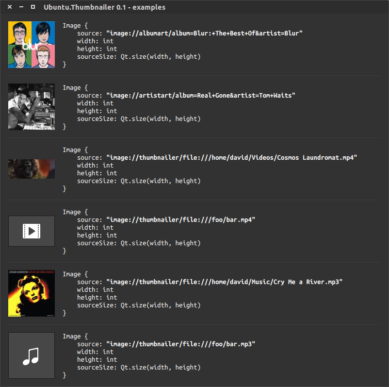

Tutorials - using the Ubuntu thumbnailer
========================================

The Ubuntu Thumbnailer QML plugin gives you extremely fast access to
thumbnails of pictures and videos stored locally, as well as music
artwork (albums and artists) using a third party backend.

Why use the thumbnailer
-----------------------

We believe this thumbnailer solves a whole range of issues, not only for
galleries and media players, but for all developers wanting to enrich
their app with media content.

Speed
~~~~~

Using thumbnails instead of loading and reducing arbitrary images in
your code will dramatically improve loading speed of your components.
This thumbnailer is heavily optimized for speed and caching.

Developer time
~~~~~~~~~~~~~~

Video thumbnails often need to be generated with specific libraries
(such as FFMPEG) you would need to embed in your package. A common
service is a clean solution for all apps consuming it.

Consistency
~~~~~~~~~~~

Users get the same thumbnails for the same content between apps. A music
album looks the same everywhere on their device.

How to use it
-------------

Importing ``Ubuntu.Thumbnailer`` in your QML code will give new powers
to ``Image`` components, via dedicated URI schemes for your image
``source``:

-  ``"image://thumbnailer/<file URI>"`` : local videos, audio files and
   pictures
-  ``"image://albumart/album=<album>&artist=<artist>"`` : any music
   album (online query)
-  ``"image://artistart/album=<album>&artist=<artist>"`` : any music
   artist (online query)

Note that for privacy reasons, user devices won't be talking directly to
the third party backend (currently: 7digital), all responses and queries
are proxied by the `musicproxy <https://dash.ubuntu.com/musicproxy>`__
server.

Successful responses for such online queries are cached locally to avoid
unnecessary network use.

.. code:: qml

    ## Example

    import QtQuick 2.0
    import Ubuntu.Components 1.3
    import Ubuntu.Thumbnailer 0.1
    Image {
        source: "image://thumbnailer/"+Qt.resolvedUrl("data/videos/file.mp4")
        width:units.gu(20)
        height:width
        fillMode:Image.PreserveAspectFit
        sourceSize:Qt.size(width, height)
        anchors.centerIn: parent
    }

Note that you need to specify ``sourceSize`` for the thumbnailer to know
at which size to produce the thumbnail.

A few other examples
--------------------

Size and ratio
--------------

-  The thumbnailer always preserves aspect ratio.
-  It never up-scales. Returned thumbnails may be smaller than what was
   asked for because the thumbnailer never up-scales. If the original
   artwork is smaller than what was asked for, the largest possible
   thumbnail will be returned.
-  Thumbnails are never larger than 1920 pixels in the larger dimension
   (even if the original artwork is larger).
-  Requests with either dimension ``< 0`` are invalid and return an
   error.
-  Requests for ``(0,0)`` mean "as large as possible" (subject to the
   1920 pixel limit).
-  Requests for ``(x,0)`` or ``(0,y)`` mean "no larger than x or y",
   while keeping the original aspect ratio.
