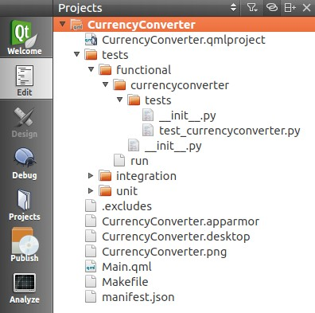

Tutorials - writing QML acceptance tests
========================================

In this tutorial you will learn how to write an autopilot test to
strengthen the quality of your Ubuntu QML application. It builds upon
the Currency Converter Tutorial.

Requirements
------------

-  Ubuntu 14.04 or later -- `get
   Ubuntu <https://www.ubuntu.com/download/desktop/>`__.
-  The Currency Converter tutorial -- if you haven't already, `complete
   the Currency Converter
   tutorial <tutorials-building-your-first-qml-app.md>`__.
-  The lower level testing tutorials on `unit
   testing <tutorials-qml-unit-testing.md>`__, and `integration
   testing <tutorials-qml-integration-testing.md>`__.

Testing like a user with autopilot
----------------------------------

Whew! Presuming we've written our QML application, and written some unit
tests for it, we can now be assured our program works properly, and if
we break it we'll know about it, right?

Well, from a logical level yes, we've now assured ourselves the program
should behave reasonably. That is until a user gets ahold of it.

How can we make sure when they press a button or interact with our
application that it will respond properly? What can we do to fill this
final gap? The answer is a functional testing tool called Autopilot.

Preparing for launch
--------------------

First things first, we'll need to make sure we install the autopilot
tool. This can be done using the autopilot PPA. Add the PPA and install
the packages.

``sudo apt-add-repository ppa:autopilot/1.5 && sudo apt-get update && sudo apt-get install python3-autopilot python3-autopilot-vis``

Let's also grab a branch of currency converter code from the tutorial
with autopilot tests already written and in place to look at.

``bzr branch lp:ubuntu-sdk-tutorials``

This creates a new folder called ``ubuntu-sdk-tutorials``. The code
we'll be looking at inside the branch is under
``getting-started/CurrencyConverter``.

``cd ubuntu-sdk-tutorials/getting-started/CurrencyConverter``

Learning the basics of autopilot
--------------------------------

A basic autopilot test consists of:

-  a **setup** phase where we **start the application and create any
   data** we might need. Next,
-  we **interact with the application** by pressing buttons, sending
   keystrokes and doing things a user would do. Finally,
-  we **make some assertions** about our actions to ensure the
   application responded appropriately.

If you've used other testing frameworks that follow in the line of
xUnit, you will notice the similarities.

So what does a test look like? If you notice there is already an
autopilot folder waiting for us inside the *tests* subfolder of the
"CurrencyConverter" subdirectory. Inside is a folder aptly called
*currencyconverter* which represents our testsuite name. Finally, inside
this folder is the testcases and supporting code.

``cd tests/functional/currencyconverter``

So, let's take a look and talk about how it works.

Looking at the ``__init__.py`` file:

.. code:: python

    from autopilot.testcase import AutopilotTestCase
    ...
    class CurrencyConverterTestCase(AutopilotTestCase):
    ...
        def setUp(self):
            super(CurrencyConverterTestCase, self).setUp()
            self.launcher, self.test_type = self.get_launcher_and_type()
            self.app = currencyconverter.CurrencyConverter(self.launcher(),
                                                           self.test_type)

And then the test\_currencyconverter.py file:

.. code:: python

    from currencyconverter.tests import CurrencyConverterTestCase
    class TestMainWindow(CurrencyConverterTestCase):
        def test_from_currency_convert(self):
            """ Setting from currency value should update to currency """
            self.app.main_view.set_random_from_value()
            to_value = self.app.main_view.get_to_currency_field().get_value()
            self.assertGreater(to_value, 0)
        def test_to_currency_convert(self):
            """ Setting to currency value should update from currency """
            self.app.main_view.set_random_to_value()
            from_value = self.app.main_view.get_from_currency_field().get_value()
            self.assertGreater(from_value, 0)
        def test_clear_button(self):
            """ Test if the clear button clears the screen """
            self.app.main_view.set_random_from_value()
            self.app.main_view.use_clear_button()
            self.assertEquals(self.app.main_view.get_from_currency_field().text,
                              '0.0')
            self.assertEquals(self.app.main_view.get_to_currency_field().text,
                              '0.0')

Back to ``__init__.py``:

.. code:: python

    class CurrencyConverter(object):
        """Autopilot helper object for the currencyconverter application."""
        def __init__(self, app_proxy, test_type):
            self.app = app_proxy
            self.test_type = test_type
            self.main_view = self.app.select_single(Main)
        @property
        def pointing_device(self):
            return self.app.pointing_device
    class Main(ubuntuuitoolkit.MainView):
        """Autopilot helper for the MainView."""
        def __init__(self, *args):
            super(Main, self).__init__(*args)
            self.visible.wait_for(True)
            self.wait_for_network()

We implement an AutopilotTestCase object (the
``CurrencyConverterTestCase`` class) and define a new method for each
test (e.g. ``test_clear_button``).

You will also notice the setUp method inside ``__init__.py``. This is
called before each test is run by the testrunner. In this case, our
setup only consists of launching the application before we run each test
and waiting for it to appear before continuing.

After setUp is launched a test\_\* function is executed. Finally the
tearDown is run and the cycle continues with the next testcase.

Since we're testing our UI on multiple form factors, you'll notice we
include logic for a mouse or touch device in ``__init__.py``. Autopilot
supports running against an agnostic display server (Xorg, mir, etc). We
simply initialize our "pointing\_device", and we can issue touch/click
and movement commands generically. In this way our testcase can be the
same across multiple form factors.

The computer has eyes
---------------------

To make things easier for us, we've also defined a class called Main
inside of ``__init__.py`` with several helper functions which you see
utilized in the tests inside of ``test_currencyconverter.py``. In fact,
this class builds upon an `entire suite of
helpers <http://people.canonical.com/~nskaggs/autopilot-sdk-helpers.html>`__
made just for autopilot testing of Ubuntu SDK applications.

These helper functions are the basis of the vision we have inside the
application. This is because autopilot hooks into the dbus session of
our application to read the data behind the scenes. In this way we can
then make assertions about an object's properties.

If you look closely you'll notice something else about the QML source
file for currency converter. To aid autopilot's vision, we've added
``objectName``'s to the objects we wish to inspect at runtime. Using
this objectName, we can issue a ``select_single`` or ``select_multiple``
call to autopilot to grab this specific object easily. Once we have the
object, we can examine an object's data structures to confirm
application behavior at runtime by using asserts.

.. code:: qml

    Button {
        id: clearBtn
        objectName: "clearBtn"
        text: i18n.tr("Clear")
        width: units.gu(12)
        onClicked: {
            inputTo.text = '0.0';
            inputFrom.text = '0.0';
        }
    }

Testing the clear button
------------------------

So, let's examine the testcase written to test the clear button for the
application to see how this works.

1. First we utilize our helper method to set a random value in the from
   field. This is done using the ``select_single`` method autopilot
   exposes to us. Given a named property type and object name, we can
   retrieve the object during runtime and examine it.
2. Next we utilize a second helper method, which relies on the autopilot
   functions to tap or click on the clearButton. You can see all of
   these helper methods inside the Main class in ``__init__.py``.
3. Lastly, we need to assert the resulting text fields are zeroed out --
   just like we coded it.

.. code:: qml

    from currencyconverter.tests import CurrencyConverterTestCase
    class TestMainWindow(CurrencyConverterTestCase):
        def test_clear_button(self):
            """ Test if the clear button clears the screen """
            self.app.main_view.set_random_from_value()
            self.app.main_view.use_clear_button()
            self.assertEquals(self.app.main_view.get_from_currency_field().text,
                              '0.0')
            self.assertEquals(self.app.main_view.get_to_currency_field().text,
                              '0.0')

Computer, run my test!
----------------------

We're now ready to execute the test to see what happens. Autopilot
supports listing the testcases present in a testsuite and executing them
via the autopilot list [testsuite] and autopilot3 run [testsuite]
commands respectively. Autopilot also supports running in verbose mode
via the '-v' argument. This helps us see the output as we execute the
test. So from the tests/autopilot subfolder, execute:

``autopilot3 run -v currencyconverter``

This will execute the entire testsuite. It's important you execute this
command from the tests/autopilot subfolder, else python will fail to
find your testsuite. We can also run a single test at a time by
specifying the testname in our run command. We can use the list command
to see what's available, and then run just one test.

::

    autopilot list currencyconverter
    autopilot3 run -v currencyconverter.tests.test_currencyconverter.TestCurrencyConverter.test_clear_button

Seeing what autopilot sees
--------------------------

Autopilot contains an additional tool that let's us see the entire dbus
session that autopilot has available; including things we might not
realize are defined by our application. This can be useful for adding
more advanced testcases or to debug your existing tests further. This
happens via the autopilot launch and autopilot vis commands. The launch
command prepares and launches the application with a hook for autopilot
to introspect it's data. The vis command then launches a visualizer
allowing us to examine the data autopilot gathers.

::

    autopilot launch -i Qt qmlscene /path/to/file.qml
    autopilot3 vis

Select the ``QtQmlViewer Connection`` from the dropdown and presto, say
hello to the entire dbus session properties and values for our
application.

Conclusion
----------

You've just learned how to test a form-factor-independent Ubuntu
application for the phone. But there is more information to be learned
about the powers of autopilot. Check out the links below for more
documentation and help. Welcome to the world of testing!

Resources
~~~~~~~~~

-  `Official Autopilot
   Tutorial <../api-autopilot-current/tutorial-getting_started.md>`__
-  `Autopilot API Documentation <../api-autopilot-current/index.md>`__
-  `Autopilot SDK
   Helpers <../api-autopilot-current/ubuntuuitoolkit.md>`__
