Tutorial - create your first web app
====================================

Ubuntu web applications are standalone browsers restricting navigation
to certain URL patterns. They are very easy to make : using the SDK, you
can turn any website into a web app in minutes. In this tutorial, we are
going to make a webapp for
`BrowserQuest <http://browserquest.mozilla.org/>`__, a multiplayer RPG
created by Little Workshop and sponsored by Mozilla. Before going
further, you may want to check the following resources to be sure you
understand everything you will be doing :

-  `Creating an SDK app
   project <../../platform/sdk/tutorials-creating-an-sdk-app-project.md>`__
-  `Running apps from the
   SDK <../../platform/sdk/tutorials-running-apps-from-the-sdk.md>`__
-  `Security policy
   groups <http://developer.ubuntu.com/en/publish/security-policy-groups/>`__

First step : Creating the project
---------------------------------

Open the Ubuntu SDK, click on New Project and choose the Web App
template.

.. figure:: ../../../media/web-apps-create-web-app.png
   :alt: 

Project info
^^^^^^^^^^^^

You will be asked some information about the project:

-  The **name** of the project : ``browserquest``
-  Its **path**

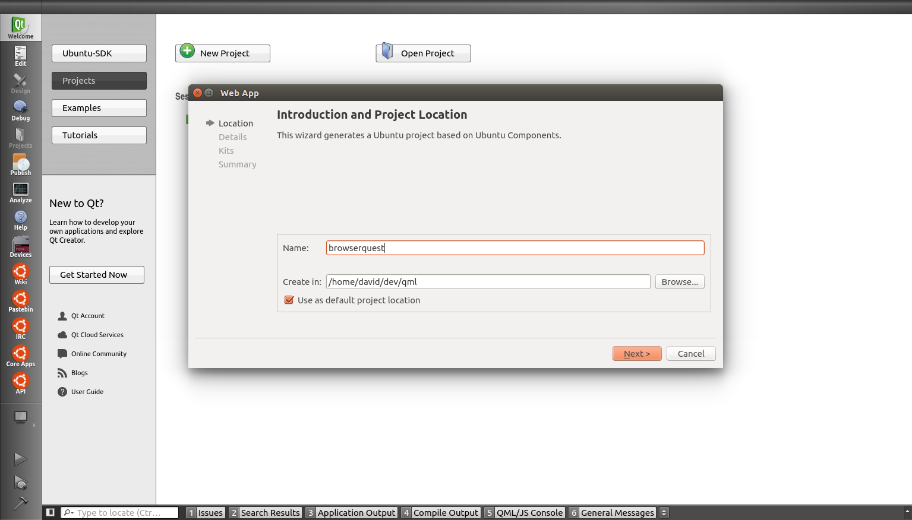

Click info
^^^^^^^^^^

-  Your developer **nickname** also known as "package namespace", this
   has to match the one you are using to publish in
   `MyApps <https://myapps.developer.ubuntu.com/dev/click-apps/>`__. It
   will be appended to your package name in order to ensure that
   packages of the same name uploaded by two developers will remain
   unique. If you have a `Launchpad <https://launchpad.net/>`__
   username, you should use that.

-  Your **maintainer** information : your name and email
-  The **name** of your app : BrowserQuest

Device info
^^^^^^^^^^^

-  Device
   kits](../../platform/sdk/tutorials-running-apps-from-the-sdk.md) your
   project will be using.

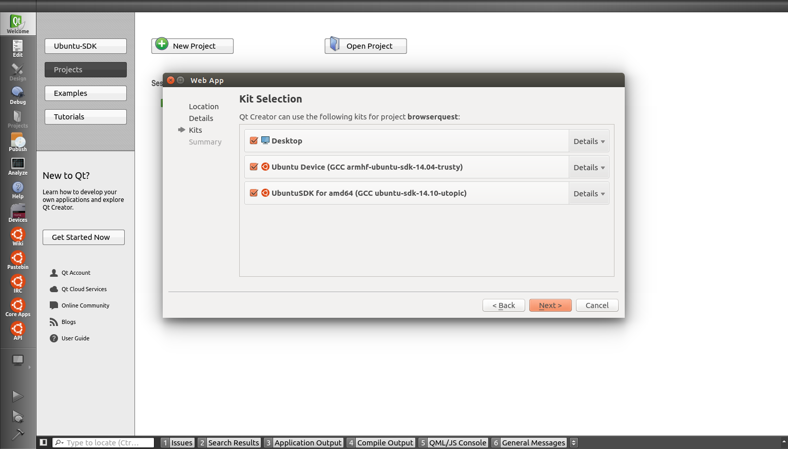

That’s it, your project is now created and the SDK has generated a few
files you need to complete.

Step 2 : Completing the template
--------------------------------

Once you navigate to the Edit page, you can see that the SDK has created
the following files :

-  ``BrowserQuest.apparmor``: Security Policy Groups your app needs to
   work on the device
-  ``BrowserQuest.desktop``: infos needed by Ubuntu to launch your app
   and show it to the user
-  ``browserquest.png``: a default icon you will replace later
-  ``manifest.json``: infos needed to identify your app and declare it
   to the system
-  a ``README`` file that covers the basics for setting up a webapp

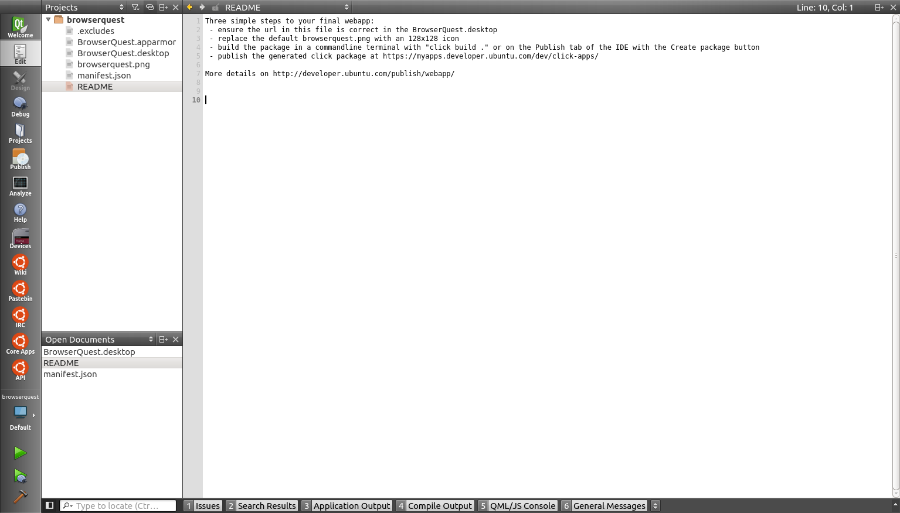

The icon
~~~~~~~~

First, we are going to replace the default icon by a new 256x256 one,
which is the minimum size for it to look good in the store. Luckily,
BrowerQuest is open source and we can find a lot of resources, such as
sprites from the game. Make sure your follow `our good
practices <http://developer.ubuntu.com/en/publish/creating-a-good-icon/>`__.
Here is the icon I’ve created:

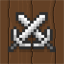

URLs
~~~~

We need to add the URL of the game to the .desktop file :
http://browserquest.mozilla.org The Exec line is where we need to add
it, but we are also going to add an URL pattern, to make sure the webapp
has access to URLs matching this regex:
https?://browserquest.mozilla.org/\* Our line now looks like this :

::

     Exec=webapp-container --enable-back-forward --store-session-cookies --webappUrlPatterns=https?://browserquest.mozilla.org/* http://browserquest.mozilla.org

You can add several patterns as arguments. For example if you wanted the
webapp to be allowed to navigate to the rest of mozilla.org, you could
do :

::

    Exec=webapp-container --enable-back-forward --store-session-cookies --webappUrlPatterns=https?://browserquest.mozilla.org/* https?://mozilla.org/* http://browserquest.mozilla.org

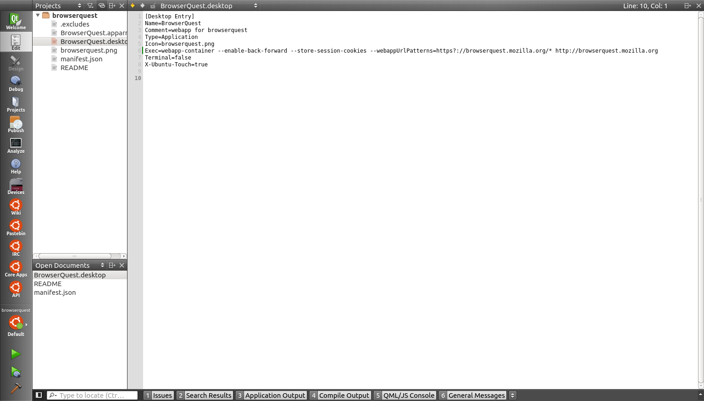

Step 3 : Testing
----------------

We are almost done! To test your app, click on the Ubuntu icon above the
play button, pick a device, then press ``Run`` (the play button).

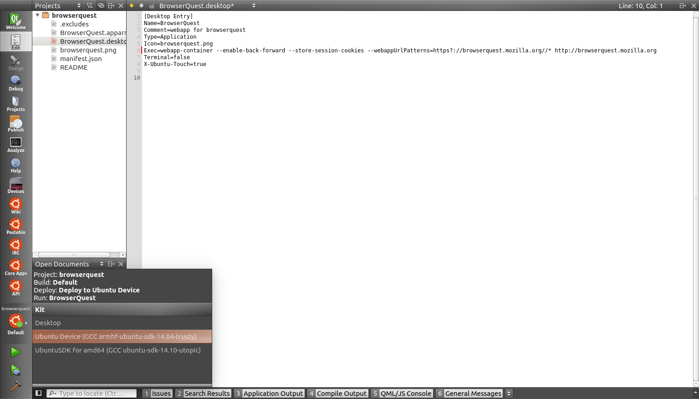

Your app is now being loaded onto the device and should open after a few
seconds...

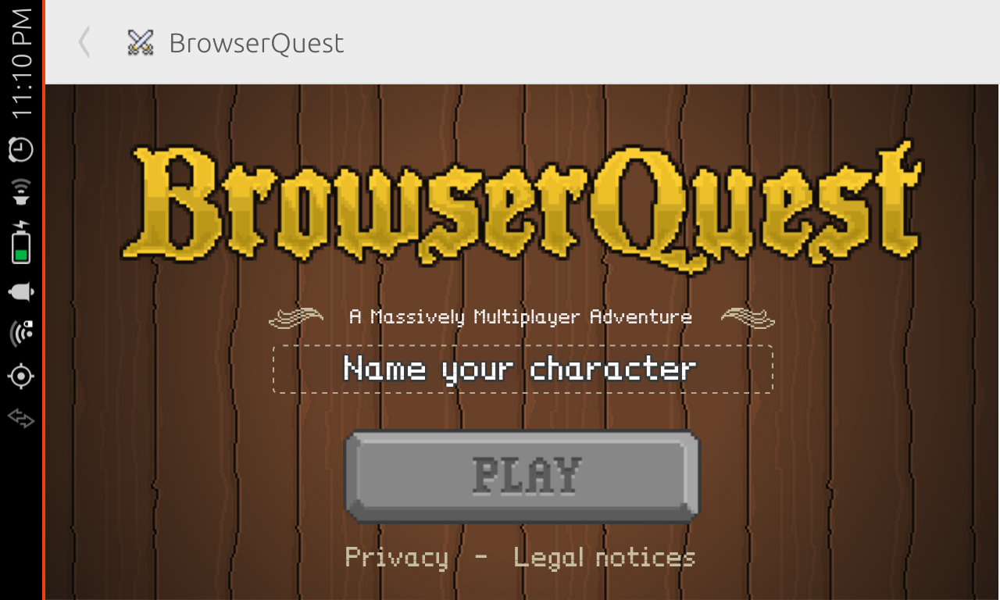

Here it is! But there seems to be one thing we need to fix : the default
webapps view has more chrome than needed for this game. We can fix that
by changing a few parameters, like removing the navigation arrows and
make the app fullscreen.

::

    Exec=webapp-container --fullscreen --store-session-cookies --webappUrlPatterns=https?://browserquest.mozilla.org/* http://browserquest.mozilla.org

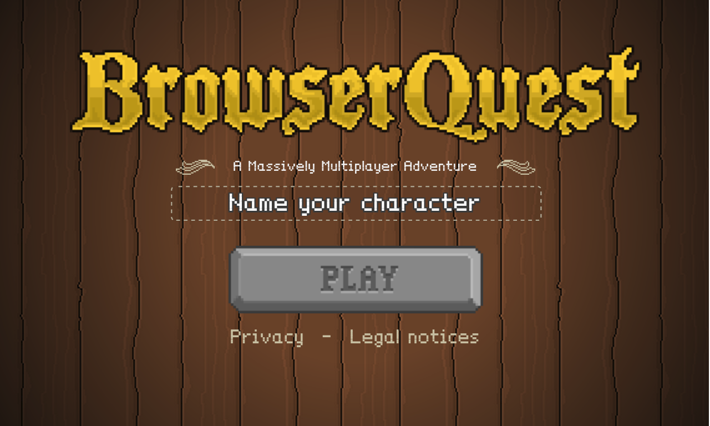

Much better ! More options are available depending on your needs, here
are some common ones:

::

    --fullscreen --maximized (desktop only) --enable-back-forward --enable-addressbar

You can see the complete list by running in a terminal:
``webapp-container --help`` Note that the application is (and will
always be) **confined** in a safe container. Cookies will not be shared
with the default browser and other web apps. Now that we have a working
app, we need to package it before publishing...

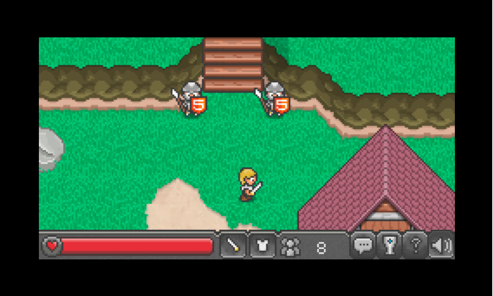

Step 4: Creating your package
-----------------------------

The **Publish** page of the SDK lets you **create and validate** the
package you will publish to the store. It will be created in the folder
containing your project folder.

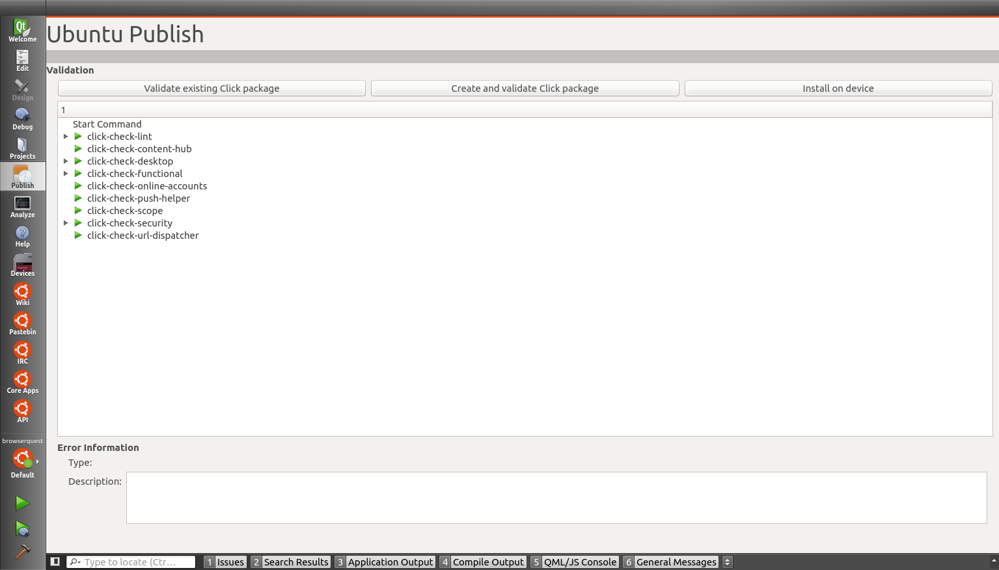

If all tests are green, you can see how your app looks along others by
installing it on your device, directly from the **Publish** page with
the **Install on device** button.

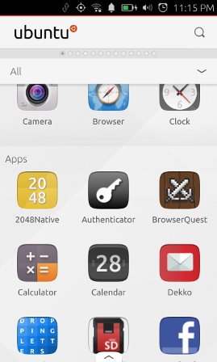

**Publishing your app**
~~~~~~~~~~~~~~~~~~~~~~~

We are done with the SDK. Once you have successfully created a click
package and are happy with how it looks and works, you are ready to
upload it and start the process of `publishing
it <http://developer.ubuntu.com/en/publish/>`__.
