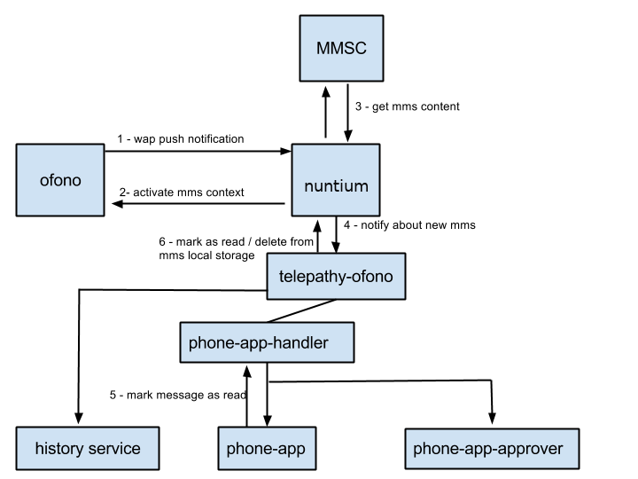
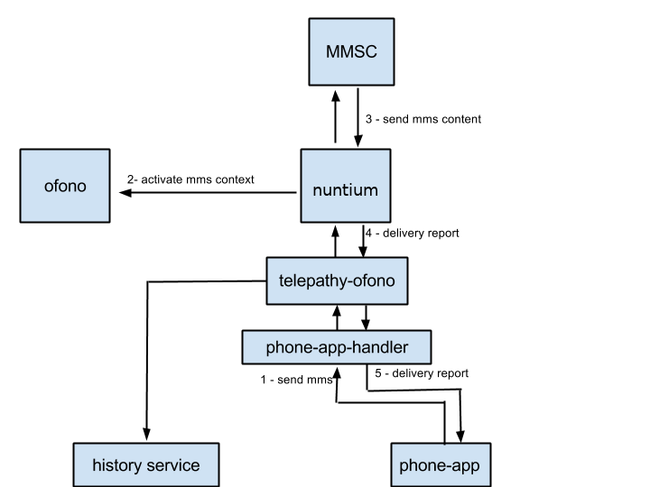

MMS infrastructure components:
==============================

**oFono [1]** - responsible for providing the data context used to transfer mms data (image/music). It also propagates wap push notifications to upper layers.

**nuntium [2]** - daemon that listens to wap push notifications and activates the mms data context on ofono on demand to send/receive mms's. It provides a local store, which will probably not be used by ubuntu-touch. The history service component will be used instead.

**telepathy-ofono [3]**  - talks to nuntium through dbus and will be used to both relay messages from phone-app to nuntium and inject into the telepathy infrastructure mms's received by nuntium as multi-part messages [4]. This component also needs to mark messages as read and delete successfully received messages from nuntium.

**history-service [5]**  - this component will watch the telepathy communication and store the messages received by telepathy-ofono or sent by phone-app.

**telephony-service-approver [6]**  - this component is currently in charge of adding sms's to the messaging menu and to display incoming text notifications. It needs to be changed in order to add the received mms's to the messaging menu and display a notification that a new mms is available for download when auto-retrieval is disabled.

**messaging-app  [7]** - It needs to correctly render mms's in the conversation view and also provide a way to attach media files to a message in order to send an mms.

[1] - `hhttps://github.com/ubports/ofono <https://github.com/ubports/ofono>`_

[2] - `https://github.com/ubports/nuntium <https://github.com/ubports/nuntium>`_

[3] - `https://github.com/ubports/telepathy-ofono <https://github.com/ubports/telepathy-ofono>`_

[4] - `https://telepathy.freedesktop.org/spec/Channel_Interface_Messages.html <http://telepathy.freedesktop.org/spec/Channel_Interface_Messages.html#Mapping:Message_Part>`_

[5] - `https://github.com/ubports/history-service <https://github.com/ubports/history-service>`_

[6] - `https://github.com/ubports/telephony-service <https://github.com/ubports/telephony-service>`_

[7] - `https://github.com/ubports/messaging-app <https://github.com/ubports/messaging-app>`_

General Description
-------------------

Incoming MMS:
^^^^^^^^^^^^^

* An mms WAP push notification is received by ofono and propagated to nuntium
* nuntium enables the mms context in ofono, retrieves the content from MMSC and propagates the new MMS to upper layers.
* A new MMS arrives at telepathy-ofono.
* If automatic retrieval is not enabled or not available at the moment, a control message is sent to the app (we can use one of the different message types that Telepathy supports)
* An interface for requesting the retrieval of the message will be available on telepathy-ofono.
* After the message is retrieved, it will be delivered to the apps via normal text channel in a multi-part message (one text/html part, one text/plain part and one part per attachment). If the control message was previously delivered, this real message will have a flag telling it is a replacement for the previous message.
* The new message history service will save the attachment parts to disk, and replace the paths on text/html to point to the new attachment locations. It will also save a flag (or maybe just the content type).

Outgoing MMS:
^^^^^^^^^^^^^

* phone-app creates a new text channel in telepathy-ofono, or uses an existing channel.
* phone-app sends the mms as a multi-part message to telepathy-ofono
* nuntium enables the mms context in ofono, sends the mms through MMSC and signals the upper layers about the current status (sent, draft).
* telepathy-ofono sends signals to applications with delivery reports.

Incoming MMS diagram:
*********************

Outgoing MMS diagram:
*********************

Current Issues:
***************

* The proposed scheme seems to work well except for one use case, when the MMS auto retrieval is disabled. In such case the user should be able to decide when to download a specific MMS. Currently nuntium automatically retrieves any new MMS that was notified by ofono through an WAP push notification.

Proposed solution:

* Add an option to nuntium to disable auto retrieval and submit upstream.
